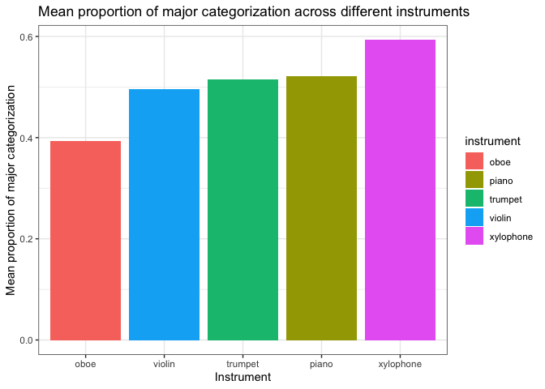
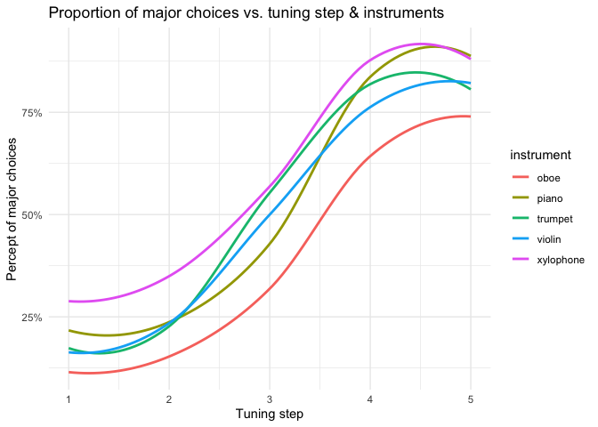
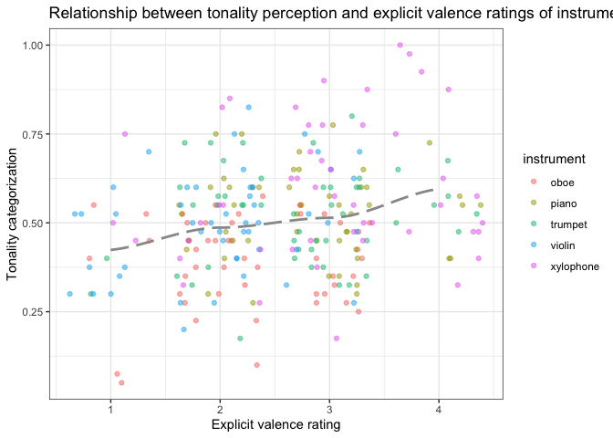

MA Thesis: Effect of Instrument Timbre on Tonality Perception
================
Eva Wu

Advisors: Dr. Howard Nusbaum & Dr. Stephen Van Hedger

``` r
library(tidyverse)
```

    ## ── Attaching packages ─────────────────────────────────────── tidyverse 1.3.2 ──
    ## ✔ ggplot2 3.3.6      ✔ purrr   0.3.4 
    ## ✔ tibble  3.1.8      ✔ dplyr   1.0.10
    ## ✔ tidyr   1.2.1      ✔ stringr 1.4.1 
    ## ✔ readr   2.1.2      ✔ forcats 0.5.2 
    ## ── Conflicts ────────────────────────────────────────── tidyverse_conflicts() ──
    ## ✖ dplyr::filter() masks stats::filter()
    ## ✖ dplyr::lag()    masks stats::lag()

``` r
library(ggtext)
library(ggsignif) # label ggplot
knitr::opts_chunk$set(echo = FALSE, warning = FALSE, message = FALSE)
all <- read_csv("all.csv")
```

    ## Rows: 1225 Columns: 51
    ## ── Column specification ────────────────────────────────────────────────────────
    ## Delimiter: ","
    ## chr (13): instrument, chord, participant, Gender, Year, Year_6_TEXT, Major, ...
    ## dbl (38): qualtrics_id, tuning_step, pct_maj, explicit_rtg, passed_practice,...
    ## 
    ## ℹ Use `spec()` to retrieve the full column specification for this data.
    ## ℹ Specify the column types or set `show_col_types = FALSE` to quiet this message.

## Hypothesis

“Happy” instruments would make people more prone to identify the chord
as major, while “sad” instruments would make people more prone to
identify the chord as minor.

## Research questions

1)  Association between instrument timbre and tonality judgment

2)  How timbre interacts and tuning step affect tonality judgment

3)  Association between timbre and explicit ratings of instrument
    valence

4)  Association between tonality judgment and explicit ratings of
    instrument valence

5)  Association between musical background/key and tonality judgment
    and/or explicit ratings of instrument valence

## Design

-   IV1 (w/in-subject): instrument (happy \[xylophone, trumpet\]
    vs. neutral \[piano\] vs. sad \[oboe, violin\])

-   IV2 (w/in-subject): tuning of middle note (5 levels, ranging from
    absolute minor to absolute major)

-   IV3 (b/w-subject): key (B vs. C) (to find out absolute-pitch-related
    effects)

-   DV: the likelihood that one categorizes a chord as major/minor

## Procedure

-   Pt 1 Sound calibration & headphone test (choose the quietest sound
    among 3)

-   Pt 2 Training (press the buttons to listen to the chords, practice
    w/ feedback) + testing phase (listen to 12 chords and choose b/w
    major and minor for each, need to correctly answer 8 to pass)

-   only analyzed the response of those who passed the assessment w/in 2
    tries

-   Pt 3 Categorization task (jspsych) - listen to 4 blocks of 70 chords
    and choose b/w major and minor for each chord; explicit rating of
    instrument valence at the end

-   Pt 4 Questionnaires (demographics & music experience; Qualtrics)

## Main Findings

<!-- --><!-- -->

<!-- -->

<!-- -->

<!-- -->

## File directory

-   [cancatenate.md](cancatenate.md): concatenate raw data into 1 csv -
    by Steve

-   [instcat-analysis.md](instcat-analysis.md): GLM analyses - by Steve

-   [data_cleaning.md](data_cleaning.md): data cleaning and wrangling &
    pre-analysis exploratory graphs - by Eva

-   [eva_analyses.md](eva_analyses.md): ANOVA of mean categorization and
    rating across instruments & tuning step - by Eva

-   [slope_crossover.md](slope_crossover.md): ANOVA of each individual’s
    regression slope and 50% crossover point - by Eva

-   [inst-cat-uc-1.csv](inst-cat-uc-1.csv): raw jspsych data
    concatenated into one csv file

-   [all.csv](all.csv): cleaned data with jspsych and demographics
    (qualtrics) combined

-   [demo_test.csv](demo_test.csv): cleaned data with demographics only
