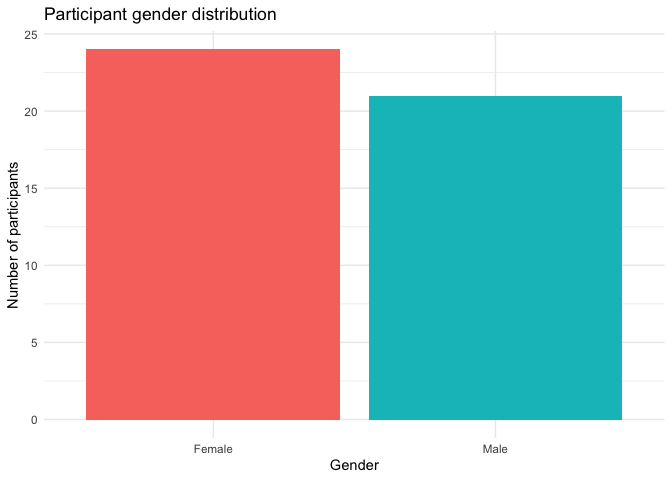

Data Cleaning
================
Eva Wu
2022-05-18

## Recap

### Hypothesis

“Happy” instruments would make people more prone to identify the chord
as major, while “sad” instruments might make people more prone to
identify the chord as minor.

### Exploratory research questions

1)  Association between timbre and tonality judgment

2)  Association between timbre and explicit ratings of instrument
    valence

3)  Association between tonality judgment and explicit ratings of
    instrument valence

4)  Association between musical background and tonality judgment and/or
    explicit ratings of instrument valence

### Design

-   IV1 (w/in-subject): instrument (happy \[marimba, xylophone,
    vibraphone\] vs. neutral \[piano\] vs. sad \[oboe, flute, violin\])

-   IV2 (w/in-subject): tuning of middle note (5 levels, ranging from
    absolute minor to absolute major)

-   IV3 (b/w-subject): key (Bb vs. C) (to find out
    absolute-pitch-related effects)

-   DV: the likelihood that one categorizes a chord as major/minor

### Procedure

-   Pt 1 Sound calibration (choose the quietest sound among 3)

-   Pt 2 Training (press the buttons to listen to the chords, practice
    w/ feedback) + testing phase (listen to 12 chords and choose b/w
    major and minor for each, need to correctly answer 8 to pass)

-   Everyone moves on to the categorization task, but we will only
    analyze the response of those who pass the assessment.

-   Pt 3 Categorization task (jspsych) - listen to 4 blocks of 70 chords
    and choose b/w major and minor for each chord; explicit rating of
    instrument valence at the end

-   Pt 4 Questionnaires (demographics & music experience; Qualtrics)

## Clean Data

    ## Rows: 10,388
    ## Columns: 49
    ## $ participant           <chr> "14vd1s548b9ux8", "14vd1s548b9ux8", "14vd1s548b9…
    ## $ qualtrics_id          <chr> "9800773380", "9800773380", "9800773380", "98007…
    ## $ chord                 <chr> "C", "C", "C", "C", "C", "C", "C", "C", "C", "C"…
    ## $ designation           <chr> "headphone-test", "headphone-test", "headphone-t…
    ## $ response              <chr> "0", "1", "2", "1", "2", "0", "0", "0", "1", "0"…
    ## $ correct               <dbl> 1, 1, 1, 1, 1, 1, NA, NA, NA, NA, NA, NA, NA, NA…
    ## $ passed_practice       <dbl> NA, NA, NA, NA, NA, NA, 1, NA, NA, NA, NA, NA, N…
    ## $ block_passed_practice <dbl> NA, NA, NA, NA, NA, NA, 1, NA, NA, NA, NA, NA, N…
    ## $ practice_score        <dbl> NA, NA, NA, NA, NA, NA, 11, NA, NA, NA, NA, NA, …
    ## $ instrument            <fct> NA, NA, NA, NA, NA, NA, NA, violin, piano, oboe,…
    ## $ valence               <chr> NA, NA, NA, NA, NA, NA, NA, "sad", "neutral", "s…
    ## $ tuning_step           <dbl> NA, NA, NA, NA, NA, NA, NA, 5, 2, 5, 5, 3, 1, 3,…
    ## $ selected_major        <dbl> NA, NA, NA, NA, NA, NA, NA, 1, 0, 1, 1, 0, 0, 0,…
    ## $ explicit_rtg          <dbl> NA, NA, NA, NA, NA, NA, NA, NA, NA, NA, NA, NA, …
    ## $ StartDate             <chr> "2022-02-17 12:13:06", "2022-02-17 12:13:06", "2…
    ## $ jspsych_id            <chr> "14vd1s548b9ux8", "14vd1s548b9ux8", "14vd1s548b9…
    ## $ Age                   <chr> "18", "18", "18", "18", "18", "18", "18", "18", …
    ## $ Gender                <chr> "Female", "Female", "Female", "Female", "Female"…
    ## $ Year                  <chr> "Freshman", "Freshman", "Freshman", "Freshman", …
    ## $ Year_6_TEXT           <chr> NA, NA, NA, NA, NA, NA, NA, NA, NA, NA, NA, NA, …
    ## $ Major                 <chr> "Other (please specify):", "Other (please specif…
    ## $ Major_5_TEXT          <chr> "Public Policy", "Public Policy", "Public Policy…
    ## $ Inst                  <chr> "Yes", "Yes", "Yes", "Yes", "Yes", "Yes", "Yes",…
    ## $ Start                 <chr> "8", "8", "8", "8", "8", "8", "8", "8", "8", "8"…
    ## $ Inst_now              <chr> "No", "No", "No", "No", "No", "No", "No", "No", …
    ## $ Inst_list             <chr> "Clarinet, ages 8-13; voice, ages 11-13", "Clari…
    ## $ Ens                   <chr> "Yes", "Yes", "Yes", "Yes", "Yes", "Yes", "Yes",…
    ## $ Course                <chr> "No", "No", "No", "No", "No", "No", "No", "No", …
    ## $ Course_list           <chr> NA, NA, NA, NA, NA, NA, NA, NA, NA, NA, NA, NA, …
    ## $ Read                  <chr> "Yes", "Yes", "Yes", "Yes", "Yes", "Yes", "Yes",…
    ## $ `Pitch&Tempo_1`       <chr> "61", "61", "61", "61", "61", "61", "61", "61", …
    ## $ `Pitch&Tempo_2`       <chr> "70", "70", "70", "70", "70", "70", "70", "70", …
    ## $ Perf                  <chr> "No", "No", "No", "No", "No", "No", "No", "No", …
    ## $ Time_make             <chr> "Less than one hour", "Less than one hour", "Les…
    ## $ Time_listen           <chr> "1-2 hours", "1-2 hours", "1-2 hours", "1-2 hour…
    ## $ Concert               <chr> "1", "1", "1", "1", "1", "1", "1", "1", "1", "1"…
    ## $ Genre_18              <chr> "25", "25", "25", "25", "25", "25", "25", "25", …
    ## $ Genre_8               <chr> "0", "0", "0", "0", "0", "0", "0", "0", "0", "0"…
    ## $ Genre_9               <chr> "0", "0", "0", "0", "0", "0", "0", "0", "0", "0"…
    ## $ Genre_17              <chr> "0", "0", "0", "0", "0", "0", "0", "0", "0", "0"…
    ## $ Genre_10              <chr> "0", "0", "0", "0", "0", "0", "0", "0", "0", "0"…
    ## $ Genre_11              <chr> "0", "0", "0", "0", "0", "0", "0", "0", "0", "0"…
    ## $ Genre_12              <chr> "25", "25", "25", "25", "25", "25", "25", "25", …
    ## $ Genre_13              <chr> "0", "0", "0", "0", "0", "0", "0", "0", "0", "0"…
    ## $ Genre_16              <chr> "0", "0", "0", "0", "0", "0", "0", "0", "0", "0"…
    ## $ Genre_14              <chr> "0", "0", "0", "0", "0", "0", "0", "0", "0", "0"…
    ## $ Genre_15              <chr> "50", "50", "50", "50", "50", "50", "50", "50", …
    ## $ Genre_15_TEXT         <chr> "Indie", "Indie", "Indie", "Indie", "Indie", "In…
    ## $ id                    <chr> "18935", "18935", "18935", "18935", "18935", "18…

## Demographics

<!-- --><!-- -->

## Practice Score

<!-- -->

## Categorization

<!-- -->

## Explicit Rating

<!-- -->

## Compare trend between tonality judgment and explicit rating

<!-- -->

## Explore correlation between music background & categorization / explicit rating
