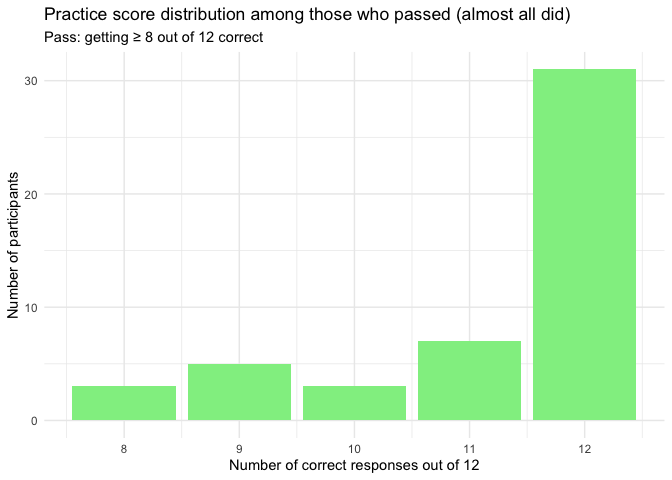
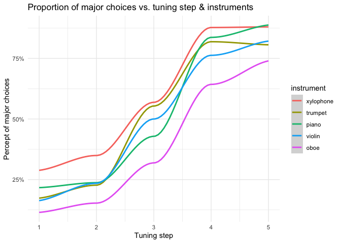
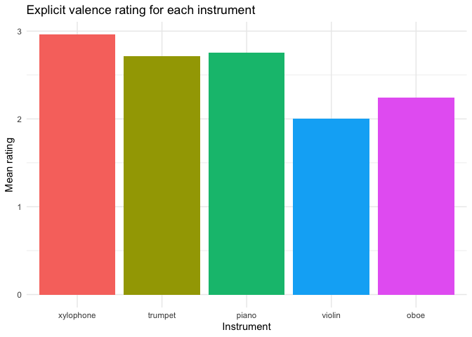
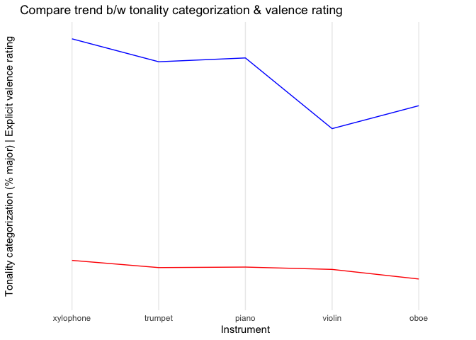

Exploratory Analysis
================
Eva Wu
2022-05-18

## Recap

### Hypothesis

“Happy” instruments would make people more prone to identify the chord
as major, while “sad” instruments might make people more prone to
identify the chord as minor.

### Exploratory research questions

1)  Association between timbre and tonality judgment

2)  Association between timbre and explicit ratings of instrument
    valence

3)  Association between tonality judgment and explicit ratings of
    instrument valence

4)  Association between musical background and tonality judgment and/or
    explicit ratings of instrument valence

### Design

-   IV1 (w/in-subject): instrument (happy \[marimba, xylophone,
    vibraphone\] vs. neutral \[piano\] vs. sad \[oboe, flute, violin\])

-   IV2 (w/in-subject): tuning of middle note (5 levels, ranging from
    absolute minor to absolute major)

-   IV3 (b/w-subject): key (Bb vs. C) (to find out
    absolute-pitch-related effects)

-   DV: the likelihood that one categorizes a chord as major/minor

### Procedure

-   Pt 1 Sound calibration (choose the quietest sound among 3)

-   Pt 2 Training (press the buttons to listen to the chords, practice
    w/ feedback) + testing phase (listen to 12 chords and choose b/w
    major and minor for each, need to correctly answer 8 to pass)

-   Everyone moves on to the categorization task, but we will only
    analyze the response of those who pass the assessment.

-   Pt 3 Categorization task (jspsych) - listen to 4 blocks of 70 chords
    and choose b/w major and minor for each chord; explicit rating of
    instrument valence at the end

-   Pt 4 Questionnaires (demographics & music experience; Qualtrics)

## Clean Data

A snapshot of the data (still need to do further cleaning)

    ## Rows: 10,388
    ## Columns: 49
    ## $ participant           <chr> "14vd1s548b9ux8", "14vd1s548b9ux8", "14vd1s548b9…
    ## $ qualtrics_id          <chr> "9800773380", "9800773380", "9800773380", "98007…
    ## $ chord                 <chr> "C", "C", "C", "C", "C", "C", "C", "C", "C", "C"…
    ## $ designation           <chr> "headphone-test", "headphone-test", "headphone-t…
    ## $ response              <chr> "0", "1", "2", "1", "2", "0", "0", "0", "1", "0"…
    ## $ correct               <dbl> 1, 1, 1, 1, 1, 1, NA, NA, NA, NA, NA, NA, NA, NA…
    ## $ passed_practice       <dbl> NA, NA, NA, NA, NA, NA, 1, NA, NA, NA, NA, NA, N…
    ## $ block_passed_practice <dbl> NA, NA, NA, NA, NA, NA, 1, NA, NA, NA, NA, NA, N…
    ## $ practice_score        <dbl> NA, NA, NA, NA, NA, NA, 11, NA, NA, NA, NA, NA, …
    ## $ instrument            <fct> NA, NA, NA, NA, NA, NA, NA, violin, piano, oboe,…
    ## $ valence               <chr> NA, NA, NA, NA, NA, NA, NA, "sad", "neutral", "s…
    ## $ tuning_step           <dbl> NA, NA, NA, NA, NA, NA, NA, 5, 2, 5, 5, 3, 1, 3,…
    ## $ selected_major        <dbl> NA, NA, NA, NA, NA, NA, NA, 1, 0, 1, 1, 0, 0, 0,…
    ## $ explicit_rtg          <dbl> NA, NA, NA, NA, NA, NA, NA, NA, NA, NA, NA, NA, …
    ## $ StartDate             <chr> "2022-02-17 12:13:06", "2022-02-17 12:13:06", "2…
    ## $ jspsych_id            <chr> "14vd1s548b9ux8", "14vd1s548b9ux8", "14vd1s548b9…
    ## $ Age                   <chr> "18", "18", "18", "18", "18", "18", "18", "18", …
    ## $ Gender                <chr> "Female", "Female", "Female", "Female", "Female"…
    ## $ Year                  <chr> "Freshman", "Freshman", "Freshman", "Freshman", …
    ## $ Year_6_TEXT           <chr> NA, NA, NA, NA, NA, NA, NA, NA, NA, NA, NA, NA, …
    ## $ Major                 <chr> "Other (please specify):", "Other (please specif…
    ## $ Major_5_TEXT          <chr> "Public Policy", "Public Policy", "Public Policy…
    ## $ Inst                  <chr> "Yes", "Yes", "Yes", "Yes", "Yes", "Yes", "Yes",…
    ## $ Start                 <chr> "8", "8", "8", "8", "8", "8", "8", "8", "8", "8"…
    ## $ Inst_now              <chr> "No", "No", "No", "No", "No", "No", "No", "No", …
    ## $ Inst_list             <chr> "Clarinet, ages 8-13; voice, ages 11-13", "Clari…
    ## $ Ens                   <chr> "Yes", "Yes", "Yes", "Yes", "Yes", "Yes", "Yes",…
    ## $ Course                <chr> "No", "No", "No", "No", "No", "No", "No", "No", …
    ## $ Course_list           <chr> NA, NA, NA, NA, NA, NA, NA, NA, NA, NA, NA, NA, …
    ## $ Read                  <chr> "Yes", "Yes", "Yes", "Yes", "Yes", "Yes", "Yes",…
    ## $ `Pitch&Tempo_1`       <chr> "61", "61", "61", "61", "61", "61", "61", "61", …
    ## $ `Pitch&Tempo_2`       <chr> "70", "70", "70", "70", "70", "70", "70", "70", …
    ## $ Perf                  <chr> "No", "No", "No", "No", "No", "No", "No", "No", …
    ## $ Time_make             <chr> "Less than one hour", "Less than one hour", "Les…
    ## $ Time_listen           <chr> "1-2 hours", "1-2 hours", "1-2 hours", "1-2 hour…
    ## $ Concert               <chr> "1", "1", "1", "1", "1", "1", "1", "1", "1", "1"…
    ## $ Genre_18              <chr> "25", "25", "25", "25", "25", "25", "25", "25", …
    ## $ Genre_8               <chr> "0", "0", "0", "0", "0", "0", "0", "0", "0", "0"…
    ## $ Genre_9               <chr> "0", "0", "0", "0", "0", "0", "0", "0", "0", "0"…
    ## $ Genre_17              <chr> "0", "0", "0", "0", "0", "0", "0", "0", "0", "0"…
    ## $ Genre_10              <chr> "0", "0", "0", "0", "0", "0", "0", "0", "0", "0"…
    ## $ Genre_11              <chr> "0", "0", "0", "0", "0", "0", "0", "0", "0", "0"…
    ## $ Genre_12              <chr> "25", "25", "25", "25", "25", "25", "25", "25", …
    ## $ Genre_13              <chr> "0", "0", "0", "0", "0", "0", "0", "0", "0", "0"…
    ## $ Genre_16              <chr> "0", "0", "0", "0", "0", "0", "0", "0", "0", "0"…
    ## $ Genre_14              <chr> "0", "0", "0", "0", "0", "0", "0", "0", "0", "0"…
    ## $ Genre_15              <chr> "50", "50", "50", "50", "50", "50", "50", "50", …
    ## $ Genre_15_TEXT         <chr> "Indie", "Indie", "Indie", "Indie", "Indie", "In…
    ## $ id                    <chr> "18935", "18935", "18935", "18935", "18935", "18…

## Demographics

<!-- --><!-- -->

## Practice Score

<!-- -->

## Categorization

<!-- -->

## Explicit Rating

<!-- -->

## Compare trend between tonality judgment and explicit rating

<!-- -->

## Explore correlation between music background & categorization / explicit rating

TBC

## Statistical Analyses

Descriptives, exploratory plot

    ##      instrument  tuning_step       n            pct_maj          inst_id 
    ##  xylophone:5    Min.   :1    Min.   : 45.0   Min.   :0.1148   Min.   :1  
    ##  trumpet  :5    1st Qu.:2    1st Qu.: 92.0   1st Qu.:0.2347   1st Qu.:2  
    ##  piano    :5    Median :3    Median :196.0   Median :0.5000   Median :3  
    ##  violin   :5    Mean   :3    Mean   :197.6   Mean   :0.5041   Mean   :3  
    ##  oboe     :5    3rd Qu.:4    3rd Qu.:316.0   3rd Qu.:0.8061   3rd Qu.:4  
    ##                 Max.   :5    Max.   :348.0   Max.   :0.8878   Max.   :5  
    ##     mean_rtg    
    ##  Min.   :2.000  
    ##  1st Qu.:2.245  
    ##  Median :2.714  
    ##  Mean   :2.535  
    ##  3rd Qu.:2.755  
    ##  Max.   :2.959

<!-- -->

Correlations b/w 1) instrument’s presumed valence, 2) mean explicit
rating, and 3) tuning step & percent of major categorization, and
4)instrument’s presumed valence & mean explicit rating

    ## [1] 0.2145526

    ## [1] 0.1630075

    ## [1] 0.9350613

    ## [1] 0.853123

Logistic regression

1)  Percent major \~ instrument & tuning step

<!-- -->

    ## 
    ## Call:
    ## glm(formula = pct_maj ~ instrument + tuning_step, family = binomial)
    ## 
    ## Deviance Residuals: 
    ##      Min        1Q    Median        3Q       Max  
    ## -0.20221  -0.11459   0.00986   0.12625   0.24408  
    ## 
    ## Coefficients:
    ##                   Estimate Std. Error z value Pr(>|z|)  
    ## (Intercept)        -2.1771     1.4853  -1.466   0.1427  
    ## instrumenttrumpet  -0.4293     1.4980  -0.287   0.7744  
    ## instrumentpiano    -0.3983     1.4978  -0.266   0.7903  
    ## instrumentviolin   -0.5364     1.4995  -0.358   0.7205  
    ## instrumentoboe     -1.1086     1.5256  -0.727   0.4674  
    ## tuning_step         0.8979     0.3834   2.342   0.0192 *
    ## ---
    ## Signif. codes:  0 '***' 0.001 '**' 0.01 '*' 0.05 '.' 0.1 ' ' 1
    ## 
    ## (Dispersion parameter for binomial family taken to be 1)
    ## 
    ##     Null deviance: 8.24632  on 24  degrees of freedom
    ## Residual deviance: 0.46274  on 19  degrees of freedom
    ## AIC: 28.317
    ## 
    ## Number of Fisher Scoring iterations: 5

2)  Percent major \~ mean explicit rating of each instrument & tuning
    step

<!-- -->

    ## 
    ## Call:
    ## glm(formula = pct_maj ~ mean_rtg + tuning_step, family = binomial)
    ## 
    ## Deviance Residuals: 
    ##      Min        1Q    Median        3Q       Max  
    ## -0.27832  -0.18536   0.02224   0.17012   0.28202  
    ## 
    ## Coefficients:
    ##             Estimate Std. Error z value Pr(>|z|)  
    ## (Intercept)  -4.3947     3.7112  -1.184   0.2363  
    ## mean_rtg      0.6941     1.3323   0.521   0.6024  
    ## tuning_step   0.8859     0.3789   2.338   0.0194 *
    ## ---
    ## Signif. codes:  0 '***' 0.001 '**' 0.01 '*' 0.05 '.' 0.1 ' ' 1
    ## 
    ## (Dispersion parameter for binomial family taken to be 1)
    ## 
    ##     Null deviance: 8.24632  on 24  degrees of freedom
    ## Residual deviance: 0.75289  on 22  degrees of freedom
    ## AIC: 22.44
    ## 
    ## Number of Fisher Scoring iterations: 4

Linear regression

    ## 
    ## Call:
    ## lm(formula = pct_maj ~ instrument + tuning_step, data = cat)
    ## 
    ## Residuals:
    ##       Min        1Q    Median        3Q       Max 
    ## -0.106888 -0.073469  0.002551  0.059184  0.133418 
    ## 
    ## Coefficients:
    ##                   Estimate Std. Error t value Pr(>|t|)    
    ## (Intercept)        0.04719    0.05198   0.908  0.37533    
    ## instrumenttrumpet -0.07704    0.05334  -1.444  0.16490    
    ## instrumentpiano   -0.07143    0.05334  -1.339  0.19629    
    ## instrumentviolin  -0.09643    0.05334  -1.808  0.08647 .  
    ## instrumentoboe    -0.19898    0.05334  -3.731  0.00142 ** 
    ## tuning_step        0.18189    0.01193  15.251 4.11e-12 ***
    ## ---
    ## Signif. codes:  0 '***' 0.001 '**' 0.01 '*' 0.05 '.' 0.1 ' ' 1
    ## 
    ## Residual standard error: 0.08433 on 19 degrees of freedom
    ## Multiple R-squared:  0.9286, Adjusted R-squared:  0.9098 
    ## F-statistic: 49.41 on 5 and 19 DF,  p-value: 3.097e-10

ANOVA exploring 1) whether adding instrument as a predictor
significantly improves model, and 2) whether adding both predictors is
significantly better than null model

    ## Analysis of Variance Table
    ## 
    ## Model 1: pct_maj ~ instrument + tuning_step
    ## Model 2: pct_maj ~ tuning_step
    ##   Res.Df     RSS Df Sum of Sq      F Pr(>F)  
    ## 1     19 0.13512                             
    ## 2     23 0.23774 -4  -0.10262 3.6074 0.0238 *
    ## ---
    ## Signif. codes:  0 '***' 0.001 '**' 0.01 '*' 0.05 '.' 0.1 ' ' 1

    ## Analysis of Variance Table
    ## 
    ## Response: pct_maj
    ##             Df  Sum Sq Mean Sq  F value    Pr(>F)    
    ## instrument   4 0.10262 0.02565   3.6074    0.0238 *  
    ## tuning_step  1 1.65416 1.65416 232.6004 4.108e-12 ***
    ## Residuals   19 0.13512 0.00711                       
    ## ---
    ## Signif. codes:  0 '***' 0.001 '**' 0.01 '*' 0.05 '.' 0.1 ' ' 1
