Effects of Timbre on Tonality Perception - Data Analyses
================
Eva Wu
2026-05-26

*This script referenced code from my stats professor Liz Page-Gould and
collaborator/MA thesis advisor Stephen Van Hedger.*

This project examines how instrumental timbre influences categorization
of three-note arpeggios as major versus minor. Middle note of the
arpeggios has five steps, ranging from +0c (minor) to +100c (major) in
25c increments. Participants heard five instruments in total in
Experiment 1 (randomized across trial): piano, oboe, violin, trumpet,
xylophone. To investigate whether effects were due to acoustic reasons
or learned associations, we conducted Experiment 2 using six artificial
timbres, varying in terms of spectral centroid (low, mid, high) and
amplitude envelope (rounded versus percussive).

Judgments should be theoretically independent of instrument. However, if
certain timbres are more strongly associated with positive/negative
affect, then it is possible that this will be reflected in the
categorization task (i.e., “happier” instruments leading to a greater
likelihood of responding “major”), despite no explicit instructions to
base judgments on these characteristics.

At the end of the experiment, participants are asked to make explicit
ratings on how likely each instrument is to play a sad melody.

## 1. Demographics

``` r
# exp1
df_demo1 %>%
  get_summary_stats(c(Age, Inst_yr, accuracy), type = "full") %>%
  dplyr::select(n, variable, mean, sd, min, max)
```

    ## # A tibble: 3 × 6
    ##       n variable   mean    sd    min   max
    ##   <dbl> <fct>     <dbl> <dbl>  <dbl> <dbl>
    ## 1    43 Age      20.1   2.40  18        32
    ## 2    44 Inst_yr   6.48  5.28   0        23
    ## 3    48 accuracy  0.938 0.101  0.667     1

``` r
df_demo1 %>%
  ggplot(aes(Age)) +
  geom_bar()
```

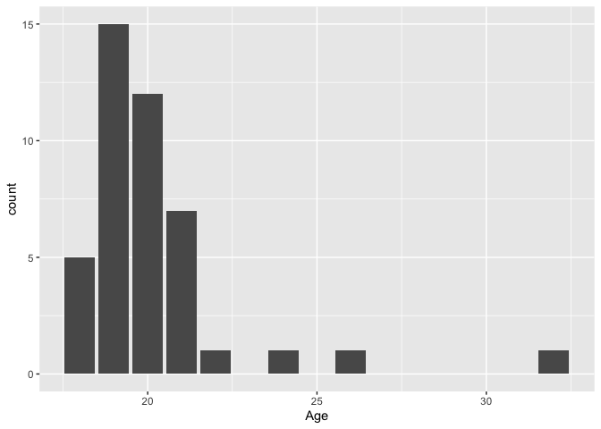<!-- -->

``` r
df_demo1 %>%
  ggplot(aes(Gender)) +
  geom_bar()
```

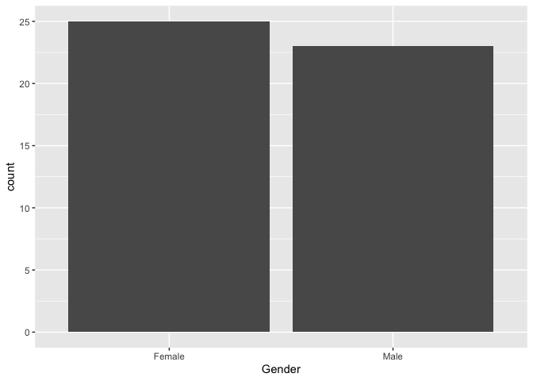<!-- -->

``` r
df_demo1 %>%
  ggplot(aes(Inst)) +
  geom_bar() +
  labs(title = "Had instrument training or not")
```

<!-- -->

``` r
df_demo1 %>%
  ggplot(aes(Inst_yr)) +
  geom_bar() +
  labs(title = "Years of most trained instrument")
```

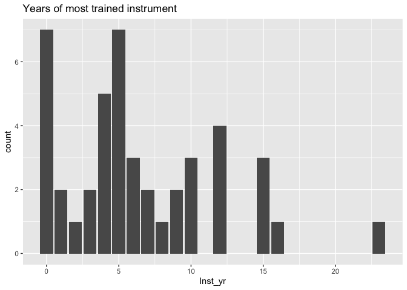<!-- -->

``` r
df_demo1 %>%
  ggplot(aes(block_passed_practice)) +
  geom_bar()
```

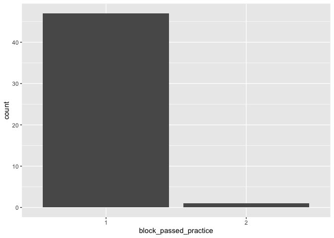<!-- -->

``` r
# exp1
df_demo2 %>%
  get_summary_stats(c(Age, Inst_yr, accuracy), type = "full") %>%
  dplyr::select(n, variable, mean, sd, min, max)
```

    ## # A tibble: 3 × 6
    ##       n variable   mean    sd    min   max
    ##   <dbl> <fct>     <dbl> <dbl>  <dbl> <dbl>
    ## 1    54 Age      19.5   1.16  18        23
    ## 2    53 Inst_yr   6.46  5.45   0        19
    ## 3    58 accuracy  0.911 0.112  0.667     1

``` r
df_demo2 %>%
  ggplot(aes(Age)) +
  geom_bar()
```

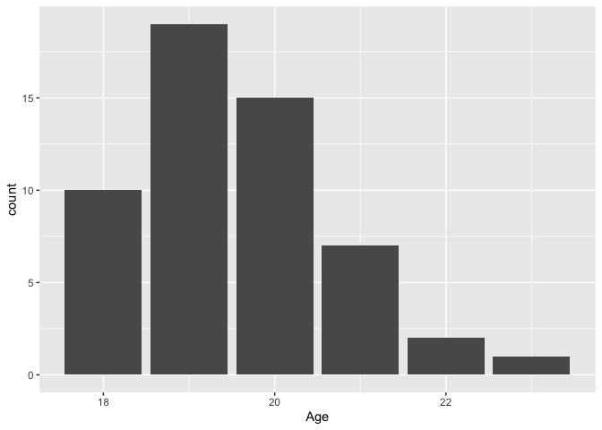<!-- -->

``` r
df_demo2 %>%
  ggplot(aes(Gender)) +
  geom_bar()
```

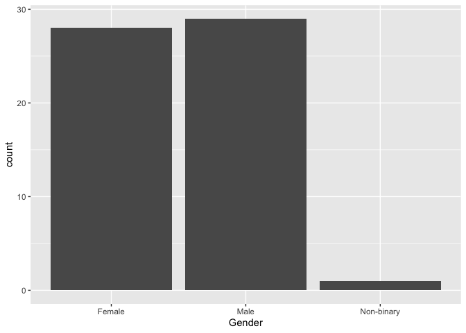<!-- -->

``` r
df_demo2 %>%
  ggplot(aes(Inst)) +
  geom_bar() +
  labs(title = "Had instrument training or not")
```

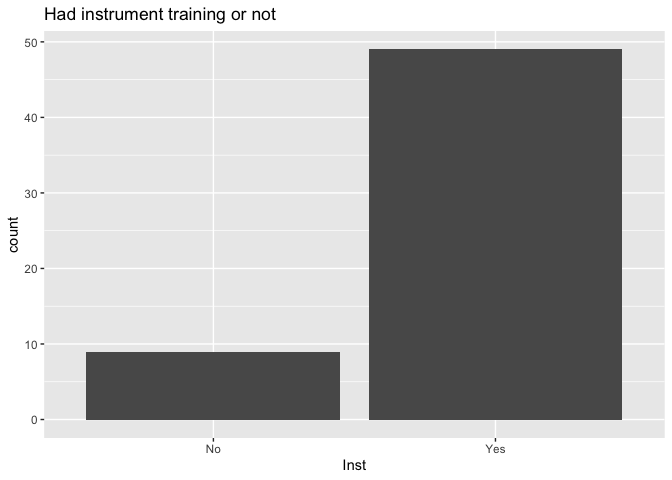<!-- -->

``` r
df_demo2 %>%
  ggplot(aes(Inst_yr)) +
  geom_bar() + 
  labs(title = "Years of most trained instrument")
```

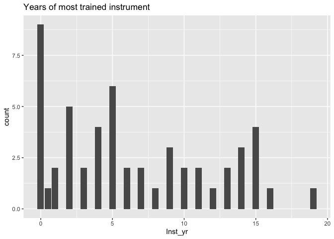<!-- -->

``` r
df_demo2 %>%
  ggplot(aes(block_passed_practice)) +
  geom_bar()
```

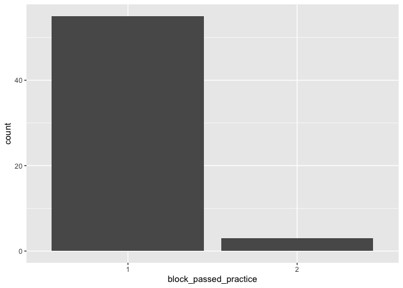<!-- -->

48 participants in exp1, 58 in exp2.

Most of our sample had prior musical training. This is good because
together with the practice test results, we were quite confident that
people knew what they were supposed to do. However, this limits the
generalizability of our results to non-musicians.

## 2. Tonality Categorization Analysis

We used binomial/probit regression to model tonality categorization
against instrument timbre and tuning step, because DV is binary (major =
1, minor = 0), and we were interested in comparing points of subjective
equality (PSEs) for each instrument.

### Calculate ICC

``` r
# baseline model
model_base_cat1 <- df_sum1 %>%
  glmer(cbind(count_major, count_minor) ~ (1 | participant) + 1, family = binomial(link = "probit"), data=.)
icc(model_base_cat1) # from performance package
```

    ## # Intraclass Correlation Coefficient
    ## 
    ##     Adjusted ICC: 0.228
    ##   Unadjusted ICC: 0.228

``` r
model_base_cat2 <- df_sum2 %>%
  glmer(cbind(count_major, count_minor) ~ (1 | participant) + 1, family = binomial(link = "probit"), data=.)
icc(model_base_cat2)
```

    ## # Intraclass Correlation Coefficient
    ## 
    ##     Adjusted ICC: 0.317
    ##   Unadjusted ICC: 0.317

First, we checked for ICC of the baseline model. ICC for both
experiments were greater than .1, indicating clustering effects within
each participant. Therefore, random effects were included in the models.

### Model Comparison (GLMM)

We modeled probability of major tonality categorization against tuning
step (5 levels, treated as a continuous numeric variable, centered ahead
of time) and instrument timbre (5 levels for exp1, 6 for exp2,
categorical variable).

We were not sure which random slopes to include, if at all, so we
compared models without random slope (only random intercept), with
random slope of instrument or tuning step, and with both random slopes.

``` r
# start with maximal model (Barr et al., 2013) 
# since we are using mixpsy to calculate PSE, we have to convert binary DV to sum
model_maximal1 <- df_sum1 %>%
  glmer(cbind(count_major, count_minor) ~ tuning_c * instrument + (1 + tuning_c + instrument | participant), 
        family = binomial(link = "probit"), data = ., control = glmerControl(optimizer = "bobyqa"))

# model is singular (convergence issue) - model too complicated
# which makes sense given instrument is a categorical variable
model_maximal2 <- df_sum2 %>%
  glmer(cbind(count_major, count_minor) ~ tuning_c * instrument + (1 + tuning_c + instrument | participant), 
        family = binomial(link = "probit"), data = ., control = glmerControl(optimizer = "bobyqa"))
```

    ## boundary (singular) fit: see help('isSingular')

``` r
# try deleting 1 random slope
model_tuning1 <- df_sum1 %>%
  glmer(cbind(count_major, count_minor) ~ tuning_c * instrument + (1 + tuning_c | participant), 
        family = binomial(link = "probit"), data = ., control = glmerControl(optimizer = "bobyqa"))

model_tuning2 <- df_sum2 %>%
  glmer(cbind(count_major, count_minor) ~ tuning_c * instrument + (1 + tuning_c | participant), 
        family = binomial(link = "probit"), data = ., control = glmerControl(optimizer = "bobyqa"))

# try deleting another random slope instead
model_instrument1 <- df_sum1 %>%
  glmer(cbind(count_major, count_minor) ~ tuning_c * instrument + (1 + instrument | participant), 
        family = binomial(link = "probit"), data = ., control = glmerControl(optimizer = "bobyqa"))

# model is still singular (too many instruments)
model_instrument2 <- df_sum2 %>%
  glmer(cbind(count_major, count_minor) ~ tuning_c * instrument + (1 + instrument | participant), 
        family = binomial(link = "probit"), data = ., control = glmerControl(optimizer = "bobyqa"))
```

    ## boundary (singular) fit: see help('isSingular')

``` r
anova(model_maximal1, model_tuning1)
```

    ## Data: .
    ## Models:
    ## model_tuning1: cbind(count_major, count_minor) ~ tuning_c * instrument + (1 + tuning_c | participant)
    ## model_maximal1: cbind(count_major, count_minor) ~ tuning_c * instrument + (1 + tuning_c + instrument | participant)
    ##                npar    AIC    BIC  logLik deviance  Chisq Df Pr(>Chisq)    
    ## model_tuning1    13 3814.8 3881.0 -1894.4   3788.8                         
    ## model_maximal1   31 3500.7 3658.5 -1719.3   3438.7 350.15 18  < 2.2e-16 ***
    ## ---
    ## Signif. codes:  0 '***' 0.001 '**' 0.01 '*' 0.05 '.' 0.1 ' ' 1

``` r
# including both random slope (vs only 1 of the 2) significantly improves model
anova(model_maximal1, model_instrument1)
```

    ## Data: .
    ## Models:
    ## model_instrument1: cbind(count_major, count_minor) ~ tuning_c * instrument + (1 + instrument | participant)
    ## model_maximal1: cbind(count_major, count_minor) ~ tuning_c * instrument + (1 + tuning_c + instrument | participant)
    ##                   npar    AIC    BIC  logLik deviance  Chisq Df Pr(>Chisq)    
    ## model_instrument1   25 5077.9 5205.2 -2513.9   5027.9                         
    ## model_maximal1      31 3500.7 3658.5 -1719.3   3438.7 1589.2  6  < 2.2e-16 ***
    ## ---
    ## Signif. codes:  0 '***' 0.001 '**' 0.01 '*' 0.05 '.' 0.1 ' ' 1

``` r
# including random slope of tuning step (vs instrument) results in lower AIC/BIC 
anova(model_tuning1, model_instrument1)
```

    ## Data: .
    ## Models:
    ## model_tuning1: cbind(count_major, count_minor) ~ tuning_c * instrument + (1 + tuning_c | participant)
    ## model_instrument1: cbind(count_major, count_minor) ~ tuning_c * instrument + (1 + instrument | participant)
    ##                   npar    AIC    BIC  logLik deviance Chisq Df Pr(>Chisq)
    ## model_tuning1       13 3814.8 3881.0 -1894.4   3788.8                    
    ## model_instrument1   25 5077.9 5205.2 -2513.9   5027.9     0 12          1

Even though likelihood ratio test (LRT) showed that the model including
both random slopes explained the most variance, it resulted in model
convergence issues (especially for exp2 because there were 6
instruments). Therefore, we decided to only include 1 random slope.
Including the random slope for tuning step resulted in a better model
than including that for instrument.

### Model Summary

``` r
# examine results of the model we decided on
summary(model_tuning1) # baseline = oboe
```

    ## Generalized linear mixed model fit by maximum likelihood (Laplace
    ##   Approximation) [glmerMod]
    ##  Family: binomial  ( probit )
    ## Formula: cbind(count_major, count_minor) ~ tuning_c * instrument + (1 +  
    ##     tuning_c | participant)
    ##    Data: .
    ## Control: glmerControl(optimizer = "bobyqa")
    ## 
    ##      AIC      BIC   logLik deviance df.resid 
    ##   3814.8   3881.0  -1894.4   3788.8     1187 
    ## 
    ## Scaled residuals: 
    ##     Min      1Q  Median      3Q     Max 
    ## -16.641  -0.628   0.000   0.767  38.736 
    ## 
    ## Random effects:
    ##  Groups      Name        Variance Std.Dev. Corr
    ##  participant (Intercept) 0.2177   0.4666       
    ##              tuning_c    0.7002   0.8368   0.09
    ## Number of obs: 1200, groups:  participant, 48
    ## 
    ## Fixed effects:
    ##                              Estimate Std. Error z value Pr(>|z|)    
    ## (Intercept)                  -0.44956    0.07756  -5.796 6.78e-09 ***
    ## tuning_c                      0.93237    0.12666   7.361 1.82e-13 ***
    ## instrumentviolin              0.40672    0.05106   7.966 1.64e-15 ***
    ## instrumenttrumpet             0.49617    0.05121   9.689  < 2e-16 ***
    ## instrumentpiano               0.52860    0.05159  10.246  < 2e-16 ***
    ## instrumentxylophone           0.82062    0.05194  15.798  < 2e-16 ***
    ## tuning_c:instrumentviolin     0.02764    0.04020   0.687    0.492    
    ## tuning_c:instrumenttrumpet    0.03530    0.04019   0.878    0.380    
    ## tuning_c:instrumentpiano      0.10076    0.04100   2.458    0.014 *  
    ## tuning_c:instrumentxylophone -0.01137    0.04077  -0.279    0.780    
    ## ---
    ## Signif. codes:  0 '***' 0.001 '**' 0.01 '*' 0.05 '.' 0.1 ' ' 1
    ## 
    ## Correlation of Fixed Effects:
    ##                 (Intr) tnng_c instrmntv instrmntt instrmntp instrmntx
    ## tuning_c         0.056                                               
    ## instrmntvln     -0.336  0.031                                        
    ## instrmnttrm     -0.335  0.032  0.512                                 
    ## instrumntpn     -0.334  0.032  0.508     0.508                       
    ## instrmntxyl     -0.333  0.039  0.507     0.507     0.503             
    ## tnng_c:nstrmntv  0.049 -0.161 -0.082    -0.074    -0.074    -0.073   
    ## tnng_c:nstrmntt  0.049 -0.161 -0.074    -0.068    -0.073    -0.073   
    ## tnng_c:nstrmntp  0.046 -0.156 -0.072    -0.072    -0.046    -0.070   
    ## tnng_c:nstrmntx  0.049 -0.160 -0.074    -0.074    -0.073    -0.017   
    ##                 tnng_c:nstrmntv tnng_c:nstrmntt tnng_c:nstrmntp
    ## tuning_c                                                       
    ## instrmntvln                                                    
    ## instrmnttrm                                                    
    ## instrumntpn                                                    
    ## instrmntxyl                                                    
    ## tnng_c:nstrmntv                                                
    ## tnng_c:nstrmntt  0.510                                         
    ## tnng_c:nstrmntp  0.500           0.500                         
    ## tnng_c:nstrmntx  0.504           0.504           0.495

``` r
summary(model_tuning2) # baseline = T1
```

    ## Generalized linear mixed model fit by maximum likelihood (Laplace
    ##   Approximation) [glmerMod]
    ##  Family: binomial  ( probit )
    ## Formula: cbind(count_major, count_minor) ~ tuning_c * instrument + (1 +  
    ##     tuning_c | participant)
    ##    Data: .
    ## Control: glmerControl(optimizer = "bobyqa")
    ## 
    ##      AIC      BIC   logLik deviance df.resid 
    ##   5257.9   5339.9  -2614.0   5227.9     1725 
    ## 
    ## Scaled residuals: 
    ##      Min       1Q   Median       3Q      Max 
    ## -13.7266  -0.5978   0.0024   0.6345  30.7818 
    ## 
    ## Random effects:
    ##  Groups      Name        Variance Std.Dev. Corr 
    ##  participant (Intercept) 0.1950   0.4416        
    ##              tuning_c    0.6972   0.8350   -0.48
    ## Number of obs: 1740, groups:  participant, 58
    ## 
    ## Fixed effects:
    ##                       Estimate Std. Error z value Pr(>|z|)    
    ## (Intercept)           -0.10595    0.06696  -1.582  0.11359    
    ## tuning_c               0.89151    0.11434   7.797 6.35e-15 ***
    ## instrumentT2          -0.02568    0.04552  -0.564  0.57266    
    ## instrumentT3           0.17269    0.04534   3.809  0.00014 ***
    ## instrumentT4           0.06197    0.04590   1.350  0.17703    
    ## instrumentT5           0.08695    0.04549   1.912  0.05594 .  
    ## instrumentT6           0.27402    0.04619   5.933 2.98e-09 ***
    ## tuning_c:instrumentT2  0.03870    0.03588   1.079  0.28067    
    ## tuning_c:instrumentT3  0.00898    0.03564   0.252  0.80109    
    ## tuning_c:instrumentT4  0.11402    0.03657   3.118  0.00182 ** 
    ## tuning_c:instrumentT5  0.02918    0.03578   0.816  0.41466    
    ## tuning_c:instrumentT6  0.10221    0.03655   2.796  0.00518 ** 
    ## ---
    ## Signif. codes:  0 '***' 0.001 '**' 0.01 '*' 0.05 '.' 0.1 ' ' 1
    ## 
    ## Correlation of Fixed Effects:
    ##             (Intr) tnng_c instT2 instT3 instT4 instT5 instT6 tn_:T2 tn_:T3
    ## tuning_c    -0.409                                                        
    ## instrumntT2 -0.335  0.002                                                 
    ## instrumntT3 -0.338  0.005  0.496                                          
    ## instrumntT4 -0.333  0.003  0.490  0.492                                   
    ## instrumntT5 -0.336  0.004  0.494  0.496  0.490                            
    ## instrumntT6 -0.332  0.007  0.487  0.490  0.483  0.488                     
    ## tnng_c:nsT2  0.005 -0.153 -0.019 -0.007 -0.007 -0.007 -0.007              
    ## tnng_c:nsT3  0.006 -0.155 -0.007  0.010 -0.007 -0.007 -0.007  0.495       
    ## tnng_c:nsT4  0.005 -0.150 -0.007 -0.007  0.000 -0.007 -0.006  0.482  0.485
    ## tnng_c:nsT5  0.005 -0.155 -0.007 -0.007 -0.007  0.005 -0.007  0.492  0.496
    ## tnng_c:nsT6  0.005 -0.150 -0.007 -0.007 -0.007 -0.007  0.045  0.482  0.486
    ##             tn_:T4 tn_:T5
    ## tuning_c                 
    ## instrumntT2              
    ## instrumntT3              
    ## instrumntT4              
    ## instrumntT5              
    ## instrumntT6              
    ## tnng_c:nsT2              
    ## tnng_c:nsT3              
    ## tnng_c:nsT4              
    ## tnng_c:nsT5  0.483       
    ## tnng_c:nsT6  0.474  0.484

### Post-hoc Comparison

``` r
# pairwise comparison at the 3rd tuning_step (+50c)
# exp 1
emmeans(model_tuning1, "instrument") %>%
  pairs()
```

    ## NOTE: Results may be misleading due to involvement in interactions

    ## Note: Use 'contrast(regrid(object), ...)' to obtain contrasts of back-transformed estimates

    ##  contrast            estimate     SE  df z.ratio p.value
    ##  oboe - violin        -0.4067 0.0511 Inf  -7.966  <.0001
    ##  oboe - trumpet       -0.4962 0.0512 Inf  -9.689  <.0001
    ##  oboe - piano         -0.5286 0.0516 Inf -10.246  <.0001
    ##  oboe - xylophone     -0.8206 0.0519 Inf -15.798  <.0001
    ##  violin - trumpet     -0.0895 0.0505 Inf  -1.771  0.3906
    ##  violin - piano       -0.1219 0.0509 Inf  -2.395  0.1167
    ##  violin - xylophone   -0.4139 0.0511 Inf  -8.092  <.0001
    ##  trumpet - piano      -0.0324 0.0510 Inf  -0.636  0.9693
    ##  trumpet - xylophone  -0.3244 0.0512 Inf  -6.334  <.0001
    ##  piano - xylophone    -0.2920 0.0516 Inf  -5.660  <.0001
    ## 
    ## Note: contrasts are still on the probit scale 
    ## P value adjustment: tukey method for comparing a family of 5 estimates

``` r
# exp 2
emmeans(model_tuning2, "instrument") %>%
  pairs()
```

    ## NOTE: Results may be misleading due to involvement in interactions
    ## Note: Use 'contrast(regrid(object), ...)' to obtain contrasts of back-transformed estimates

    ##  contrast estimate     SE  df z.ratio p.value
    ##  T1 - T2    0.0257 0.0455 Inf   0.564  0.9933
    ##  T1 - T3   -0.1727 0.0453 Inf  -3.809  0.0019
    ##  T1 - T4   -0.0620 0.0459 Inf  -1.350  0.7569
    ##  T1 - T5   -0.0870 0.0455 Inf  -1.912  0.3949
    ##  T1 - T6   -0.2740 0.0462 Inf  -5.933  <.0001
    ##  T2 - T3   -0.1984 0.0456 Inf  -4.349  0.0002
    ##  T2 - T4   -0.0876 0.0462 Inf  -1.898  0.4033
    ##  T2 - T5   -0.1126 0.0458 Inf  -2.461  0.1359
    ##  T2 - T6   -0.2997 0.0465 Inf  -6.451  <.0001
    ##  T3 - T4    0.1107 0.0460 Inf   2.407  0.1535
    ##  T3 - T5    0.0857 0.0456 Inf   1.881  0.4137
    ##  T3 - T6   -0.1013 0.0462 Inf  -2.192  0.2415
    ##  T4 - T5   -0.0250 0.0461 Inf  -0.541  0.9945
    ##  T4 - T6   -0.2121 0.0468 Inf  -4.530  0.0001
    ##  T5 - T6   -0.1871 0.0464 Inf  -4.031  0.0008
    ## 
    ## Note: contrasts are still on the probit scale 
    ## P value adjustment: tukey method for comparing a family of 6 estimates

At the 3rd tuning step (+50c) -

Exp1: oboe \< all, xylophone \> all

Exp2: T6 \> all but T3, T3 \> T1&2, T1 \< T3&6

### PSE Analysis

PSE represents the tuning step at which the probability of selecting
major (or minor) is .5 (probit(p) = 0). Higher PSE means chords played
on that instrument tend to sound more minor. Lower PSE means the
instrument is more biased towards major.

``` r
# the mixpsy package can helps us achieve this with 1 line of code
mixpsy_x1 <- xplode(model_tuning1, name.cont="tuning_c", name.factor = "instrument")
pses1 <- MixDelta(mixpsy_x1) 

mixpsy_x2 <- xplode(model_tuning2, name.cont="tuning_c", name.factor = "instrument")
pses2 <- MixDelta(mixpsy_x2) # convergence issue, but gradient only .007 -> acceptable

pses1
```

    ## $instrumentoboe
    ##      statistics
    ##        Estimate Std. Error  Inferior  Superior
    ##   pse 0.4821810 0.10870264 0.2691277 0.6952343
    ##   jnd 0.7233781 0.09825908 0.5307939 0.9159624
    ## 
    ## $instrumentviolin
    ##      statistics
    ##         Estimate Std. Error   Inferior Superior
    ##   pse 0.04463122 0.08106158 -0.1142466 0.203509
    ##   jnd 0.70258978 0.09262883  0.5210406 0.884139
    ## 
    ## $instrumenttrumpet
    ##      statistics
    ##          Estimate Std. Error   Inferior  Superior
    ##   pse -0.04820907 0.07962360 -0.2042684 0.1078503
    ##   jnd  0.69700645 0.09116804  0.5183204 0.8756925
    ## 
    ## $instrumentpiano
    ##      statistics
    ##          Estimate Std. Error   Inferior   Superior
    ##   pse -0.07649835 0.07484165 -0.2231853 0.07018859
    ##   jnd  0.65284429 0.08017169  0.4957107 0.80997791
    ## 
    ## $instrumentxylophone
    ##      statistics
    ##         Estimate Std. Error   Inferior   Superior
    ##   pse -0.4029295  0.0964682 -0.5920037 -0.2138553
    ##   jnd  0.7323318  0.1007288  0.5349070  0.9297566

``` r
pses2
```

    ## $instrumentT1
    ##      statistics
    ##        Estimate Std. Error    Inferior  Superior
    ##   pse 0.1186825 0.07026243 -0.01902931 0.2563943
    ##   jnd 0.7565712 0.09701949  0.56641647 0.9467259
    ## 
    ## $instrumentT2
    ##      statistics
    ##        Estimate Std. Error   Inferior  Superior
    ##   pse 0.1415029 0.06701431 0.01015723 0.2728485
    ##   jnd 0.7251076 0.08922763 0.55022467 0.8999905
    ## 
    ## $instrumentT3
    ##      statistics
    ##          Estimate Std. Error   Inferior   Superior
    ##   pse -0.07412051 0.07864459 -0.2282611 0.08002006
    ##   jnd  0.74903746 0.09514953  0.5625478 0.93552712
    ## 
    ## $instrumentT4
    ##      statistics
    ##         Estimate Std. Error    Inferior  Superior
    ##   pse 0.04373657 0.06519160 -0.08403662 0.1715097
    ##   jnd 0.67078039 0.07651175  0.52082012 0.8207407
    ## 
    ## $instrumentT5
    ##      statistics
    ##         Estimate Std. Error   Inferior  Superior
    ##   pse 0.02065377 0.07190051 -0.1202686 0.1615762
    ##   jnd 0.73256900 0.09103030  0.5541529 0.9109851
    ## 
    ## $instrumentT6
    ##      statistics
    ##         Estimate Std. Error   Inferior    Superior
    ##   pse -0.1691891 0.07765555 -0.3213912 -0.01698704
    ##   jnd  0.6787662 0.07835030  0.5252024  0.83232993

### Visualizations

We calculated predicted probability values at tuning steps with smaller
bins so that we could plot a smoothed curve graph rather than just a
line graph. We also calculated predicted probability values at the 3rd
(middle) tuning step.

``` r
df_cat_plot1 <- emmeans(model_tuning1, c("tuning_c", "instrument"),
                        at = list(instrument = instruments1,
                                  tuning_c = seq(-2, 2, length = 25)), 
                        type = "response") %>% # converts to probability rather than probit
  as_tibble() 

# predicted probability at 3rd tuning step
df_cat_pts1 <- emmeans(model_tuning1, c("tuning_c", "instrument"),
                       at = list(instrument = instruments1,
                                 # discrete tuning steps
                                 tuning_c = -2:2), 
                       type = "response") %>%
  as_tibble()

# do the same for exp2
df_cat_plot2 <- emmeans(model_tuning2, c("tuning_c", "instrument"),
                        at = list(instrument = instruments2,
                                  tuning_c = seq(-2, 2, length = 30)), 
                        type = "response") %>%
  as_tibble() 

df_cat_pts2 <- emmeans(model_tuning2, c("tuning_c", "instrument"),
                       at = list(instrument = instruments2,
                                 # discrete tuning steps
                                 tuning_c = -2:2), 
                       type = "response") %>%
  as_tibble()

# PSEs for plotting
df_pse1 <- pses1 %>%
  as.data.frame() %>%
  rownames_to_column("parameter") %>%
  pivot_longer(-parameter,
               names_to = "instrument",
               values_to = "value") %>%
  separate(instrument, c("instrument", "param")) %>%
  filter(parameter == "pse") %>%
  pivot_wider(names_from = "param", values_from = "value") %>%
  mutate(instrument = str_remove(instrument, "instrument"),
         instrument = factor(instrument, levels = instruments1), # reorder
         PSE = (Estimate+2)*25,
         SE = Std*25,
         CI.low = (Inferior+2)*25,
         CI.upp = (Superior+2)*25) %>%
  dplyr::select(-parameter, -Estimate, -Std, -Inferior, -Superior)

df_pse2 <- pses2 %>%
  as.data.frame() %>%
  rownames_to_column("parameter") %>%
  pivot_longer(-parameter,
               names_to = "instrument",
               values_to = "value") %>%
  separate(instrument, c("instrument", "param")) %>%
  filter(parameter == "pse") %>%
  pivot_wider(names_from = "param", values_from = "value") %>%
  mutate(instrument = str_remove(instrument, "instrument"),
         PSE = (Estimate+2)*25,
         SE = Std*25,
         CI.low = (Inferior+2)*25,
         CI.upp = (Superior+2)*25) %>%
  dplyr::select(-parameter, -Estimate, -Std, -Inferior, -Superior)
```

``` r
# exp1

# graphing probability
df_cat_plot1 %>%
  ggplot(aes(x = tuning_c, y = prob, color = instrument)) +
  geom_line() + # so that it reflects model predicted value
  geom_line(aes(y = 0.5), color = "grey", linetype = "dotted") +
  geom_point(data = df_cat_pts1) +
  geom_errorbar(data = df_cat_pts1, aes(ymin = prob-SE, ymax = prob+SE), width = 0.1) +
  scale_x_continuous(labels = c("0", "25", "50", "75", "100")) +
  labs(y = "Predicted likelihood of major categorization",
       x = "Tuning step (+cents)") +
  theme_minimal()
```

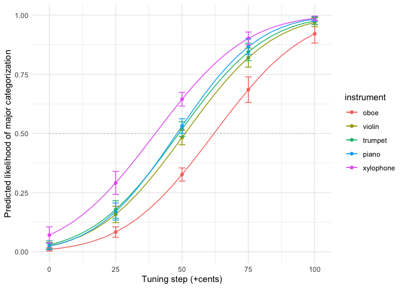<!-- -->

``` r
# tuning step = 3
df_cat_pts1 %>%
  filter(tuning_c == 0) %>%
  ggplot(aes(instrument, prob, fill = instrument)) +
  geom_col() +
  geom_errorbar(aes(ymin = prob-SE, ymax = prob+SE), width = 0.1) +
  labs(x = "Instrument", y = "Avg predicted likelihood of major categorization",
       title = "Tonality Categorization at Tuning Step = +50c") +
  guides(fill = "none") +
  theme_minimal()
```

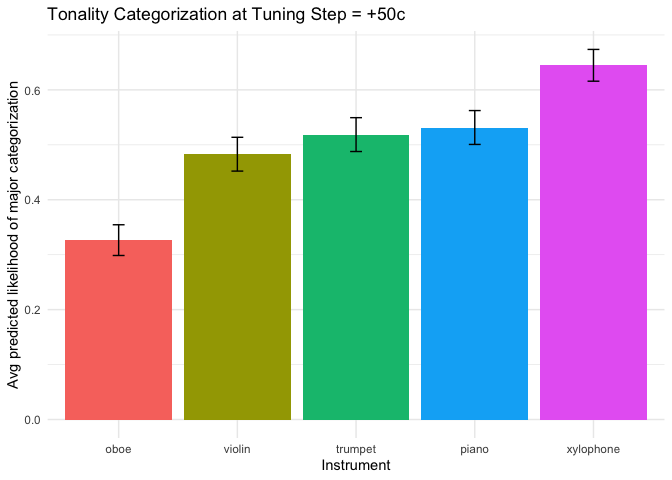<!-- -->

``` r
# pse
df_pse1 %>%
  ggplot(aes(instrument, PSE, fill = instrument)) +
  geom_col() +
  geom_errorbar(aes(ymin = CI.low, ymax = CI.upp), width = 0.1) + 
  labs(x = "Instrument", y = "Tuning step (cents) at which \nprobability of major categorization = 50%",
       title = "Points of Subjective Equality (PSE)") +
  guides(fill = "none") +
  theme_minimal()
```

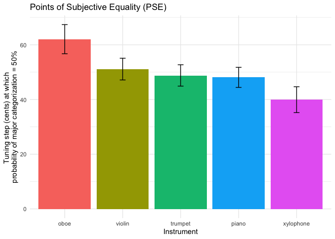<!-- -->

``` r
# exp1

df_cat_plot2 %>%
  ggplot(aes(x = tuning_c, y = prob, color = instrument)) +
  geom_line() + # so that it reflects model predicted value
  geom_line(aes(y = 0.5), color = "grey", linetype = "dotted") +
  geom_point(data = df_cat_pts2) +
  geom_errorbar(data = df_cat_pts2, aes(ymin = prob-SE, ymax = prob+SE), width = 0.1) +
  scale_x_continuous(labels = c("0", "25", "50", "75", "100")) +
  labs(y = "Predicted Likelihood of Major Categorization",
       x = "Tuning step (+cents)") +
  theme_minimal()
```

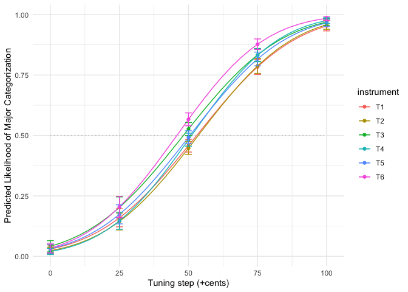<!-- -->

``` r
df_cat_pts2 %>%
  filter(tuning_c == 0) %>%
  ggplot(aes(instrument, prob, fill = instrument)) +
  geom_col() +
  labs(x = "Instrument", y = "Avg predicted likelihood of major categorization",
       title = "Tonality Categorization at Tuning Step = +50c") +
  guides(fill = "none") +
  theme_minimal()
```

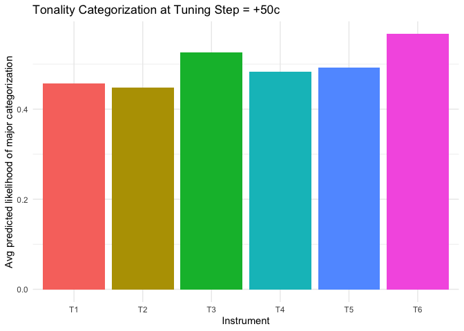<!-- -->

``` r
df_pse2 %>%
  ggplot(aes(instrument, PSE, fill = instrument)) +
  geom_col() +
  geom_errorbar(aes(ymin = CI.low, ymax = CI.upp), width = 0.1) + 
  labs(x = "Instrument", y = "Tuning step (cents) at which \nprobability of major categorization = 50%",
       title = "Points of Subjective Equality (PSE)") +
  guides(fill = "none") +
  theme_minimal()
```

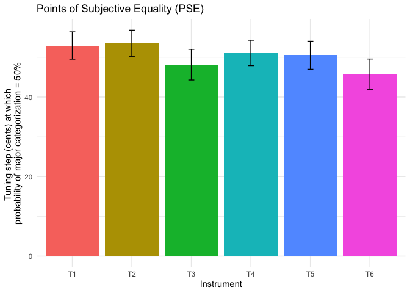<!-- -->

## 3. Explicit Valence Ratings Analysis

### Calculate ICC

``` r
model_base_rtg1 <- clmm(explicit_rtg ~ 1 + (1 | participant), data = df_rtg1)
model_base_rtg2 <- clmm(explicit_rtg ~ 1 + (1 | participant), data = df_rtg2)
icc(model_base_rtg1)
```

    ## # Intraclass Correlation Coefficient
    ## 
    ##     Adjusted ICC: 0.031
    ##   Unadjusted ICC: 0.031

``` r
icc(model_base_rtg2)
```

    ## # Intraclass Correlation Coefficient
    ## 
    ##     Adjusted ICC: 0.052
    ##   Unadjusted ICC: 0.052

ICC from both experiments were smaller than .1, but we still chose to
employ the nested model due to clustering within individuals.

### CLMM

We modeled explicit valence rating for each instrument against
instrument timbre. We used CLMM because DV is ordinal.

``` r
# fit clmm b/c rating is ordinal not interval (1-4 likert scale)
model_rtg1 <- clmm(explicit_rtg ~ instrument + (1 | participant), data = df_rtg1, Hess = TRUE)
model_rtg2 <- clmm(explicit_rtg ~ instrument + (1 | participant), data = df_rtg2, Hess = TRUE)

summary(model_rtg1)
```

    ## Cumulative Link Mixed Model fitted with the Laplace approximation
    ## 
    ## formula: explicit_rtg ~ instrument + (1 | participant)
    ## data:    df_rtg1
    ## 
    ##  link  threshold nobs logLik  AIC    niter    max.grad cond.H 
    ##  logit flexible  240  -256.98 529.96 386(785) 1.38e-04 3.3e+01
    ## 
    ## Random effects:
    ##  Groups      Name        Variance Std.Dev.
    ##  participant (Intercept) 0.3416   0.5845  
    ## Number of groups:  participant 48 
    ## 
    ## Coefficients:
    ##                     Estimate Std. Error z value Pr(>|z|)    
    ## instrumentviolin     -0.8568     0.4008  -2.138  0.03255 *  
    ## instrumenttrumpet     1.0838     0.3975   2.727  0.00640 ** 
    ## instrumentpiano       1.2263     0.3964   3.094  0.00198 ** 
    ## instrumentxylophone   1.9952     0.4259   4.684 2.81e-06 ***
    ## ---
    ## Signif. codes:  0 '***' 0.001 '**' 0.01 '*' 0.05 '.' 0.1 ' ' 1
    ## 
    ## Threshold coefficients:
    ##     Estimate Std. Error z value
    ## 1|2  -2.1952     0.3609  -6.082
    ## 2|3   0.6119     0.2959   2.068
    ## 3|4   3.2352     0.3885   8.328

``` r
#"cond. H" shows identifiability of the model. The smaller the better; not ok above 10^4. We are ok.
summary(model_rtg2)
```

    ## Cumulative Link Mixed Model fitted with the Laplace approximation
    ## 
    ## formula: explicit_rtg ~ instrument + (1 | participant)
    ## data:    df_rtg2
    ## 
    ##  link  threshold nobs logLik  AIC    niter     max.grad cond.H 
    ##  logit flexible  348  -379.02 776.03 552(1118) 2.50e-04 5.4e+01
    ## 
    ## Random effects:
    ##  Groups      Name        Variance Std.Dev.
    ##  participant (Intercept) 0.3992   0.6318  
    ## Number of groups:  participant 58 
    ## 
    ## Coefficients:
    ##              Estimate Std. Error z value Pr(>|z|)    
    ## instrumentT2   0.7757     0.3728   2.081   0.0375 *  
    ## instrumentT3   1.4750     0.3764   3.918 8.92e-05 ***
    ## instrumentT4   1.9628     0.3812   5.149 2.62e-07 ***
    ## instrumentT5   2.4240     0.3898   6.218 5.02e-10 ***
    ## instrumentT6   2.6595     0.3893   6.831 8.44e-12 ***
    ## ---
    ## Signif. codes:  0 '***' 0.001 '**' 0.01 '*' 0.05 '.' 0.1 ' ' 1
    ## 
    ## Threshold coefficients:
    ##     Estimate Std. Error z value
    ## 1|2  -0.7388     0.2766  -2.671
    ## 2|3   2.0915     0.3117   6.710
    ## 3|4   4.4470     0.3839  11.582

``` r
# odds ratio (OR)
exp(coef(model_rtg1)[4:7])
```

    ##    instrumentviolin   instrumenttrumpet     instrumentpiano instrumentxylophone 
    ##           0.4245079           2.9558469           3.4086158           7.3533433

``` r
exp(coef(model_rtg2)[4:8])
```

    ## instrumentT2 instrumentT3 instrumentT4 instrumentT5 instrumentT6 
    ##     2.172131     4.371078     7.118938    11.291016    14.288876

### Post-hoc Comparison

``` r
# correction: Tukey (default)
emmeans(model_rtg1, ~ instrument) %>%
  pairs()
```

    ##  contrast            estimate    SE  df z.ratio p.value
    ##  oboe - violin          0.857 0.401 Inf   2.138  0.2041
    ##  oboe - trumpet        -1.084 0.397 Inf  -2.727  0.0502
    ##  oboe - piano          -1.226 0.396 Inf  -3.094  0.0169
    ##  oboe - xylophone      -1.995 0.426 Inf  -4.684  <.0001
    ##  violin - trumpet      -1.941 0.421 Inf  -4.610  <.0001
    ##  violin - piano        -2.083 0.421 Inf  -4.943  <.0001
    ##  violin - xylophone    -2.852 0.452 Inf  -6.309  <.0001
    ##  trumpet - piano       -0.143 0.391 Inf  -0.365  0.9962
    ##  trumpet - xylophone   -0.911 0.412 Inf  -2.213  0.1749
    ##  piano - xylophone     -0.769 0.407 Inf  -1.889  0.3231
    ## 
    ## P value adjustment: tukey method for comparing a family of 5 estimates

``` r
emmeans(model_rtg2, "instrument") %>%
  pairs()
```

    ##  contrast estimate    SE  df z.ratio p.value
    ##  T1 - T2    -0.776 0.373 Inf  -2.081  0.2974
    ##  T1 - T3    -1.475 0.376 Inf  -3.918  0.0013
    ##  T1 - T4    -1.963 0.381 Inf  -5.149  <.0001
    ##  T1 - T5    -2.424 0.390 Inf  -6.218  <.0001
    ##  T1 - T6    -2.659 0.389 Inf  -6.831  <.0001
    ##  T2 - T3    -0.699 0.371 Inf  -1.883  0.4125
    ##  T2 - T4    -1.187 0.372 Inf  -3.190  0.0179
    ##  T2 - T5    -1.648 0.378 Inf  -4.360  0.0002
    ##  T2 - T6    -1.884 0.377 Inf  -4.999  <.0001
    ##  T3 - T4    -0.488 0.359 Inf  -1.358  0.7519
    ##  T3 - T5    -0.949 0.364 Inf  -2.609  0.0950
    ##  T3 - T6    -1.184 0.361 Inf  -3.283  0.0132
    ##  T4 - T5    -0.461 0.356 Inf  -1.296  0.7873
    ##  T4 - T6    -0.697 0.353 Inf  -1.976  0.3561
    ##  T5 - T6    -0.235 0.352 Inf  -0.669  0.9853
    ## 
    ## P value adjustment: tukey method for comparing a family of 6 estimates

Exp1: oboe \< piano, trumpet, xylophone; violin \< trumpet, piano,
xylophone

Exp2: T1 \< all but T2, T2 \< T4-6, T6 \> T1-3

### Visualizations

``` r
# exp1
# plot mean rating as estimated from the model
as.data.frame(emmeans(model_rtg1, ~ explicit_rtg | instrument, mode = "prob")) %>%
  group_by(instrument) %>%
  summarise(mean_rating = sum(as.numeric(explicit_rtg) * prob)) %>%
  ggplot(aes(reorder(instrument, mean_rating), mean_rating, fill = instrument)) +
  geom_col(position = "dodge") +
  labs(x = "instrument", y = "Mean valence rating") +
  theme_minimal() +
  theme(legend.position = "none")
```

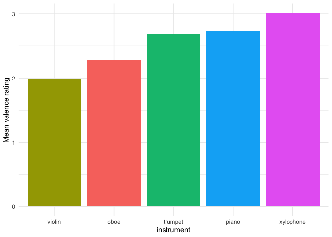<!-- -->

``` r
# plot estimated probability of each rating (not very intuitive so prolly won't use)
as.data.frame(emmeans(model_rtg1, ~ explicit_rtg | instrument, mode = "prob")) %>%
  ggplot(aes(explicit_rtg, prob, group = instrument, color = instrument)) +
  geom_line() +
  labs(x = "Explicit valence rating", y = "Probability for each rating level") +
  theme_minimal()
```

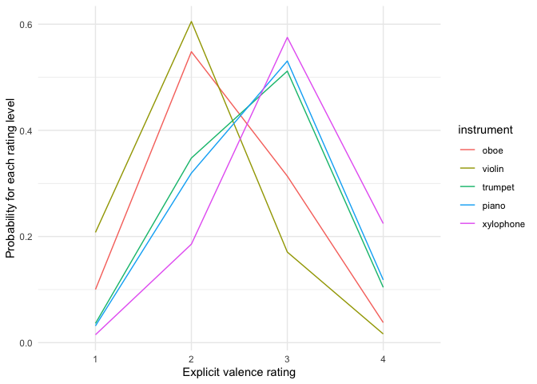<!-- -->

``` r
# exp1
# plot mean rating 
as.data.frame(emmeans(model_rtg2, ~ explicit_rtg | instrument, mode = "prob")) %>%
  group_by(instrument) %>%
  summarise(mean_rating = sum(as.numeric(explicit_rtg) * prob)) %>%
  ggplot(aes(reorder(instrument, mean_rating), mean_rating, fill = instrument)) +
  geom_col(position = "dodge") +
  labs(x = "instrument", y = "Mean valence rating") +
  theme_minimal() +
  theme(legend.position = "none")
```

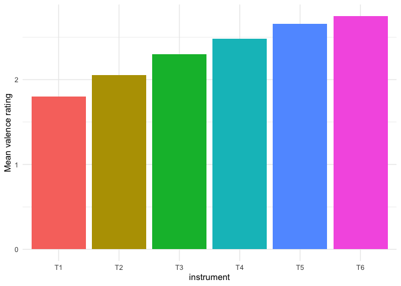<!-- -->

``` r
# plot estimated probability
as.data.frame(emmeans(model_rtg2, ~ explicit_rtg | instrument, mode = "prob")) %>%
  ggplot(aes(explicit_rtg, prob, group = instrument, color = instrument)) +
  geom_line() +
  labs(x = "Explicit valence rating", y = "Probability for each rating level") +
  theme_minimal()
```

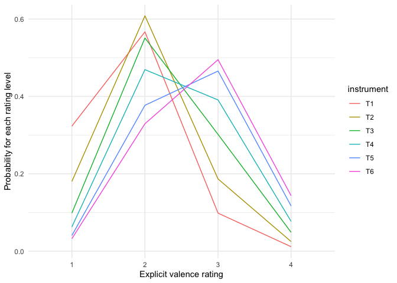<!-- -->

## 4. Mediation Analysis

We added explicit valence rating as another predictor in our GLMM, to
see if this mediates the timbre-tonality relationship.

``` r
# causal steps approach + boostrapping? TBD
df_combo1 <- left_join(df_sum1, df_rtg1, by = c("participant", "instrument"))
model_mediation1 <- df_combo1 %>%
  glmer(cbind(count_major, count_minor) ~ tuning_c * instrument + as.numeric(explicit_rtg) + (1 + tuning_c | participant), 
        family = binomial(link = "probit"), data = ., control = glmerControl(optimizer = "bobyqa"))
summary(model_mediation1)
```

    ## Generalized linear mixed model fit by maximum likelihood (Laplace
    ##   Approximation) [glmerMod]
    ##  Family: binomial  ( probit )
    ## Formula: 
    ## cbind(count_major, count_minor) ~ tuning_c * instrument + as.numeric(explicit_rtg) +  
    ##     (1 + tuning_c | participant)
    ##    Data: .
    ## Control: glmerControl(optimizer = "bobyqa")
    ## 
    ##      AIC      BIC   logLik deviance df.resid 
    ##   3805.2   3876.5  -1888.6   3777.2     1186 
    ## 
    ## Scaled residuals: 
    ##     Min      1Q  Median      3Q     Max 
    ## -16.258  -0.643   0.000   0.767  39.650 
    ## 
    ## Random effects:
    ##  Groups      Name        Variance Std.Dev. Corr
    ##  participant (Intercept) 0.2145   0.4632       
    ##              tuning_c    0.7002   0.8368   0.08
    ## Number of obs: 1200, groups:  participant, 48
    ## 
    ## Fixed effects:
    ##                              Estimate Std. Error z value Pr(>|z|)    
    ## (Intercept)                  -0.64137    0.09540  -6.723 1.78e-11 ***
    ## tuning_c                      0.93144    0.12667   7.354 1.93e-13 ***
    ## instrumentviolin              0.42875    0.05150   8.326  < 2e-16 ***
    ## instrumenttrumpet             0.45351    0.05268   8.609  < 2e-16 ***
    ## instrumentpiano               0.48326    0.05322   9.080  < 2e-16 ***
    ## instrumentxylophone           0.75517    0.05524  13.670  < 2e-16 ***
    ## as.numeric(explicit_rtg)      0.08628    0.02518   3.426 0.000613 ***
    ## tuning_c:instrumentviolin     0.02828    0.04024   0.703 0.482137    
    ## tuning_c:instrumenttrumpet    0.03634    0.04022   0.904 0.366215    
    ## tuning_c:instrumentpiano      0.10064    0.04103   2.453 0.014179 *  
    ## tuning_c:instrumentxylophone -0.01248    0.04079  -0.306 0.759611    
    ## ---
    ## Signif. codes:  0 '***' 0.001 '**' 0.01 '*' 0.05 '.' 0.1 ' ' 1
    ## 
    ## Correlation of Fixed Effects:
    ##                 (Intr) tnng_c instrmntv instrmntt instrmntp instrmntx as.(_)
    ## tuning_c         0.043                                                      
    ## instrmntvln     -0.346  0.030                                               
    ## instrmnttrm     -0.128  0.031  0.464                                        
    ## instrumntpn     -0.119  0.030  0.457     0.536                              
    ## instrmntxyl     -0.054  0.036  0.429     0.543     0.542                    
    ## as.nmrc(x_)     -0.589  0.000  0.128    -0.233    -0.245    -0.340          
    ## tnng_c:nstrmntv  0.036 -0.161 -0.079    -0.072    -0.072    -0.070     0.005
    ## tnng_c:nstrmntt  0.035 -0.161 -0.072    -0.068    -0.072    -0.071     0.008
    ## tnng_c:nstrmntp  0.037 -0.157 -0.071    -0.069    -0.043    -0.065     0.000
    ## tnng_c:nstrmntx  0.043 -0.161 -0.073    -0.070    -0.068    -0.015    -0.006
    ##                 tnng_c:nstrmntv tnng_c:nstrmntt tnng_c:nstrmntp
    ## tuning_c                                                       
    ## instrmntvln                                                    
    ## instrmnttrm                                                    
    ## instrumntpn                                                    
    ## instrmntxyl                                                    
    ## as.nmrc(x_)                                                    
    ## tnng_c:nstrmntv                                                
    ## tnng_c:nstrmntt  0.510                                         
    ## tnng_c:nstrmntp  0.500           0.501                         
    ## tnng_c:nstrmntx  0.504           0.504           0.495

``` r
df_combo2 <- left_join(df_sum2, df_rtg2, by = c("participant", "instrument"))
model_mediation2 <- df_combo2 %>%
  glmer(cbind(count_major, count_minor) ~ tuning_c * instrument + as.numeric(explicit_rtg) + (1 + tuning_c | participant), 
        family = binomial(link = "probit"), data = ., control = glmerControl(optimizer = "bobyqa"))
summary(model_mediation2)
```

    ## Generalized linear mixed model fit by maximum likelihood (Laplace
    ##   Approximation) [glmerMod]
    ##  Family: binomial  ( probit )
    ## Formula: 
    ## cbind(count_major, count_minor) ~ tuning_c * instrument + as.numeric(explicit_rtg) +  
    ##     (1 + tuning_c | participant)
    ##    Data: .
    ## Control: glmerControl(optimizer = "bobyqa")
    ## 
    ##      AIC      BIC   logLik deviance df.resid 
    ##   5257.6   5345.0  -2612.8   5225.6     1724 
    ## 
    ## Scaled residuals: 
    ##      Min       1Q   Median       3Q      Max 
    ## -14.2906  -0.6029   0.0016   0.6438  30.9726 
    ## 
    ## Random effects:
    ##  Groups      Name        Variance Std.Dev. Corr 
    ##  participant (Intercept) 0.1955   0.4421        
    ##              tuning_c    0.6979   0.8354   -0.49
    ## Number of obs: 1740, groups:  participant, 58
    ## 
    ## Fixed effects:
    ##                           Estimate Std. Error z value Pr(>|z|)    
    ## (Intercept)              -0.162075   0.076436  -2.120  0.03397 *  
    ## tuning_c                  0.891191   0.114389   7.791 6.65e-15 ***
    ## instrumentT2             -0.033709   0.045822  -0.736  0.46195    
    ## instrumentT3              0.153914   0.046949   3.278  0.00104 ** 
    ## instrumentT4              0.041328   0.047862   0.863  0.38788    
    ## instrumentT5              0.056142   0.049730   1.129  0.25893    
    ## instrumentT6              0.241437   0.050846   4.748 2.05e-06 ***
    ## as.numeric(explicit_rtg)  0.031771   0.020788   1.528  0.12643    
    ## tuning_c:instrumentT2     0.039130   0.035883   1.090  0.27550    
    ## tuning_c:instrumentT3     0.009416   0.035638   0.264  0.79160    
    ## tuning_c:instrumentT4     0.114883   0.036591   3.140  0.00169 ** 
    ## tuning_c:instrumentT5     0.029756   0.035774   0.832  0.40554    
    ## tuning_c:instrumentT6     0.102674   0.036555   2.809  0.00497 ** 
    ## ---
    ## Signif. codes:  0 '***' 0.001 '**' 0.01 '*' 0.05 '.' 0.1 ' ' 1

    ## 
    ## Correlation matrix not shown by default, as p = 13 > 12.
    ## Use print(x, correlation=TRUE)  or
    ##     vcov(x)        if you need it

``` r
# instrument - tonality sig
# instrument - valence sig
# (instrument + valence) - tonality sig
# partial mediation
```

TBD. Look into the mediation package.

Adding explicit valence rating to our OG GLMM attenuated but did not
completely eliminate the effect of instrument timbre on tonality
categorization.

## 5. Separate Timbral Features

In Experiment 2, we created artificial timbres, systematically varying
their envelopes and spectral centroids. T1-3 had a rounded envelope,
while T4-6 had a percussive envelope. T1&4 had a lower spectral
centroid, T2&5 had a mid spectral centroid, while T3&6 had a higher
spectral centoid. Here we separated the “intrument” variable into
“envelope” and “harmonics” to look at what was driving the effect of
timbre.

``` r
# Tonality Categorization
model_sep2 <- df_sum2 %>%
  glmer(cbind(count_major, count_minor) ~ tuning_c * envelope * harmonics + (1 + tuning_c | participant), 
        family = binomial(link = "probit"), data = ., control = glmerControl(optimizer = "bobyqa"))
summary(model_sep2)
```

    ## Generalized linear mixed model fit by maximum likelihood (Laplace
    ##   Approximation) [glmerMod]
    ##  Family: binomial  ( probit )
    ## Formula: cbind(count_major, count_minor) ~ tuning_c * envelope * harmonics +  
    ##     (1 + tuning_c | participant)
    ##    Data: .
    ## Control: glmerControl(optimizer = "bobyqa")
    ## 
    ##      AIC      BIC   logLik deviance df.resid 
    ##   5257.9   5339.9  -2614.0   5227.9     1725 
    ## 
    ## Scaled residuals: 
    ##      Min       1Q   Median       3Q      Max 
    ## -13.7267  -0.5978   0.0024   0.6345  30.7817 
    ## 
    ## Random effects:
    ##  Groups      Name        Variance Std.Dev. Corr 
    ##  participant (Intercept) 0.1950   0.4416        
    ##              tuning_c    0.6972   0.8350   -0.48
    ## Number of obs: 1740, groups:  participant, 58
    ## 
    ## Fixed effects:
    ##                                            Estimate Std. Error z value Pr(>|z|)
    ## (Intercept)                               -0.105949   0.066962  -1.582  0.11360
    ## tuning_c                                   0.891507   0.114343   7.797 6.35e-15
    ## envelopepercussive                         0.061965   0.045903   1.350  0.17704
    ## harmonicsmid                              -0.025680   0.045520  -0.564  0.57265
    ## harmonicshigh                              0.172691   0.045338   3.809  0.00014
    ## tuning_c:envelopepercussive                0.114024   0.036570   3.118  0.00182
    ## tuning_c:harmonicsmid                      0.038704   0.035877   1.079  0.28068
    ## tuning_c:harmonicshigh                     0.008979   0.035643   0.252  0.80110
    ## envelopepercussive:harmonicsmid            0.050665   0.064817   0.782  0.43441
    ## envelopepercussive:harmonicshigh           0.039366   0.065136   0.604  0.54560
    ## tuning_c:envelopepercussive:harmonicsmid  -0.123545   0.051384  -2.404  0.01620
    ## tuning_c:envelopepercussive:harmonicshigh -0.020798   0.051738  -0.402  0.68769
    ##                                              
    ## (Intercept)                                  
    ## tuning_c                                  ***
    ## envelopepercussive                           
    ## harmonicsmid                                 
    ## harmonicshigh                             ***
    ## tuning_c:envelopepercussive               ** 
    ## tuning_c:harmonicsmid                        
    ## tuning_c:harmonicshigh                       
    ## envelopepercussive:harmonicsmid              
    ## envelopepercussive:harmonicshigh             
    ## tuning_c:envelopepercussive:harmonicsmid  *  
    ## tuning_c:envelopepercussive:harmonicshigh    
    ## ---
    ## Signif. codes:  0 '***' 0.001 '**' 0.01 '*' 0.05 '.' 0.1 ' ' 1
    ## 
    ## Correlation of Fixed Effects:
    ##                           (Intr) tnng_c envlpp hrmncsm hrmncsh tnng_c:n
    ## tuning_c                  -0.409                                       
    ## envlpprcssv               -0.333  0.003                                
    ## harmonicsmd               -0.335  0.002  0.490                         
    ## harmoncshgh               -0.338  0.005  0.492  0.496                  
    ## tnng_c:nvlp                0.005 -0.150  0.000 -0.007  -0.007          
    ## tnng_c:hrmncsm             0.005 -0.153 -0.007 -0.019  -0.007   0.482  
    ## tnng_c:hrmncsh             0.006 -0.155 -0.007 -0.007   0.010   0.485  
    ## envlpprcssv:hrmncsm        0.235  0.000 -0.708 -0.702  -0.348   0.000  
    ## envlpprcssv:hrmncsh        0.234 -0.001 -0.704 -0.345  -0.695   0.000  
    ## tnng_c:nvlpprcssv:hrmncsm -0.004  0.106  0.000  0.013   0.005  -0.712  
    ## tnng_c:nvlpprcssv:hrmncsh -0.004  0.107  0.000  0.005  -0.007  -0.706  
    ##                           tnng_c:hrmncsm tnng_c:hrmncsh envlpprcssv:hrmncsm
    ## tuning_c                                                                   
    ## envlpprcssv                                                                
    ## harmonicsmd                                                                
    ## harmoncshgh                                                                
    ## tnng_c:nvlp                                                                
    ## tnng_c:hrmncsm                                                             
    ## tnng_c:hrmncsh             0.495                                           
    ## envlpprcssv:hrmncsm        0.014          0.005                            
    ## envlpprcssv:hrmncsh        0.005         -0.007          0.499             
    ## tnng_c:nvlpprcssv:hrmncsm -0.698         -0.345          0.000             
    ## tnng_c:nvlpprcssv:hrmncsh -0.341         -0.689          0.000             
    ##                           envlpprcssv:hrmncsh tnng_c:nvlpprcssv:hrmncsm
    ## tuning_c                                                               
    ## envlpprcssv                                                            
    ## harmonicsmd                                                            
    ## harmoncshgh                                                            
    ## tnng_c:nvlp                                                            
    ## tnng_c:hrmncsm                                                         
    ## tnng_c:hrmncsh                                                         
    ## envlpprcssv:hrmncsm                                                    
    ## envlpprcssv:hrmncsh                                                    
    ## tnng_c:nvlpprcssv:hrmncsm  0.000                                       
    ## tnng_c:nvlpprcssv:hrmncsh  0.034               0.503

``` r
emmeans(model_sep2, "harmonics") %>%
  pairs()
```

    ## NOTE: Results may be misleading due to involvement in interactions

    ## Note: Use 'contrast(regrid(object), ...)' to obtain contrasts of back-transformed estimates

    ##  contrast    estimate     SE  df z.ratio p.value
    ##  low - mid   0.000347 0.0324 Inf   0.011  0.9999
    ##  low - high -0.192374 0.0326 Inf  -5.901  <.0001
    ##  mid - high -0.192722 0.0325 Inf  -5.921  <.0001
    ## 
    ## Results are averaged over the levels of: envelope 
    ## Note: contrasts are still on the probit scale 
    ## P value adjustment: tukey method for comparing a family of 3 estimates

``` r
emmeans(model_sep2, ~ envelope * harmonics) %>%
  pairs()
```

    ## NOTE: Results may be misleading due to involvement in interactions
    ## Note: Use 'contrast(regrid(object), ...)' to obtain contrasts of back-transformed estimates

    ##  contrast                         estimate     SE  df z.ratio p.value
    ##  rounded low - percussive low      -0.0620 0.0459 Inf  -1.350  0.7569
    ##  rounded low - rounded mid          0.0257 0.0455 Inf   0.564  0.9933
    ##  rounded low - percussive mid      -0.0870 0.0455 Inf  -1.911  0.3949
    ##  rounded low - rounded high        -0.1727 0.0453 Inf  -3.809  0.0019
    ##  rounded low - percussive high     -0.2740 0.0462 Inf  -5.933  <.0001
    ##  percussive low - rounded mid       0.0876 0.0462 Inf   1.898  0.4033
    ##  percussive low - percussive mid   -0.0250 0.0461 Inf  -0.541  0.9945
    ##  percussive low - rounded high     -0.1107 0.0460 Inf  -2.407  0.1535
    ##  percussive low - percussive high  -0.2121 0.0468 Inf  -4.530  0.0001
    ##  rounded mid - percussive mid      -0.1126 0.0458 Inf  -2.461  0.1359
    ##  rounded mid - rounded high        -0.1984 0.0456 Inf  -4.349  0.0002
    ##  rounded mid - percussive high     -0.2997 0.0465 Inf  -6.451  <.0001
    ##  percussive mid - rounded high     -0.0857 0.0456 Inf  -1.881  0.4137
    ##  percussive mid - percussive high  -0.1871 0.0464 Inf  -4.031  0.0008
    ##  rounded high - percussive high    -0.1013 0.0462 Inf  -2.192  0.2415
    ## 
    ## Note: contrasts are still on the probit scale 
    ## P value adjustment: tukey method for comparing a family of 6 estimates

``` r
anova(model_tuning2, model_sep2) # this model did not perform better than our OG GLMM
```

    ## Data: .
    ## Models:
    ## model_tuning2: cbind(count_major, count_minor) ~ tuning_c * instrument + (1 + tuning_c | participant)
    ## model_sep2: cbind(count_major, count_minor) ~ tuning_c * envelope * harmonics + (1 + tuning_c | participant)
    ##               npar    AIC    BIC logLik deviance Chisq Df Pr(>Chisq)
    ## model_tuning2   15 5257.9 5339.9  -2614   5227.9                    
    ## model_sep2      15 5257.9 5339.9  -2614   5227.9     0  0

``` r
plot(emmeans(model_sep2, ~ harmonics * envelope))
```

    ## NOTE: Results may be misleading due to involvement in interactions

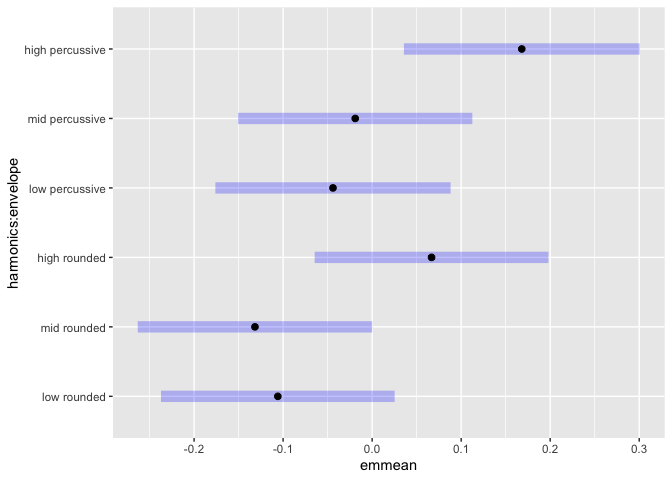<!-- -->

``` r
# Explicit Valence Rating
model_sep_rtg2 <- clmm(explicit_rtg ~ envelope * harmonics + (1 | participant), data = df_rtg2)
summary(model_sep_rtg2)
```

    ## Cumulative Link Mixed Model fitted with the Laplace approximation
    ## 
    ## formula: explicit_rtg ~ envelope * harmonics + (1 | participant)
    ## data:    df_rtg2
    ## 
    ##  link  threshold nobs logLik  AIC    niter     max.grad cond.H 
    ##  logit flexible  348  -379.02 776.03 582(1178) 2.56e-04 6.0e+01
    ## 
    ## Random effects:
    ##  Groups      Name        Variance Std.Dev.
    ##  participant (Intercept) 0.3992   0.6318  
    ## Number of groups:  participant 58 
    ## 
    ## Coefficients:
    ##                               Estimate Std. Error z value Pr(>|z|)    
    ## enveloperounded                -1.9628     0.3812  -5.149 2.62e-07 ***
    ## harmonicsmid                    0.4612     0.3559   1.296   0.1950    
    ## harmonicshigh                   0.6967     0.3526   1.976   0.0481 *  
    ## enveloperounded:harmonicsmid    0.3145     0.5133   0.613   0.5401    
    ## enveloperounded:harmonicshigh   0.7783     0.5109   1.523   0.1277    
    ## ---
    ## Signif. codes:  0 '***' 0.001 '**' 0.01 '*' 0.05 '.' 0.1 ' ' 1
    ## 
    ## Threshold coefficients:
    ##     Estimate Std. Error z value
    ## 1|2  -2.7016     0.3264  -8.276
    ## 2|3   0.1287     0.2671   0.482
    ## 3|4   2.4843     0.3243   7.660

``` r
emmeans(model_sep_rtg2, "harmonics") %>%
  pairs()
```

    ## NOTE: Results may be misleading due to involvement in interactions

    ##  contrast   estimate    SE  df z.ratio p.value
    ##  low - mid    -0.618 0.259 Inf  -2.390  0.0444
    ##  low - high   -1.086 0.260 Inf  -4.172  0.0001
    ##  mid - high   -0.467 0.256 Inf  -1.823  0.1622
    ## 
    ## Results are averaged over the levels of: envelope 
    ## P value adjustment: tukey method for comparing a family of 3 estimates

``` r
# main effect: high > low strong; mid > low but p =.044
emmeans(model_sep_rtg2, ~ envelope * harmonics) %>%
  pairs()
```

    ##  contrast                         estimate    SE  df z.ratio p.value
    ##  percussive low - rounded low        1.963 0.381 Inf   5.149  <.0001
    ##  percussive low - percussive mid    -0.461 0.356 Inf  -1.296  0.7874
    ##  percussive low - rounded mid        1.187 0.372 Inf   3.190  0.0179
    ##  percussive low - percussive high   -0.697 0.353 Inf  -1.976  0.3561
    ##  percussive low - rounded high       0.488 0.359 Inf   1.358  0.7519
    ##  rounded low - percussive mid       -2.424 0.390 Inf  -6.218  <.0001
    ##  rounded low - rounded mid          -0.776 0.373 Inf  -2.081  0.2974
    ##  rounded low - percussive high      -2.660 0.389 Inf  -6.831  <.0001
    ##  rounded low - rounded high         -1.475 0.376 Inf  -3.918  0.0013
    ##  percussive mid - rounded mid        1.648 0.378 Inf   4.360  0.0002
    ##  percussive mid - percussive high   -0.235 0.352 Inf  -0.669  0.9853
    ##  percussive mid - rounded high       0.949 0.364 Inf   2.609  0.0950
    ##  rounded mid - percussive high      -1.884 0.377 Inf  -4.999  <.0001
    ##  rounded mid - rounded high         -0.699 0.371 Inf  -1.883  0.4125
    ##  percussive high - rounded high      1.184 0.361 Inf   3.283  0.0132
    ## 
    ## P value adjustment: tukey method for comparing a family of 6 estimates

``` r
plot(emmeans(model_sep_rtg2, ~ harmonics * envelope))
```

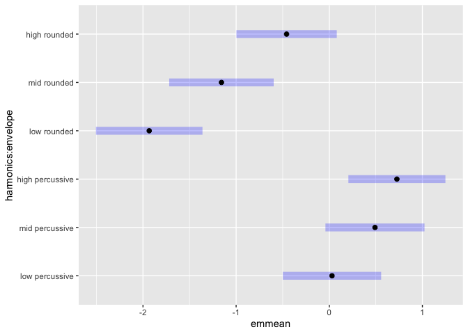<!-- -->

**Tonality categorization:**

GLMM showed no significant main effect of envelope or envelope \*
harmonics interaction, but significant main effect of harmonics and
tuning \* envelope interaction and tuning \* harmonics \* envelope 3-way
interaction. Post-hoc comparisons below.

Main effect: \* Harmonics: low/mid \< high; low = mid \* Envelope:
rounded \< percussive

Interaction: \* rounded low/mid \< rounded/percussive high \* percussive
low/mid \< high

**Explicit valence rating:**

CLMM showed significant main effects of envelope and harmonics, but no
significant envelope \* harmonics interaction. Post-hoc comparisons
below.

Main effect: \* Harmonics: low \< high (strong); low \< mid (p =.044);
mid = high \* Envelope: rounded \< percussive

Interaction: \* rounded \< percussive envelope for all harmonics \*
rounded low \< high \* rounded low \< percussive mid \* rounded mid \<
percussive low  
\* rounded low/mid \< percussive high

Similar trend between tonality categorization and explicit valence
rating.

Experiment 2 partially replicated Experiment 1 results, suggesting that
exp1 effects were partly acoustically grounded and partly due to learned
associations.

## 6. Exploratory Analyses

We added key and music training variables as exploratory predictors in
the model. None of them changed the effect of our main IVs of interest,
so we left them out of our models for parsimony. These analyses will not
be included in main results, but will potentially be included as
supplementary materials.

### Key

``` r
model_key1 <- df_sum1 %>%
  glmer(cbind(count_major, count_minor) ~ tuning_c * instrument + chord + (1 + tuning_c | participant), 
        family = binomial(link = "probit"), data = ., control = glmerControl(optimizer = "bobyqa"))
anova(model_key1, model_tuning1) # slightly improves model fit
```

    ## Data: .
    ## Models:
    ## model_tuning1: cbind(count_major, count_minor) ~ tuning_c * instrument + (1 + tuning_c | participant)
    ## model_key1: cbind(count_major, count_minor) ~ tuning_c * instrument + chord + (1 + tuning_c | participant)
    ##               npar    AIC    BIC  logLik deviance  Chisq Df Pr(>Chisq)  
    ## model_tuning1   13 3814.8 3881.0 -1894.4   3788.8                       
    ## model_key1      14 3813.0 3884.2 -1892.5   3785.0 3.8696  1    0.04917 *
    ## ---
    ## Signif. codes:  0 '***' 0.001 '**' 0.01 '*' 0.05 '.' 0.1 ' ' 1

``` r
summary(model_key1) 
```

    ## Generalized linear mixed model fit by maximum likelihood (Laplace
    ##   Approximation) [glmerMod]
    ##  Family: binomial  ( probit )
    ## Formula: cbind(count_major, count_minor) ~ tuning_c * instrument + chord +  
    ##     (1 + tuning_c | participant)
    ##    Data: .
    ## Control: glmerControl(optimizer = "bobyqa")
    ## 
    ##      AIC      BIC   logLik deviance df.resid 
    ##   3813.0   3884.2  -1892.5   3785.0     1186 
    ## 
    ## Scaled residuals: 
    ##     Min      1Q  Median      3Q     Max 
    ## -17.116  -0.625   0.000   0.759  39.932 
    ## 
    ## Random effects:
    ##  Groups      Name        Variance Std.Dev. Corr
    ##  participant (Intercept) 0.2048   0.4526       
    ##              tuning_c    0.7124   0.8441   0.16
    ## Number of obs: 1200, groups:  participant, 48
    ## 
    ## Fixed effects:
    ##                              Estimate Std. Error z value Pr(>|z|)    
    ## (Intercept)                  -0.31562    0.10107  -3.123  0.00179 ** 
    ## tuning_c                      0.93506    0.12768   7.323 2.42e-13 ***
    ## instrumentviolin              0.40661    0.05107   7.963 1.69e-15 ***
    ## instrumenttrumpet             0.49645    0.05122   9.693  < 2e-16 ***
    ## instrumentpiano               0.52864    0.05159  10.246  < 2e-16 ***
    ## instrumentxylophone           0.82084    0.05195  15.801  < 2e-16 ***
    ## chordC                       -0.27520    0.13785  -1.996  0.04589 *  
    ## tuning_c:instrumentviolin     0.02756    0.04020   0.686  0.49303    
    ## tuning_c:instrumenttrumpet    0.03507    0.04019   0.873  0.38285    
    ## tuning_c:instrumentpiano      0.10052    0.04099   2.452  0.01420 *  
    ## tuning_c:instrumentxylophone -0.01166    0.04077  -0.286  0.77494    
    ## ---
    ## Signif. codes:  0 '***' 0.001 '**' 0.01 '*' 0.05 '.' 0.1 ' ' 1
    ## 
    ## Correlation of Fixed Effects:
    ##                 (Intr) tnng_c instrmntv instrmntt instrmntp instrmntx chordC
    ## tuning_c         0.100                                                      
    ## instrmntvln     -0.257  0.030                                               
    ## instrmnttrm     -0.253  0.032  0.512                                        
    ## instrumntpn     -0.253  0.031  0.508     0.508                              
    ## instrmntxyl     -0.250  0.038  0.507     0.507     0.503                    
    ## chordC          -0.661 -0.020 -0.002    -0.007    -0.004    -0.009          
    ## tnng_c:nstrmntv  0.037 -0.160 -0.083    -0.074    -0.074    -0.073     0.000
    ## tnng_c:nstrmntt  0.036 -0.159 -0.075    -0.068    -0.074    -0.073     0.003
    ## tnng_c:nstrmntp  0.034 -0.155 -0.072    -0.072    -0.046    -0.070     0.002
    ## tnng_c:nstrmntx  0.036 -0.159 -0.074    -0.074    -0.073    -0.017     0.003
    ##                 tnng_c:nstrmntv tnng_c:nstrmntt tnng_c:nstrmntp
    ## tuning_c                                                       
    ## instrmntvln                                                    
    ## instrmnttrm                                                    
    ## instrumntpn                                                    
    ## instrmntxyl                                                    
    ## chordC                                                         
    ## tnng_c:nstrmntv                                                
    ## tnng_c:nstrmntt  0.510                                         
    ## tnng_c:nstrmntp  0.500           0.501                         
    ## tnng_c:nstrmntx  0.504           0.504           0.495

``` r
# now do the same for exp2
# include all possible interactions for key
model_key2 <- df_sum2 %>%
  glmer(cbind(count_major, count_minor) ~ tuning_c * instrument + chord + (1 + tuning_c | participant), 
        family = binomial(link = "probit"), data = ., control = glmerControl(optimizer = "bobyqa"))
anova(model_key2, model_tuning2) # slightly improves model fit
```

    ## Data: .
    ## Models:
    ## model_tuning2: cbind(count_major, count_minor) ~ tuning_c * instrument + (1 + tuning_c | participant)
    ## model_key2: cbind(count_major, count_minor) ~ tuning_c * instrument + chord + (1 + tuning_c | participant)
    ##               npar    AIC    BIC  logLik deviance Chisq Df Pr(>Chisq)
    ## model_tuning2   15 5257.9 5339.9 -2614.0   5227.9                    
    ## model_key2      16 5259.6 5347.0 -2613.8   5227.6 0.357  1     0.5502

``` r
summary(model_key2) 
```

    ## Generalized linear mixed model fit by maximum likelihood (Laplace
    ##   Approximation) [glmerMod]
    ##  Family: binomial  ( probit )
    ## Formula: cbind(count_major, count_minor) ~ tuning_c * instrument + chord +  
    ##     (1 + tuning_c | participant)
    ##    Data: .
    ## Control: glmerControl(optimizer = "bobyqa")
    ## 
    ##      AIC      BIC   logLik deviance df.resid 
    ##   5259.6   5347.0  -2613.8   5227.6     1724 
    ## 
    ## Scaled residuals: 
    ##      Min       1Q   Median       3Q      Max 
    ## -13.4825  -0.5956   0.0024   0.6351  30.6112 
    ## 
    ## Random effects:
    ##  Groups      Name        Variance Std.Dev. Corr 
    ##  participant (Intercept) 0.1963   0.4430        
    ##              tuning_c    0.6980   0.8355   -0.49
    ## Number of obs: 1740, groups:  participant, 58
    ## 
    ## Fixed effects:
    ##                        Estimate Std. Error z value Pr(>|z|)    
    ## (Intercept)           -0.073188   0.086683  -0.844  0.39849    
    ## tuning_c               0.891629   0.114397   7.794 6.48e-15 ***
    ## instrumentT2          -0.025657   0.045520  -0.564  0.57300    
    ## instrumentT3           0.172690   0.045339   3.809  0.00014 ***
    ## instrumentT4           0.062001   0.045903   1.351  0.17679    
    ## instrumentT5           0.086942   0.045488   1.911  0.05596 .  
    ## instrumentT6           0.274036   0.046189   5.933 2.98e-09 ***
    ## chordC                -0.064081   0.107393  -0.597  0.55071    
    ## tuning_c:instrumentT2  0.038711   0.035877   1.079  0.28059    
    ## tuning_c:instrumentT3  0.009019   0.035644   0.253  0.80025    
    ## tuning_c:instrumentT4  0.114048   0.036570   3.119  0.00182 ** 
    ## tuning_c:instrumentT5  0.029183   0.035776   0.816  0.41467    
    ## tuning_c:instrumentT6  0.102242   0.036555   2.797  0.00516 ** 
    ## ---
    ## Signif. codes:  0 '***' 0.001 '**' 0.01 '*' 0.05 '.' 0.1 ' ' 1

    ## 
    ## Correlation matrix not shown by default, as p = 13 > 12.
    ## Use print(x, correlation=TRUE)  or
    ##     vcov(x)        if you need it

``` r
# add key to the sep model
model_sep_key2 <- df_sum2 %>%
  glmer(cbind(count_major, count_minor) ~ tuning_c * envelope * harmonics * chord + (1 + tuning_c | participant), 
        family = binomial(link = "probit"), data = ., control = glmerControl(optimizer = "bobyqa"))
summary(model_sep_key2)
```

    ## Generalized linear mixed model fit by maximum likelihood (Laplace
    ##   Approximation) [glmerMod]
    ##  Family: binomial  ( probit )
    ## Formula: cbind(count_major, count_minor) ~ tuning_c * envelope * harmonics *  
    ##     chord + (1 + tuning_c | participant)
    ##    Data: .
    ## Control: glmerControl(optimizer = "bobyqa")
    ## 
    ##      AIC      BIC   logLik deviance df.resid 
    ##   5261.6   5409.1  -2603.8   5207.6     1713 
    ## 
    ## Scaled residuals: 
    ##      Min       1Q   Median       3Q      Max 
    ## -14.6577  -0.6147   0.0025   0.6362  29.5263 
    ## 
    ## Random effects:
    ##  Groups      Name        Variance Std.Dev. Corr 
    ##  participant (Intercept) 0.1958   0.4425        
    ##              tuning_c    0.6907   0.8311   -0.48
    ## Number of obs: 1740, groups:  participant, 58
    ## 
    ## Fixed effects:
    ##                                                  Estimate Std. Error z value
    ## (Intercept)                                      -0.15486    0.09688  -1.599
    ## tuning_c                                          0.95708    0.16365   5.848
    ## envelopepercussive                                0.07268    0.06907   1.052
    ## harmonicsmid                                      0.02945    0.06826   0.431
    ## harmonicshigh                                     0.35130    0.06808   5.160
    ## chordC                                            0.08643    0.13414   0.644
    ## tuning_c:envelopepercussive                       0.15485    0.05771   2.683
    ## tuning_c:harmonicsmid                             0.05821    0.05613   1.037
    ## tuning_c:harmonicshigh                            0.02878    0.05586   0.515
    ## envelopepercussive:harmonicsmid                   0.02009    0.09713   0.207
    ## envelopepercussive:harmonicshigh                 -0.04721    0.09793  -0.482
    ## tuning_c:chordC                                  -0.12623    0.22727  -0.555
    ## envelopepercussive:chordC                        -0.02111    0.09257  -0.228
    ## harmonicsmid:chordC                              -0.10047    0.09168  -1.096
    ## harmonicshigh:chordC                             -0.32216    0.09142  -3.524
    ## tuning_c:envelopepercussive:harmonicsmid         -0.20865    0.08043  -2.594
    ## tuning_c:envelopepercussive:harmonicshigh        -0.07662    0.08156  -0.939
    ## tuning_c:envelopepercussive:chordC               -0.06907    0.07471  -0.925
    ## tuning_c:harmonicsmid:chordC                     -0.03432    0.07305  -0.470
    ## tuning_c:harmonicshigh:chordC                    -0.03167    0.07265  -0.436
    ## envelopepercussive:harmonicsmid:chordC            0.05842    0.13053   0.448
    ## envelopepercussive:harmonicshigh:chordC           0.15738    0.13133   1.198
    ## tuning_c:envelopepercussive:harmonicsmid:chordC   0.14495    0.10464   1.385
    ## tuning_c:envelopepercussive:harmonicshigh:chordC  0.09173    0.10563   0.868
    ##                                                  Pr(>|z|)    
    ## (Intercept)                                      0.109930    
    ## tuning_c                                         4.97e-09 ***
    ## envelopepercussive                               0.292690    
    ## harmonicsmid                                     0.666119    
    ## harmonicshigh                                    2.46e-07 ***
    ## chordC                                           0.519360    
    ## tuning_c:envelopepercussive                      0.007291 ** 
    ## tuning_c:harmonicsmid                            0.299727    
    ## tuning_c:harmonicshigh                           0.606428    
    ## envelopepercussive:harmonicsmid                  0.836172    
    ## envelopepercussive:harmonicshigh                 0.629754    
    ## tuning_c:chordC                                  0.578620    
    ## envelopepercussive:chordC                        0.819586    
    ## harmonicsmid:chordC                              0.273125    
    ## harmonicshigh:chordC                             0.000425 ***
    ## tuning_c:envelopepercussive:harmonicsmid         0.009481 ** 
    ## tuning_c:envelopepercussive:harmonicshigh        0.347517    
    ## tuning_c:envelopepercussive:chordC               0.355213    
    ## tuning_c:harmonicsmid:chordC                     0.638485    
    ## tuning_c:harmonicshigh:chordC                    0.662849    
    ## envelopepercussive:harmonicsmid:chordC           0.654487    
    ## envelopepercussive:harmonicshigh:chordC          0.230758    
    ## tuning_c:envelopepercussive:harmonicsmid:chordC  0.166004    
    ## tuning_c:envelopepercussive:harmonicshigh:chordC 0.385171    
    ## ---
    ## Signif. codes:  0 '***' 0.001 '**' 0.01 '*' 0.05 '.' 0.1 ' ' 1

    ## 
    ## Correlation matrix not shown by default, as p = 24 > 12.
    ## Use print(x, correlation=TRUE)  or
    ##     vcov(x)        if you need it

``` r
anova(model_sep_key2, model_sep2) # does not significantly improve model fit
```

    ## Data: .
    ## Models:
    ## model_sep2: cbind(count_major, count_minor) ~ tuning_c * envelope * harmonics + (1 + tuning_c | participant)
    ## model_sep_key2: cbind(count_major, count_minor) ~ tuning_c * envelope * harmonics * chord + (1 + tuning_c | participant)
    ##                npar    AIC    BIC  logLik deviance  Chisq Df Pr(>Chisq)  
    ## model_sep2       15 5257.9 5339.9 -2614.0   5227.9                       
    ## model_sep_key2   27 5261.6 5409.1 -2603.8   5207.6 20.317 12    0.06131 .
    ## ---
    ## Signif. codes:  0 '***' 0.001 '**' 0.01 '*' 0.05 '.' 0.1 ' ' 1

### Musical Training

We wanted to add Inst_yr, etc., but there were too many NA values, so we
couldn’t compare it against the OG model.

`Inst/Inst_now` don’t have NAs, but they are not balanced (only \<10
answered no to Inst / yes to Inst_now) - not enough data to reach stable
model params.

### Pianists only

We filtered out participants who have had experience playing an
instrument that was used as stimuli in exp1.

``` r
# how many ppl in exp1 have played the instruments used in exp1
# character(0) means played instruments not used in exp1
df_sum1 %>%
  ungroup() %>%
  dplyr::select(participant, Inst_best) %>%
  unique() %>%
  group_by(Inst_best) %>%
  summarise(n())
```

    ## # A tibble: 6 × 2
    ##   Inst_best                  `n()`
    ##   <chr>                      <int>
    ## 1 "c(\"piano\", \"violin\")"     2
    ## 2 "c(\"violin\", \"piano\")"     2
    ## 3 "character(0)"                11
    ## 4 "piano"                       21
    ## 5 "violin"                       5
    ## 6  <NA>                          7

``` r
# 25 piano, 9 violin
# only worth trying it w piano

model_pianists <- df_sum1 %>%
  filter(grepl("piano", Inst_best)) %>%
  glmer(cbind(count_major, count_minor) ~ tuning_c * instrument + (1 + tuning_c | participant), 
        family = binomial(link = "probit"), data = ., control = glmerControl(optimizer = "bobyqa"))

summary(model_pianists)
```

    ## Generalized linear mixed model fit by maximum likelihood (Laplace
    ##   Approximation) [glmerMod]
    ##  Family: binomial  ( probit )
    ## Formula: cbind(count_major, count_minor) ~ tuning_c * instrument + (1 +  
    ##     tuning_c | participant)
    ##    Data: .
    ## Control: glmerControl(optimizer = "bobyqa")
    ## 
    ##      AIC      BIC   logLik deviance df.resid 
    ##   1643.3   1700.9   -808.6   1617.3      612 
    ## 
    ## Scaled residuals: 
    ##    Min     1Q Median     3Q    Max 
    ## -7.664 -0.466  0.000  0.569 37.966 
    ## 
    ## Random effects:
    ##  Groups      Name        Variance Std.Dev. Corr
    ##  participant (Intercept) 0.3553   0.5961       
    ##              tuning_c    1.0978   1.0477   0.38
    ## Number of obs: 625, groups:  participant, 25
    ## 
    ## Fixed effects:
    ##                               Estimate Std. Error z value Pr(>|z|)    
    ## (Intercept)                  -0.377072   0.133514  -2.824  0.00474 ** 
    ## tuning_c                      1.387271   0.221344   6.267 3.67e-10 ***
    ## instrumentviolin              0.350680   0.078312   4.478 7.54e-06 ***
    ## instrumenttrumpet             0.488162   0.078393   6.227 4.75e-10 ***
    ## instrumentpiano               0.376995   0.079281   4.755 1.98e-06 ***
    ## instrumentxylophone           0.677505   0.079534   8.518  < 2e-16 ***
    ## tuning_c:instrumentviolin    -0.002948   0.065862  -0.045  0.96430    
    ## tuning_c:instrumenttrumpet   -0.014504   0.065433  -0.222  0.82458    
    ## tuning_c:instrumentpiano      0.082332   0.067601   1.218  0.22326    
    ## tuning_c:instrumentxylophone  0.037824   0.067233   0.563  0.57372    
    ## ---
    ## Signif. codes:  0 '***' 0.001 '**' 0.01 '*' 0.05 '.' 0.1 ' ' 1
    ## 
    ## Correlation of Fixed Effects:
    ##                 (Intr) tnng_c instrmntv instrmntt instrmntp instrmntx
    ## tuning_c         0.311                                               
    ## instrmntvln     -0.298  0.033                                        
    ## instrmnttrm     -0.298  0.037  0.514                                 
    ## instrumntpn     -0.295  0.032  0.507     0.508                       
    ## instrmntxyl     -0.295  0.043  0.508     0.510     0.503             
    ## tnng_c:nstrmntv  0.046 -0.153 -0.101    -0.082    -0.081    -0.081   
    ## tnng_c:nstrmntt  0.048 -0.155 -0.084    -0.076    -0.082    -0.083   
    ## tnng_c:nstrmntp  0.043 -0.147 -0.080    -0.079    -0.083    -0.077   
    ## tnng_c:nstrmntx  0.043 -0.151 -0.081    -0.081    -0.079    -0.029   
    ##                 tnng_c:nstrmntv tnng_c:nstrmntt tnng_c:nstrmntp
    ## tuning_c                                                       
    ## instrmntvln                                                    
    ## instrmnttrm                                                    
    ## instrumntpn                                                    
    ## instrmntxyl                                                    
    ## tnng_c:nstrmntv                                                
    ## tnng_c:nstrmntt  0.518                                         
    ## tnng_c:nstrmntp  0.501           0.505                         
    ## tnng_c:nstrmntx  0.505           0.508           0.494

No difference in slopes for piano vs other instruments among pianists.
