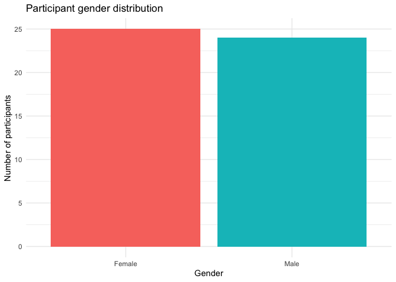
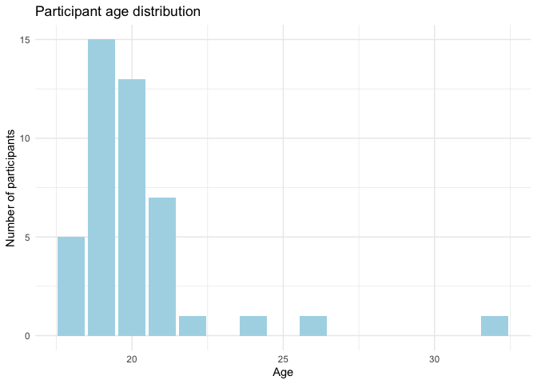
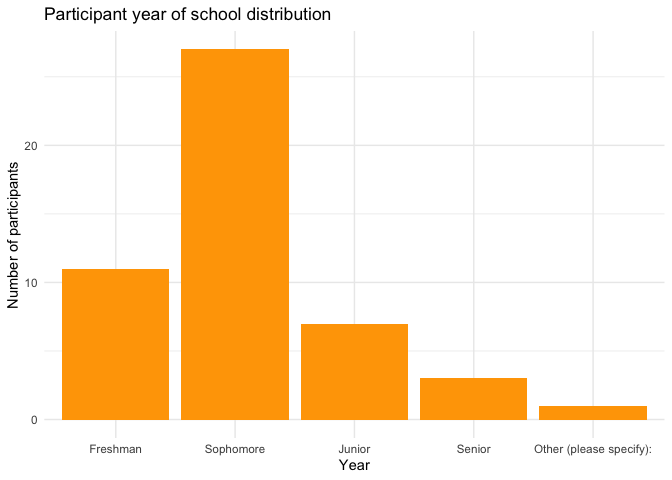
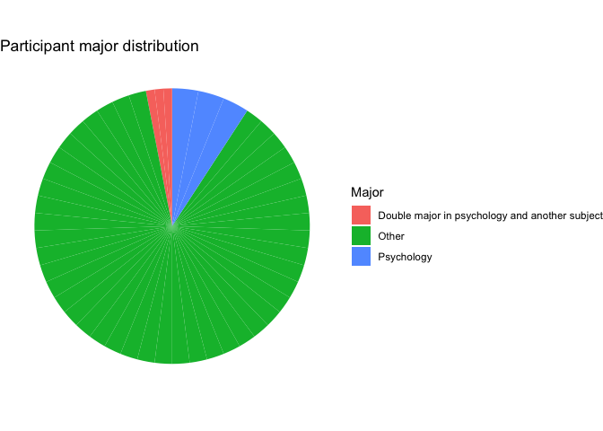
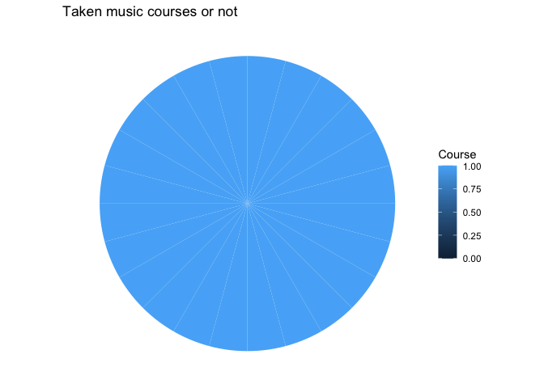
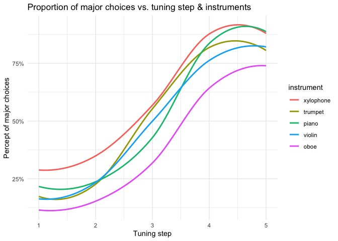
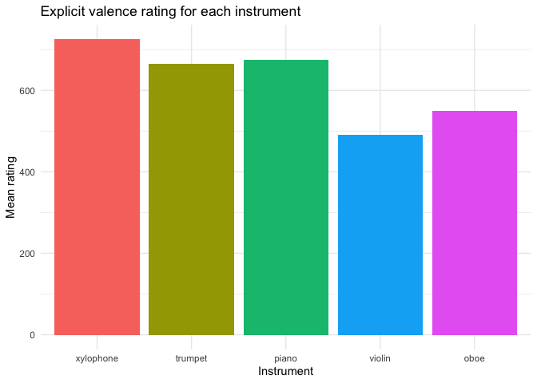

Data Cleaning & Exploratory Graphs
================
Eva Wu
2022-05-18

## Data Cleaning

This code chunk is to import concatenated data, delete irrelevant
variables and metadata to prepare for further data cleaning.

``` r
# jspsych data
df_j <- read_csv("inst-cat-uc-1.csv") %>% # load exp1 data
  filter(designation != "NA" & designation != "practice-intro" & designation != "practice-resp" & 
         qualtrics_id != "NA" & qualtrics_id != "9643222579") %>% # delete pilot data
  select(participant, qualtrics_id, chord, designation, response, # delete meta data
         correct, passed_practice, block_passed_practice, practice_score, 
         instrument, valence, tuning_step, selected_major, explicit_rtg) %>% 
  # for some reason 2 participant's qualtrics id was "participant", so I recoded according to their id on Qualtrics
  mutate(qualtrics_id = if_else(participant == "ch4dg75c7th9g1", "1706631024", qualtrics_id), 
         qualtrics_id = if_else(participant == "ept8xz3drgq38w", "4475978126", qualtrics_id),
         instrument = factor(instrument, levels = c("xylophone", "trumpet", "piano", "violin", "oboe")))

# qualtrics data
df_q <- read_csv("Qualtrics_5:4.csv") %>%
  filter(row_number() > 7) %>% # delete pilot data
  select(-(2:16), -50) %>% # delete unnecessary meta data
  mutate(Age = as.numeric(Age),
         Year = factor(Year, levels = c("Freshman", "Sophomore", "Junior", "Senior", "Graduate", "Other (please specify: )")),
         Inst = as.integer(if_else(Inst == "Yes", 1, 0)),
         Start = if_else(Start == "10 Years Old", "10", Start), # so that this won't be coerced to NA when mutating to numeric
         Start = as.integer(Start),
         Inst_now = as.integer(if_else(Inst_now == "Yes", 1, 0)),
         Ens = as.integer(if_else(Ens == "Yes", 1, 0)),
         Course = as.integer(if_else(Course == "Yes", 1, 0)),
         Read = as.integer(if_else(Read == "Yes", 1, 0)),
         `Pitch&Tempo_1` = as.integer(`Pitch&Tempo_1`),
         `Pitch&Tempo_2` = as.integer(`Pitch&Tempo_2`),
         Perf = as.integer(case_when(Perf == "Yes" ~ 1,
                                     Perf == "No" ~ 0,
                                     Perf == "Not sure" ~ -1)),
         Concert = as.integer(Concert))

# join qualtrics & jspsych data by embedded qualtrics id
# discard those who do not have a matching qualtrics_id in qualtrics data, keep everyone in jspsych data
combined <- left_join(df_j, df_q, by = c("qualtrics_id" = "participant"))
```

This code chunk is to filter out participants who did not do anything in
the survey/categorization task. Since there were problems with SONA,
some participants had duplicate rows, one with data and the other
without. Others had two rows, one with Qualtrics response but blank
jspsych response, the other with filled jspsych response but blank
Qualtrics response. This step is to make sure we delete duplicates and
combine same participants’ Qualtrics and jspsych data into one row.

``` r
# those who only have j data but not q
na_q <- combined %>%
  filter(is.na(Gender)) %>%
  select(1:14) # delete q columns
# there are 4 of them w/ blank qualtrics data but full jspsych data

# those who only have q data but not j
na_j <- df_q %>%
  # assume 22-0159 in q is 5281kj47nhoboj in j
  mutate(jspsych_id = if_else(jspsych_id == "22-0159", "5281kj47nhoboj", jspsych_id)) %>% 
  semi_join(na_q, by = c("jspsych_id" = "participant"))

# join the half-full data together according to jspsych id
na_combined <- full_join(na_q, na_j, by = c("participant" = "jspsych_id"), keep = TRUE) %>%
  select(-participant.y) %>%
  rename(participant = participant.x)

# bind them back to combined, delete the half-full rows
combined_drop_na <- rbind(combined, na_combined) %>%
  filter(!is.na(Gender))
```

The following code chunk is to extract demographics and headphone test
data, combine them together, and filter out those who did not pass the
headphone test.

``` r
# df for demographics
# need to find a way to summarize musical expertise
demo <- combined_drop_na %>%
  filter(designation == "PRACTICE-PASSED-SUMMARY") %>%
  select(-1, -(3:6), -(10:16), -49) # delete unnecessary data

# df for headphone test
test <- combined_drop_na %>%
  filter(designation == "headphone-test") %>%
  select(2, 6) %>%
  group_by(qualtrics_id) %>%
  summarize(n = sum(correct)) %>%
  # set 4 out of 6 as passed headphone test
  mutate(headphone = if_else(n >= 4, 1, 0),
         test_corr = n) %>%
  select(-n)

# combine headphone test pass/fail result w/ original data
demo_test <- left_join(demo, test, by = "qualtrics_id")

# see how many failed the headphone test
test %>%
  filter(headphone == 0)
```

    ## # A tibble: 8 × 3
    ##   qualtrics_id headphone test_corr
    ##   <chr>            <dbl>     <dbl>
    ## 1 1044403354           0         2
    ## 2 2077443174           0         2
    ## 3 3619423604           0         0
    ## 4 5405144116           0         0
    ## 5 6323213291           0         2
    ## 6 6783315289           0         2
    ## 7 8089229725           0         0
    ## 8 9018846073           0         1

Setting 4 as the pass threshold, we can see that 8 participants did not
pass the headphone test (answered fewer than 4 questions correctly). For
now I’ll keep them, but later we can see if deleting them makes a big
difference, and then decide whether to keep them.

The following code chunk extracts categorization and explicit rating
data respectively, and manipulate them to create 2 new data frames, 1
with participants’ categorization with explicit ratings combined
([cat_rtg.csv](cat_rtg.csv)), the other with participants’ demographics
and average percent of major categorization and explicit rating of each
instrument combined ([pivoted_data.csv](pivoted_data.csv)).

``` r
# df for categorization
cat <- combined_drop_na %>%
  filter(designation == "MAIN-JUDGMENT") %>%
  select(2:3, 10:13) %>%
  group_by(qualtrics_id, instrument, tuning_step) %>%
  summarize(pct_maj = mean(selected_major))
  
# each person's mean major choice proportion 
cat_pivoted <- cat %>%
  group_by(qualtrics_id, instrument) %>%
  summarize(mean_cat = mean(pct_maj)) %>%
  mutate(instrument = paste0("cat_", instrument)) %>%
  pivot_wider(names_from = instrument, values_from = mean_cat)

# delete since no point of having 25 cols for major judgment
# pivot_wider(names_from = c(instrument, tuning_step), values_from = pct_maj)

# df for explicit rating
rtg <- combined_drop_na %>%
  filter(designation == "INST-VALENCE-RTG") %>%
  select(qualtrics_id, instrument, explicit_rtg)

# pivot so that one person has one row
rtg_pivoted <- rtg %>%
  mutate(instrument = paste0("rtg_", instrument)) %>%
  pivot_wider(names_from = instrument, values_from = explicit_rtg)

# df for both combined
cat_rtg <- left_join(cat, rtg)

# each instrument's mean cat & rtg
cat_rtg_summary <- cat_rtg %>%
  group_by(instrument) %>%
  summarize(mean_pct = mean(pct_maj),
         mean_rtg = mean(explicit_rtg))

# both pivoted combined
cat_rtg_pivoted <- cat_pivoted %>% 
  left_join(rtg_pivoted, by = c("qualtrics_id"))

# delete the following since no need
# mutate(inst_id = case_when(instrument == "oboe" ~ 1, instrument == "violin" ~ 2,
# instrument == "piano" ~ 3, instrument == "trumpet" ~ 4, instrument == "xylophone" ~ 5))

# each participant = 1 row of data
all <- left_join(cat_rtg_pivoted, demo_test)

write_csv(cat_rtg, "cat_rtg.csv")
write_csv(all, "pivoted_data.csv")
```

A snapshot of the data (next step: find a measure to summarize musical
background)

``` r
variable_names = colnames(all)
variable_meaning = c("Random 10-digit ID assigned by Qualtrics, used to join Qualtrics and jspsych data", "Proportion of major categorization for xylophone", "Proportion of major categorization for violin", "Proportion of major categorization for piano",
                "Proportion of major categorization for trumpet", "Proportion of major categorization for oboe",
                "Explicit valence rating of xylophone", "Explicit valence rating of violin", "Explicit valence rating of piano",
                "Explicit valence rating of trumpet", "Explicit valence rating of oboe", "Passed practice or not (1 = pass)", "Number of tries taken to pass", 
                "Practice score (out of 12)", "", "", "", "If not a student or faculty", "", "If not a psych of music major", "Play instrument or not", 
                "At what age did they start playing an instrument", "Still playing now?", "List instruments played", "Participated in ensemble or not",
                "Taken music courses or not", "List music courses taken", "Read music or not", "Ability to perceive and remember pitch", "Ability to perceive and remember tempo",
                "Perfect pitch", "Time spent making music per week", "Time spent listening to music per day", "Number of concert attended per year", 
                "Proportion of each genre listened to (total 100)", "", "", "", "", "", "", "", "", "", "", "", "Passed headphone test or not (1 = pass)", 
                "Number of correct answers in headphone test")
codebook <- data.frame(variable_names, variable_meaning)
kable(codebook)
```

<table>
<thead>
<tr>
<th style="text-align:left;">
variable_names
</th>
<th style="text-align:left;">
variable_meaning
</th>
</tr>
</thead>
<tbody>
<tr>
<td style="text-align:left;">
qualtrics_id
</td>
<td style="text-align:left;">
Random 10-digit ID assigned by Qualtrics, used to join Qualtrics and
jspsych data
</td>
</tr>
<tr>
<td style="text-align:left;">
cat_xylophone
</td>
<td style="text-align:left;">
Proportion of major categorization for xylophone
</td>
</tr>
<tr>
<td style="text-align:left;">
cat_trumpet
</td>
<td style="text-align:left;">
Proportion of major categorization for violin
</td>
</tr>
<tr>
<td style="text-align:left;">
cat_piano
</td>
<td style="text-align:left;">
Proportion of major categorization for piano
</td>
</tr>
<tr>
<td style="text-align:left;">
cat_violin
</td>
<td style="text-align:left;">
Proportion of major categorization for trumpet
</td>
</tr>
<tr>
<td style="text-align:left;">
cat_oboe
</td>
<td style="text-align:left;">
Proportion of major categorization for oboe
</td>
</tr>
<tr>
<td style="text-align:left;">
rtg_xylophone
</td>
<td style="text-align:left;">
Explicit valence rating of xylophone
</td>
</tr>
<tr>
<td style="text-align:left;">
rtg_violin
</td>
<td style="text-align:left;">
Explicit valence rating of violin
</td>
</tr>
<tr>
<td style="text-align:left;">
rtg_piano
</td>
<td style="text-align:left;">
Explicit valence rating of piano
</td>
</tr>
<tr>
<td style="text-align:left;">
rtg_trumpet
</td>
<td style="text-align:left;">
Explicit valence rating of trumpet
</td>
</tr>
<tr>
<td style="text-align:left;">
rtg_oboe
</td>
<td style="text-align:left;">
Explicit valence rating of oboe
</td>
</tr>
<tr>
<td style="text-align:left;">
passed_practice
</td>
<td style="text-align:left;">
Passed practice or not (1 = pass)
</td>
</tr>
<tr>
<td style="text-align:left;">
block_passed_practice
</td>
<td style="text-align:left;">
Number of tries taken to pass
</td>
</tr>
<tr>
<td style="text-align:left;">
practice_score
</td>
<td style="text-align:left;">
Practice score (out of 12)
</td>
</tr>
<tr>
<td style="text-align:left;">
Age
</td>
<td style="text-align:left;">
</td>
</tr>
<tr>
<td style="text-align:left;">
Gender
</td>
<td style="text-align:left;">
</td>
</tr>
<tr>
<td style="text-align:left;">
Year
</td>
<td style="text-align:left;">
</td>
</tr>
<tr>
<td style="text-align:left;">
Year_6\_TEXT
</td>
<td style="text-align:left;">
If not a student or faculty
</td>
</tr>
<tr>
<td style="text-align:left;">
Major
</td>
<td style="text-align:left;">
</td>
</tr>
<tr>
<td style="text-align:left;">
Major_5\_TEXT
</td>
<td style="text-align:left;">
If not a psych of music major
</td>
</tr>
<tr>
<td style="text-align:left;">
Inst
</td>
<td style="text-align:left;">
Play instrument or not
</td>
</tr>
<tr>
<td style="text-align:left;">
Start
</td>
<td style="text-align:left;">
At what age did they start playing an instrument
</td>
</tr>
<tr>
<td style="text-align:left;">
Inst_now
</td>
<td style="text-align:left;">
Still playing now?
</td>
</tr>
<tr>
<td style="text-align:left;">
Inst_list
</td>
<td style="text-align:left;">
List instruments played
</td>
</tr>
<tr>
<td style="text-align:left;">
Ens
</td>
<td style="text-align:left;">
Participated in ensemble or not
</td>
</tr>
<tr>
<td style="text-align:left;">
Course
</td>
<td style="text-align:left;">
Taken music courses or not
</td>
</tr>
<tr>
<td style="text-align:left;">
Course_list
</td>
<td style="text-align:left;">
List music courses taken
</td>
</tr>
<tr>
<td style="text-align:left;">
Read
</td>
<td style="text-align:left;">
Read music or not
</td>
</tr>
<tr>
<td style="text-align:left;">
Pitch&Tempo_1
</td>
<td style="text-align:left;">
Ability to perceive and remember pitch
</td>
</tr>
<tr>
<td style="text-align:left;">
Pitch&Tempo_2
</td>
<td style="text-align:left;">
Ability to perceive and remember tempo
</td>
</tr>
<tr>
<td style="text-align:left;">
Perf
</td>
<td style="text-align:left;">
Perfect pitch
</td>
</tr>
<tr>
<td style="text-align:left;">
Time_make
</td>
<td style="text-align:left;">
Time spent making music per week
</td>
</tr>
<tr>
<td style="text-align:left;">
Time_listen
</td>
<td style="text-align:left;">
Time spent listening to music per day
</td>
</tr>
<tr>
<td style="text-align:left;">
Concert
</td>
<td style="text-align:left;">
Number of concert attended per year
</td>
</tr>
<tr>
<td style="text-align:left;">
Genre_18
</td>
<td style="text-align:left;">
Proportion of each genre listened to (total 100)
</td>
</tr>
<tr>
<td style="text-align:left;">
Genre_8
</td>
<td style="text-align:left;">
</td>
</tr>
<tr>
<td style="text-align:left;">
Genre_9
</td>
<td style="text-align:left;">
</td>
</tr>
<tr>
<td style="text-align:left;">
Genre_17
</td>
<td style="text-align:left;">
</td>
</tr>
<tr>
<td style="text-align:left;">
Genre_10
</td>
<td style="text-align:left;">
</td>
</tr>
<tr>
<td style="text-align:left;">
Genre_11
</td>
<td style="text-align:left;">
</td>
</tr>
<tr>
<td style="text-align:left;">
Genre_12
</td>
<td style="text-align:left;">
</td>
</tr>
<tr>
<td style="text-align:left;">
Genre_13
</td>
<td style="text-align:left;">
</td>
</tr>
<tr>
<td style="text-align:left;">
Genre_16
</td>
<td style="text-align:left;">
</td>
</tr>
<tr>
<td style="text-align:left;">
Genre_14
</td>
<td style="text-align:left;">
</td>
</tr>
<tr>
<td style="text-align:left;">
Genre_15
</td>
<td style="text-align:left;">
</td>
</tr>
<tr>
<td style="text-align:left;">
Genre_15_TEXT
</td>
<td style="text-align:left;">
</td>
</tr>
<tr>
<td style="text-align:left;">
headphone
</td>
<td style="text-align:left;">
Passed headphone test or not (1 = pass)
</td>
</tr>
<tr>
<td style="text-align:left;">
test_corr
</td>
<td style="text-align:left;">
Number of correct answers in headphone test
</td>
</tr>
</tbody>
</table>

## Demographic analysis

``` r
all %>%
  filter(Gender != "NA") %>%
  ggplot(aes(Gender, fill = Gender)) +
  geom_bar() +
  labs(title = "Participant gender distribution",
       x = "Gender",
       y = "Number of participants") +
  theme_minimal() +
  theme(legend.position = "None")
```

<!-- -->

``` r
all %>%
  ggplot(aes(Age)) +
  geom_bar(fill = "lightblue") +
  labs(title = "Participant age distribution",
       x = "Age",
       y = "Number of participants") +
  theme_minimal()
```

<!-- -->

``` r
all %>%
  filter(Year != "NA") %>%
  ggplot(aes(Year)) +
  geom_bar(fill = "orange") +
  labs(title = "Participant year of school distribution",
       x = "Year",
       y = "Number of participants") +
  theme_minimal()
```

<!-- -->

``` r
# 3 psych, 3 double, 43 other; why is the graph like this
all %>%
  mutate(Major = case_when(Major == "Psychology" ~ "Psychology",
                           Major == "Music" ~ "Music",
                           Major == "NA" ~ "NA",
                           Major == "Music,Other (please specify):" ~ "Double major in music and another subject",
                           Major == "Other (please specify):" ~ "Other",
                           Major == "Psychology,Other (please specify):" ~ "Double major in psychology and another subject")) %>%
  ggplot(aes("", Major, fill = Major)) +
  geom_bar(stat = "identity") +
  coord_polar(theta = "y") +
  labs(title = "Participant major distribution") +
  theme_void()
```

<!-- -->

Turns out the number of female and male participants did not differ
much. Most participants were aged 18-21, while a few above 22. We had
the greatest number of sophomores, then freshmen, then juniors, and the
lowest number of seniors. Pie chart was a bit odd; need more work. But
we can see that most participants were neither a psychology major nor a
music major.

## Music courses taken

``` r
# demo$Course is already an integer, why is it still double in the graph
#all %>%
#  ggplot(aes("", Course, fill = Course)) +
#  geom_bar(stat = "identity") +
#  coord_polar(theta = "y") +
#  labs(title = "Taken music courses or not") +
#  theme_void()

all %>%
  ggplot(aes(Course)) +
  geom_bar() +
  labs(title = "Taken music courses or not")
```

<!-- -->

The number of participants who have taken music courses were slightly
lower than that of those who haven’t.

## Practice Score

``` r
all %>%
  filter(block_passed_practice == 2)
```

    ## # A tibble: 2 × 48
    ## # Groups:   qualtrics_id [2]
    ##   qualtrics_id cat_xylophone cat_trumpet cat_piano cat_violin cat_oboe
    ##   <chr>                <dbl>       <dbl>     <dbl>      <dbl>    <dbl>
    ## 1 2701997442            1           0.8      0.75       0.375    0.3  
    ## 2 6783315289            0.55        0.65     0.575      0.7      0.525
    ## # … with 42 more variables: rtg_xylophone <dbl>, rtg_violin <dbl>,
    ## #   rtg_piano <dbl>, rtg_trumpet <dbl>, rtg_oboe <dbl>, passed_practice <dbl>,
    ## #   block_passed_practice <dbl>, practice_score <dbl>, Age <dbl>, Gender <chr>,
    ## #   Year <fct>, Year_6_TEXT <chr>, Major <chr>, Major_5_TEXT <chr>, Inst <int>,
    ## #   Start <int>, Inst_now <int>, Inst_list <chr>, Ens <int>, Course <int>,
    ## #   Course_list <chr>, Read <int>, `Pitch&Tempo_1` <int>,
    ## #   `Pitch&Tempo_2` <int>, Perf <int>, Time_make <chr>, Time_listen <chr>, …

``` r
all %>%
  ggplot(aes(practice_score)) +
  geom_bar(fill = "lightgreen") +
  labs(title = "Practice score distribution among those who passed (almost all did)",
       subtitle = "Pass: getting ≥ 8 out of 12 correct",
       x = "Number of correct responses out of 12",
       y = "Number of participants") +
  theme_minimal()
```

<!-- -->

Only 2 failed the 1st time. The rest all passed in the 1st try. Most
passed with 12/12.

## Categorization

``` r
cat %>%
  ggplot(aes(tuning_step, pct_maj, color = instrument)) +
  geom_smooth(se = FALSE) +
  scale_y_continuous(labels = scales::percent) +
  # need to come up w/ a better palette
  # scale_color_discrete_sequential("Viridis", rev = TRUE) + 
  labs(title = "Proportion of major choices vs. tuning step & instruments",
       x = "Tuning step", y = "Percept of major choices") +
  theme_minimal()
```

<!-- -->

Xylophone: overall most likely to be judged as major when tuning is
unclear

Oboe: overall most likely to be judged as minor when tuning is unclear

## Explicit Rating

``` r
rtg %>%
  ggplot(aes(instrument, explicit_rtg, fill = instrument)) +
  geom_col() +
  labs(title = "Explicit valence rating for each instrument",
       x = "Instrument", y = "Mean rating") +
  theme_minimal() +
  theme(legend.position = "None")
```

<!-- -->

Xylophone: rated “happiest” on average, then piano, then trumpet, then
oboe, and violin rated the “saddest”.

## Compare trend between tonality judgment and explicit rating

``` r
cat_rtg_summary %>%
  pivot_longer(cols = c(mean_pct, mean_rtg), names_to = "type", values_to = "value") %>%
  mutate(type = if_else(type == "mean_pct", "Mean percent proportion of major categorization", 
                        "Mean explicit valence rating")) %>%
  ggplot(aes(instrument, value, group = 1, color = type)) +
  geom_line() +
  facet_wrap(~type, ncol = 1, scales = "free_y") +
  labs(title = "Compare trend b/w tonality categorization & valence rating",
       x = "Instrument", y = NULL) +
  theme(axis.text.y = element_blank(),
        axis.ticks.y = element_blank(),
        panel.grid.major.y = element_blank(),
        legend.position = "None")
```

<!-- -->

Trend for categorization is similar to that for explicit rating. But
there was a tiny bit of difference:

Explicit valence rating: violin lowest, violin \< oboe

Categorization: oboe lowest, violin \> oboe
