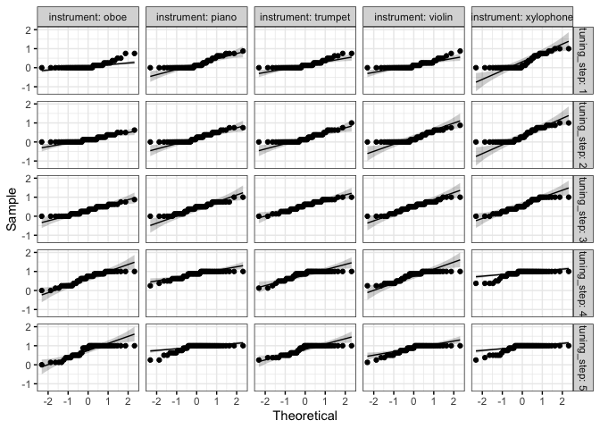
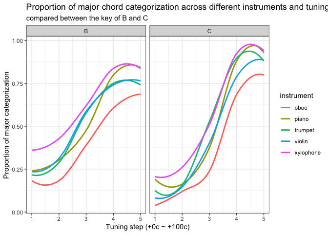
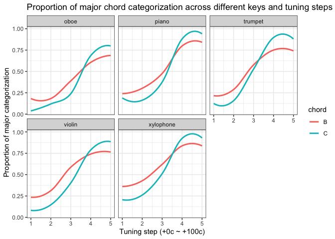
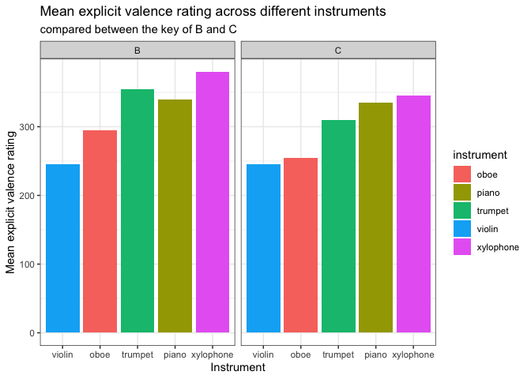
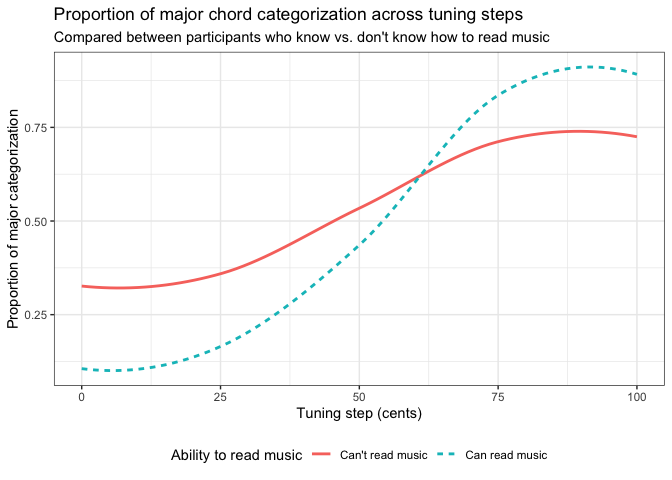
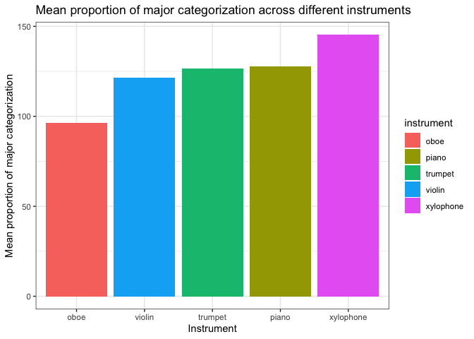
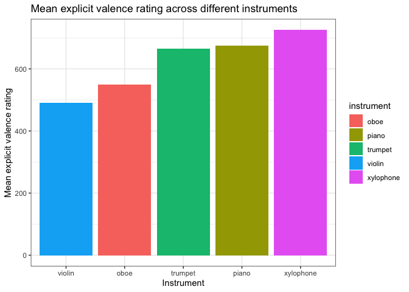
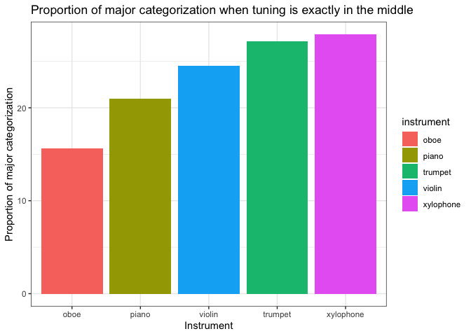
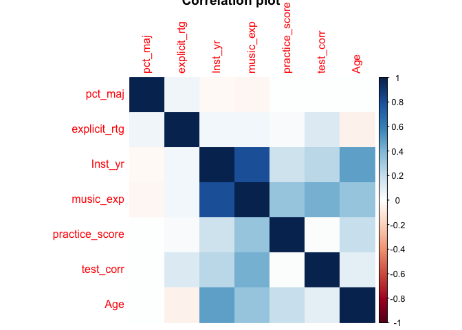

Eva Analyses
================
Eva Wu
2022-09-13

In this document, I first presented summary statistics for some
demographics variables. Then, I checked ANOVA assumptions. After that, I
calculated ANOVA results for how instrument and tuning step affect
tonality perception and how explicit valence rating differed across
instruments. Results showed that both instrument and tuning step had
significant main effect on tonality perception, and there was also a
significant interaction between the two. Results also showed that
explicit valence ratings differed significantly across instruments.

We also conducted ANOVA for exploratory variables, but eventually did
not include them in our main analysis because adding them did not change
the significance level of our main variables of interests. Then, we
performed post hoc tests for both tonality perception and explicit
valence rating, with tables presented below.

Afterwards, we created some visualizations to represent the relationship
between instrument, tuning step, & some other exploratory variables and
tonality perception & explicit valence rating. At the end of our
document, we added another method of analysis - one-way ANOVA for
tonality categorization at the most ambiguous tuning step (3) only.
Finally, we calculated whether proportion of major categorization and
explicit rating were correlated - turns out they were! This could
potentially explain that the effect of instrument on tonality perception
may be because of the difference in emotional association across
instruments.

## Summary Statistics

``` r
# age
data %>%
  get_summary_stats(Age, type = "mean_sd") %>%
  select(-n)
```

    ## # A tibble: 1 × 3
    ##   variable  mean    sd
    ##   <chr>    <dbl> <dbl>
    ## 1 Age       20.1  2.34

``` r
# practice score
data %>%
  get_summary_stats(practice_score, type = "mean_sd") %>%
  select(-n)
```

    ## # A tibble: 1 × 3
    ##   variable        mean    sd
    ##   <chr>          <dbl> <dbl>
    ## 1 practice_score  11.2  1.27

``` r
# mean & sd for instrument
data %>%
  group_by(instrument) %>%
  get_summary_stats(pct_maj, type = "mean_sd") %>%
  select(-variable, -n)
```

    ## # A tibble: 5 × 3
    ##   instrument  mean    sd
    ##   <chr>      <dbl> <dbl>
    ## 1 oboe       0.394 0.357
    ## 2 piano      0.521 0.373
    ## 3 trumpet    0.516 0.368
    ## 4 violin     0.496 0.367
    ## 5 xylophone  0.593 0.384

``` r
# mean & sd for tuning step
data %>%
  group_by(tuning_step) %>%
  get_summary_stats(pct_maj, type = "mean_sd") %>%
  select(-variable, -n)
```

    ## # A tibble: 5 × 3
    ##   tuning_step  mean    sd
    ##         <dbl> <dbl> <dbl>
    ## 1           1 0.191 0.258
    ## 2           2 0.24  0.266
    ## 3           3 0.474 0.294
    ## 4           4 0.788 0.255
    ## 5           5 0.827 0.248

``` r
# mean & sd for proportion of major categorization across instruments
data %>%
  group_by(instrument, tuning_step) %>%
  get_summary_stats(pct_maj, type = "mean_sd") %>%
  select(-variable, -n)
```

    ## # A tibble: 25 × 4
    ##    instrument tuning_step  mean    sd
    ##    <chr>            <dbl> <dbl> <dbl>
    ##  1 oboe                 1 0.115 0.189
    ##  2 oboe                 2 0.153 0.168
    ##  3 oboe                 3 0.319 0.238
    ##  4 oboe                 4 0.643 0.308
    ##  5 oboe                 5 0.74  0.323
    ##  6 piano                1 0.217 0.266
    ##  7 piano                2 0.237 0.244
    ##  8 piano                3 0.429 0.276
    ##  9 piano                4 0.837 0.195
    ## 10 piano                5 0.888 0.198
    ## # … with 15 more rows

``` r
# mean & sd for explicit emotional valence rating across instruments
data %>%
  select(instrument, explicit_rtg, qualtrics_id) %>%
  unique() %>%
  group_by(instrument) %>%
  get_summary_stats(explicit_rtg, type = "mean_sd") %>%
  select(-variable, -n)
```

    ## # A tibble: 5 × 3
    ##   instrument  mean    sd
    ##   <chr>      <dbl> <dbl>
    ## 1 oboe        2.24 0.662
    ## 2 piano       2.76 0.662
    ## 3 trumpet     2.71 0.764
    ## 4 violin      2    0.677
    ## 5 xylophone   2.96 0.865

## Check assumptions

### Outliers

    ## [1] qualtrics_id mean_pct     is.outlier   is.extreme  
    ## <0 rows> (or 0-length row.names)

    ## [1] "No outliers for tonality categorization."

    ## # A tibble: 0 × 4
    ## # … with 4 variables: qualtrics_id <dbl>, mean_rtg <dbl>, is.outlier <lgl>,
    ## #   is.extreme <lgl>

    ## [1] "No extreme outliers for explicit ratings."

### Normality

    ## # A tibble: 50 × 6
    ##    instrument tuning_step chord variable statistic           p
    ##    <chr>            <dbl> <chr> <chr>        <dbl>       <dbl>
    ##  1 oboe                 1 B     pct_maj      0.785 0.000101   
    ##  2 oboe                 1 C     pct_maj      0.592 0.000000741
    ##  3 oboe                 2 B     pct_maj      0.835 0.000753   
    ##  4 oboe                 2 C     pct_maj      0.828 0.00111    
    ##  5 oboe                 3 B     pct_maj      0.955 0.304      
    ##  6 oboe                 3 C     pct_maj      0.879 0.00936    
    ##  7 oboe                 4 B     pct_maj      0.901 0.0165     
    ##  8 oboe                 4 C     pct_maj      0.862 0.00462    
    ##  9 oboe                 5 B     pct_maj      0.836 0.000762   
    ## 10 oboe                 5 C     pct_maj      0.672 0.00000615 
    ## # … with 40 more rows

<!-- -->

Normality assumption violated, which is a given for proportion data, but
it’s fine since we had large sample size and balanced groups.

### Homogeneity of variance

    ## # A tibble: 1 × 4
    ##     df1   df2 statistic        p
    ##   <int> <int>     <dbl>    <dbl>
    ## 1    49  1175      3.07 2.62e-11

Homoscedasticity assumption violated, but no need to transform for
assumption violations because ANOVA is robust for these issues. Just
report a Greenhouse-Geisser correction (epsilon \* df).

The assumption of sphericity will be automatically checked during the
computation of the ANOVA test using the R function anova_test()
\[rstatix package\]. The Mauchly’s test is internally used to assess the
sphericity assumption.

By using the function get_anova_table() \[rstatix\] to extract the ANOVA
table, the Greenhouse-Geisser correction is automatically applied to
factors violating the sphericity assumption.

## ANOVA

### Proportion of major categorization \~ intrument \* tuning step

    ## ANOVA Table (type III tests)
    ## 
    ##                   Effect   DFn    DFd       F        p p<.05   ges
    ## 1             instrument  2.79 133.91  14.056 1.15e-07     * 0.060
    ## 2            tuning_step  1.55  74.48 104.352 8.42e-20     * 0.522
    ## 3 instrument:tuning_step 10.64 510.95   4.078 1.23e-05     * 0.015

Two-way mixed ANOVA showed that instrument and tuning step both had main
effects on tonality perception, and there was a significant interaction
between instrument and tuning step.

#### Adding headphone test score as covariate

    ## ANOVA Table (type II tests)
    ## 
    ##                             Effect   DFn    DFd       F        p p<.05      ges
    ## 1                        test_corr  1.00  47.00   0.221 6.40e-01       0.000544
    ## 2                       instrument  2.68 125.73  14.381 1.46e-07     * 0.064000
    ## 3                      tuning_step  1.63  76.60 115.637 1.06e-21     * 0.540000
    ## 4             test_corr:instrument  2.68 125.73   2.108 1.10e-01       0.010000
    ## 5            test_corr:tuning_step  1.63  76.60   6.191 6.00e-03     * 0.059000
    ## 6           instrument:tuning_step 10.58 497.16   4.087 1.27e-05     * 0.016000
    ## 7 test_corr:instrument:tuning_step 10.58 497.16   1.105 3.55e-01       0.004000

Three-way mixed ANCOVA showed that there was a significant main effect
of instrument, tuning step on tonality perception, and significant
interaction between headphone test score and tuning step as well as
between instrument and tuning step. Since the key effects of interests
were not changed as compared between the model with the headphone score
added and that without, and neither the main effect of headphone score
nor the three-way interaction was significant, we decided to drop
headphone score from the model.

#### Adding practice score as covariate

    ## ANOVA Table (type II tests)
    ## 
    ##                                  Effect   DFn    DFd       F        p p<.05
    ## 1                        practice_score  1.00  47.00   0.281 5.99e-01      
    ## 2                            instrument  2.91 136.81  15.012 2.42e-08     *
    ## 3                           tuning_step  1.97  92.46 167.281 3.22e-31     *
    ## 4             practice_score:instrument  2.91 136.81   4.265 7.00e-03     *
    ## 5            practice_score:tuning_step  1.97  92.46  29.946 1.19e-10     *
    ## 6                instrument:tuning_step 10.49 493.10   4.110 1.25e-05     *
    ## 7 practice_score:instrument:tuning_step 10.49 493.10   1.368 1.88e-01      
    ##       ges
    ## 1 0.00082
    ## 2 0.07500
    ## 3 0.58300
    ## 4 0.02300
    ## 5 0.20000
    ## 6 0.01900
    ## 7 0.00600

Similar to above, 3-way mixed ANCOVA showed that there was no difference
in the main effects and interaction of interests before vs. after adding
practice score to the model, so we decided to drop the practice score
variable.

#### Adding key as a between-subjects variable

    ## ANOVA Table (type III tests)
    ## 
    ##                         Effect   DFn    DFd       F        p p<.05   ges
    ## 1                        chord  1.00  47.00   2.010 1.63e-01       0.005
    ## 2                   instrument  2.76 129.89  13.830 1.71e-07     * 0.063
    ## 3                  tuning_step  1.59  74.57 114.978 3.98e-21     * 0.541
    ## 4             chord:instrument  2.76 129.89   0.483 6.80e-01       0.002
    ## 5            chord:tuning_step  1.59  74.57   4.842 1.60e-02     * 0.047
    ## 6       instrument:tuning_step 10.46 491.53   4.092 1.38e-05     * 0.016
    ## 7 chord:instrument:tuning_step 10.46 491.53   0.784 6.49e-01       0.003

Similar to above, 3-way mixed ANOVA showed that there was no difference
in the main effects and interaction of interests before vs. after adding
key to the model, so we decided to drop the key variable.

#### Adding number of years playing instruments as covariate

    ## ANOVA Table (type II tests)
    ## 
    ##                           Effect  DFn    DFd       F        p p<.05   ges
    ## 1                        Inst_yr 1.00  34.00   0.545 4.66e-01       0.002
    ## 2                     instrument 2.31  78.63   9.825 7.10e-05     * 0.058
    ## 3                    tuning_step 1.97  66.90 130.579 1.16e-23     * 0.640
    ## 4             Inst_yr:instrument 2.31  78.63   2.062 1.27e-01       0.013
    ## 5            Inst_yr:tuning_step 1.97  66.90   6.158 4.00e-03     * 0.077
    ## 6         instrument:tuning_step 8.65 293.96   4.275 4.15e-05     * 0.024
    ## 7 Inst_yr:instrument:tuning_step 8.65 293.96   0.956 4.75e-01       0.006

Similar to above, 3-way mixed ANCOVA showed that there was no difference
in the main effects and interaction of interests before vs. after adding
years of instrument playing to the model, so we decided to drop that
variable.

#### Adding ability to read music as between-subjects variable

    ## ANOVA Table (type III tests)
    ## 
    ##                        Effect   DFn    DFd       F        p p<.05   ges
    ## 1                        Read  1.00  47.00   3.389 7.20e-02       0.008
    ## 2                  instrument  2.83 133.05  15.917 1.40e-08     * 0.073
    ## 3                 tuning_step  1.69  79.61 104.049 3.53e-21     * 0.505
    ## 4             Read:instrument  2.83 133.05   2.276 8.60e-02       0.011
    ## 5            Read:tuning_step  1.69  79.61  10.950 1.55e-04     * 0.097
    ## 6      instrument:tuning_step 10.55 495.62   3.519 1.20e-04     * 0.014
    ## 7 Read:instrument:tuning_step 10.55 495.62   1.423 1.62e-01       0.006

Similar to above, 3-way mixed ANOVA showed that there was no difference
in the main effects and interaction of interests before vs. after adding
ability to read music to the model, so we decided to drop that variable.

#### Adding whether individuals had experience playing instruments as between-subjects variable

    ## ANOVA Table (type III tests)
    ## 
    ##                        Effect   DFn    DFd      F        p p<.05   ges
    ## 1                        Inst  1.00  47.00  1.134 2.92e-01       0.003
    ## 2                  instrument  2.79 131.07 10.392 6.35e-06     * 0.048
    ## 3                 tuning_step  1.63  76.70 39.885 2.98e-11     * 0.289
    ## 4             Inst:instrument  2.79 131.07  1.195 3.13e-01       0.006
    ## 5            Inst:tuning_step  1.63  76.70  5.678 8.00e-03     * 0.055
    ## 6      instrument:tuning_step 10.41 489.29  2.520 5.00e-03     * 0.010
    ## 7 Inst:instrument:tuning_step 10.41 489.29  1.580 1.06e-01       0.006

Similar to above, 3-way mixed ANOVA showed that there was no difference
in the main effects and interaction of interests before vs. after adding
whether individuals had experience playing instruments to the model, so
we decided to drop that variable.

### Individuals’ explicit ratings of each instrument’s emotional valence \~ intrument

    ## ANOVA Table (type III tests)
    ## 
    ##       Effect  DFn    DFd      F        p p<.05   ges
    ## 1 instrument 3.27 156.77 15.606 1.95e-09     * 0.194

A one-way repeated-measures ANOVA showed that explicit valence ratings
for each instrument significantly differed among each other.

    ## ANOVA Table (type III tests)
    ## 
    ##             Effect  DFn    DFd      F        p p<.05   ges
    ## 1            chord 1.00  47.00  1.012 3.20e-01       0.005
    ## 2       instrument 3.28 154.12 15.391 2.50e-09     * 0.196
    ## 3 chord:instrument 3.28 154.12  0.623 6.15e-01       0.010

    ## ANOVA Table (type II tests)
    ## 
    ##               Effect  DFn   DFd      F        p p<.05   ges
    ## 1            Inst_yr 1.00 34.00  0.287 5.96e-01       0.003
    ## 2         instrument 2.91 98.97 11.261 2.60e-06     * 0.183
    ## 3 Inst_yr:instrument 2.91 98.97  1.975 1.25e-01       0.038

Adding key and years of instrument experience did not change the fact
that instrument had a significant effect on explicit valence rating, and
the main effect of key and years of instrument experience as well as the
interaction were non-significant, so we decided to drop these variables.

## Post-hoc tests

A significant two-way interaction can be followed up by a simple main
effect analysis, which can be followed up by simple pairwise comparisons
if significant. Here we’re using Hommel correction method because it’s
neither too stringent nor too lenient.

    ## [1] "post hoc for main effect of instrument on tonality categorization"

    ## # A tibble: 10 × 8
    ##    group1  group2       n1    n2 statistic    df    p.adj p.adj.signif
    ##    <chr>   <chr>     <int> <int>     <dbl> <dbl>    <dbl> <chr>       
    ##  1 oboe    piano       245   245    -7.57    244 6.22e-12 ****        
    ##  2 oboe    trumpet     245   245    -8.29    244 6.88e-14 ****        
    ##  3 oboe    violin      245   245    -6.63    244 1.52e- 9 ****        
    ##  4 oboe    xylophone   245   245   -10.1     244 3.21e-19 ****        
    ##  5 piano   trumpet     245   245     0.362   244 7.18e- 1 ns          
    ##  6 piano   violin      245   245     1.72    244 2.56e- 1 ns          
    ##  7 piano   xylophone   245   245    -4.42    244 7.35e- 5 ****        
    ##  8 trumpet violin      245   245     1.37    244 3.42e- 1 ns          
    ##  9 trumpet xylophone   245   245    -4.23    244 1.33e- 4 ***         
    ## 10 violin  xylophone   245   245    -5.45    244 7.5 e- 7 ****

    ## [1] "post hoc for main effect of tuning step on tonality categorization"

    ## # A tibble: 10 × 8
    ##    group1 group2    n1    n2 statistic    df    p.adj p.adj.signif
    ##    <chr>  <chr>  <int> <int>     <dbl> <dbl>    <dbl> <chr>       
    ##  1 1      2        245   245     -4.46   244 2.56e- 5 ****        
    ##  2 1      3        245   245    -14.3    244 1.59e-33 ****        
    ##  3 1      4        245   245    -24.3    244 4.53e-66 ****        
    ##  4 1      5        245   245    -24.9    244 4.84e-68 ****        
    ##  5 2      3        245   245    -11.7    244 7.17e-25 ****        
    ##  6 2      4        245   245    -21.7    244 6.92e-58 ****        
    ##  7 2      5        245   245    -22.4    244 2.71e-60 ****        
    ##  8 3      4        245   245    -15.3    244 1.25e-36 ****        
    ##  9 3      5        245   245    -15.2    244 2.26e-36 ****        
    ## 10 4      5        245   245     -3.48   244 5.88e- 4 ***

    ## [1] "post hoc for instrument * tuning step interaction on tonality categorization"

    ## # A tibble: 5 × 8
    ##   tuning_step Effect       DFn   DFd     F            p `p<.05`   ges
    ##         <dbl> <chr>      <dbl> <dbl> <dbl>        <dbl> <chr>   <dbl>
    ## 1           1 instrument  2.69  129.  6.63 0.000556     *       0.051
    ## 2           2 instrument  3.09  148.  9.3  0.00000899   *       0.056
    ## 3           3 instrument  4     192  11.5  0.0000000208 *       0.098
    ## 4           4 instrument  3.24  155. 12.6  0.000000083  *       0.102
    ## 5           5 instrument  3.16  152.  6.61 0.000242     *       0.048

    ## [1] "pairwise comparisons for instrument * tuning step interaction on tonality categorization,\n      only presenting significant rows to save space"

    ## # A tibble: 22 × 9
    ##    tuning_step group1  group2       n1    n2 statistic    df    p.adj p.adj.si…¹
    ##          <dbl> <chr>   <chr>     <int> <int>     <dbl> <dbl>    <dbl> <chr>     
    ##  1           1 oboe    piano        49    49     -2.94    48 0.04     *         
    ##  2           1 oboe    xylophone    49    49     -3.91    48 0.003    **        
    ##  3           1 violin  xylophone    49    49     -2.86    48 0.048    *         
    ##  4           2 oboe    piano        49    49     -2.81    48 0.035    *         
    ##  5           2 oboe    trumpet      49    49     -2.90    48 0.028    *         
    ##  6           2 oboe    xylophone    49    49     -4.71    48 0.000216 ***       
    ##  7           2 piano   xylophone    49    49     -3.46    48 0.009    **        
    ##  8           2 trumpet xylophone    49    49     -3.17    48 0.017    *         
    ##  9           2 violin  xylophone    49    49     -3.44    48 0.01     **        
    ## 10           3 oboe    piano        49    49     -2.97    48 0.023    *         
    ## # … with 12 more rows, and abbreviated variable name ¹​p.adj.signif

    ## [1] "post hoc for the effect of instrument on explicit rating"

    ## # A tibble: 9 × 8
    ##   group1  group2       n1    n2 statistic    df    p.adj p.adj.signif
    ##   <chr>   <chr>     <int> <int>     <dbl> <dbl>    <dbl> <chr>       
    ## 1 oboe    piano       245   245     -8.20   244 6.7 e-14 ****        
    ## 2 oboe    trumpet     245   245     -8.78   244 1.81e-15 ****        
    ## 3 oboe    violin      245   245      4.18   244 1.63e- 4 ***         
    ## 4 oboe    xylophone   245   245    -10.4    244 1.77e-20 ****        
    ## 5 piano   violin      245   245     17.2    244 6.1 e-43 ****        
    ## 6 piano   xylophone   245   245     -3.29   244 2   e- 3 **          
    ## 7 trumpet violin      245   245     11.3    244 4.23e-23 ****        
    ## 8 trumpet xylophone   245   245     -3.48   244 2   e- 3 **          
    ## 9 violin  xylophone   245   245    -13.1    244 3.73e-29 ****

## Visualization

<!-- --><!-- --><!-- --><!-- --><!-- --><!-- -->

Seems like slope of the curve for proportion of major categorization
against tuning step is steeper for the key of C than B, for individuals
who had experience playing instruments than not, and for those who can
read music than those who can’t. So maybe familiarity with music is
related to steeper slope (since people are surely more familiar with the
key of C than B), meaning that changes in tuning step would lead to
greater changes in tonality perception? - An interesting future
direction.

Also, from the last 2 column plots, we can see same patterns for
categorization vs. rating, except for oboe and violin being reversed.

## Analyzing categorization \~ instrument at tuning step = 3 (in the middle of major & minor)

    ## # A tibble: 5 × 5
    ##   instrument variable     n  mean    sd
    ##   <chr>      <chr>    <dbl> <dbl> <dbl>
    ## 1 oboe       pct_maj     49 0.319 0.238
    ## 2 piano      pct_maj     49 0.429 0.276
    ## 3 trumpet    pct_maj     49 0.554 0.272
    ## 4 violin     pct_maj     49 0.5   0.291
    ## 5 xylophone  pct_maj     49 0.569 0.324

    ## ANOVA Table (type III tests)
    ## 
    ##       Effect DFn DFd      F        p p<.05   ges
    ## 1 instrument   4 192 11.527 2.08e-08     * 0.098

    ## [1] "Significant effect of instrument on tonality perception at tuning step 3"

    ## # A tibble: 10 × 8
    ##    group1  group2       n1    n2 statistic    df      p.adj p.adj.signif
    ##    <chr>   <chr>     <int> <int>     <dbl> <dbl>      <dbl> <chr>       
    ##  1 oboe    piano        49    49    -2.97     48 0.023      *           
    ##  2 oboe    trumpet      49    49    -5.89     48 0.00000373 ****        
    ##  3 oboe    violin       49    49    -5.12     48 0.0000423  ****        
    ##  4 oboe    xylophone    49    49    -5.07     48 0.0000508  ****        
    ##  5 piano   trumpet      49    49    -3.02     48 0.021      *           
    ##  6 piano   violin       49    49    -2.01     48 0.2        ns          
    ##  7 piano   xylophone    49    49    -2.81     48 0.036      *           
    ##  8 trumpet violin       49    49     1.46     48 0.3        ns          
    ##  9 trumpet xylophone    49    49    -0.305    48 0.762      ns          
    ## 10 violin  xylophone    49    49    -1.43     48 0.318      ns

<!-- -->

This trend is slightly different from mean categorization, mean rating,
slope, and crossover trends, but overall they are very similar.

## Correlations b/w C & E

Helpful
[guide](http://www.sthda.com/english/wiki/correlation-test-between-two-variables-in-r)
for correlation tests.

    ## 
    ##  Pearson's product-moment correlation
    ## 
    ## data:  corr_data$cat and corr_data$exp
    ## t = 3.9554, df = 243, p-value = 0.0001003
    ## alternative hypothesis: true correlation is not equal to 0
    ## 95 percent confidence interval:
    ##  0.1244514 0.3601710
    ## sample estimates:
    ##       cor 
    ## 0.2459441

Significant positive correlation between categorization and explicit
rating.

<!-- --><!-- -->

## Reference

Very helpful
[link](https://www.datanovia.com/en/lessons/mixed-anova-in-r/) for
performing mixed ANOVA in R!
