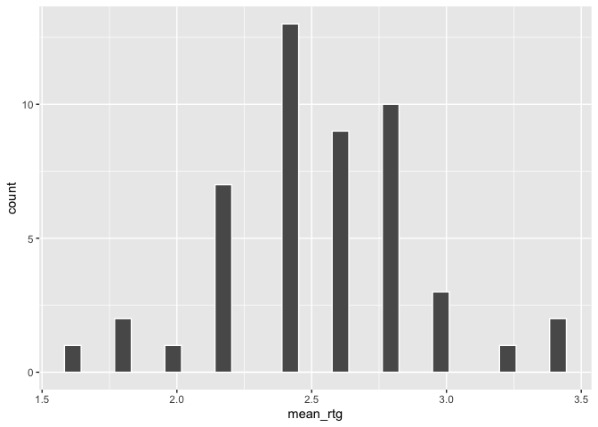

Eva Analyses
================
Eva Wu
2022-07-14

Very helpful
[link](https://www.datanovia.com/en/lessons/mixed-anova-in-r/)!

## Summary Statistics

``` r
# mean & sd for instrument
data %>%
  group_by(instrument) %>%
  get_summary_stats(pct_maj, type = "mean_sd") %>%
  select(-variable, -n)
```

    ## # A tibble: 5 × 3
    ##   instrument  mean    sd
    ##   <chr>      <dbl> <dbl>
    ## 1 oboe       0.394 0.357
    ## 2 piano      0.521 0.373
    ## 3 trumpet    0.516 0.368
    ## 4 violin     0.496 0.367
    ## 5 xylophone  0.593 0.384

``` r
# mean & sd for tuning step
data %>%
  group_by(tuning_step) %>%
  get_summary_stats(pct_maj, type = "mean_sd") %>%
  select(-variable, -n)
```

    ## # A tibble: 5 × 3
    ##   tuning_step  mean    sd
    ##         <dbl> <dbl> <dbl>
    ## 1           1 0.191 0.258
    ## 2           2 0.24  0.266
    ## 3           3 0.474 0.294
    ## 4           4 0.788 0.255
    ## 5           5 0.827 0.248

``` r
# mean & sd for each condition
data %>%
  group_by(instrument, tuning_step) %>%
  get_summary_stats(pct_maj, type = "mean_sd") %>%
  select(-variable, -n)
```

    ## # A tibble: 25 × 4
    ##    instrument tuning_step  mean    sd
    ##    <chr>            <dbl> <dbl> <dbl>
    ##  1 oboe                 1 0.115 0.189
    ##  2 oboe                 2 0.153 0.168
    ##  3 oboe                 3 0.319 0.238
    ##  4 oboe                 4 0.643 0.308
    ##  5 oboe                 5 0.74  0.323
    ##  6 piano                1 0.217 0.266
    ##  7 piano                2 0.237 0.244
    ##  8 piano                3 0.429 0.276
    ##  9 piano                4 0.837 0.195
    ## 10 piano                5 0.888 0.198
    ## # … with 15 more rows

## Visualization

``` r
data %>% 
  ggplot(aes(tuning_step, pct_maj, color = instrument)) +
  geom_smooth(se = FALSE) +
  labs(title = "Proportion of major chord categorization \nacross different instruments and tuning steps",
       x = "Tuning step (+0c ~ +100c)", y = "Proportion of major categorization") +
  theme_bw()
```

    ## `geom_smooth()` using method = 'loess' and formula 'y ~ x'

<!-- -->

``` r
data %>% 
  ggplot(aes(tuning_step, pct_maj, color = chord)) +
  geom_smooth(se = FALSE) +
  facet_wrap(~instrument) +
  labs(title = "Proportion of major chord categorization across different keys and tuning steps",
       x = "Tuning step (+0c ~ +100c)", y = "Proportion of major categorization") +
  theme_bw()
```

    ## `geom_smooth()` using method = 'loess' and formula 'y ~ x'

<!-- -->

``` r
data %>% 
  ggplot(aes(reorder(instrument, explicit_rtg), explicit_rtg, fill = instrument)) +
  geom_col() +
  facet_wrap(~chord) +
  labs(title = "Mean explicit valence rating across different instruments",
       subtitle = "compared between the key of B and C",
       x = "Instrument", y = "Mean explicit valence rating") +
  theme_bw()
```

<!-- -->

## Check assumptions

### Outliers

``` r
# for cat
data_summary <- data %>%
  group_by(qualtrics_id, tuning_step) %>%
  summarize(mean_pct = mean(pct_maj))
```

    ## `summarise()` has grouped output by 'qualtrics_id'. You can override using the
    ## `.groups` argument.

``` r
data %>%
  group_by(qualtrics_id) %>%
  summarize(mean_pct = mean(pct_maj)) %>%
  identify_outliers(mean_pct)
```

    ## [1] qualtrics_id mean_pct     is.outlier   is.extreme  
    ## <0 rows> (or 0-length row.names)

``` r
# for rtg
data %>%
  group_by(qualtrics_id) %>%
  summarize(mean_rtg = mean(explicit_rtg)) %>%
  ggplot(aes(mean_rtg)) +
  geom_histogram(color = "white")
```

    ## `stat_bin()` using `bins = 30`. Pick better value with `binwidth`.

<!-- -->

``` r
data %>%
  group_by(qualtrics_id) %>%
  summarize(mean_rtg = mean(explicit_rtg)) %>%
  identify_outliers(mean_rtg)
```

    ## # A tibble: 3 × 4
    ##   qualtrics_id mean_rtg is.outlier is.extreme
    ##          <dbl>    <dbl> <lgl>      <lgl>     
    ## 1   1588756489      3.4 TRUE       FALSE     
    ## 2   6323213291      1.6 TRUE       FALSE     
    ## 3   6444402078      3.4 TRUE       FALSE

``` r
# examine outliers
data %>%
  filter(qualtrics_id == 1588756489 | qualtrics_id == 6323213291 | qualtrics_id == 6444402078) %>%
  select(qualtrics_id, instrument, explicit_rtg) %>%
  unique()
```

    ## # A tibble: 15 × 3
    ##    qualtrics_id instrument explicit_rtg
    ##           <dbl> <chr>             <dbl>
    ##  1   1588756489 xylophone             4
    ##  2   1588756489 trumpet               4
    ##  3   1588756489 piano                 3
    ##  4   1588756489 violin                3
    ##  5   1588756489 oboe                  3
    ##  6   6323213291 xylophone             1
    ##  7   6323213291 trumpet               1
    ##  8   6323213291 piano                 2
    ##  9   6323213291 violin                2
    ## 10   6323213291 oboe                  2
    ## 11   6444402078 xylophone             4
    ## 12   6444402078 trumpet               3
    ## 13   6444402078 piano                 4
    ## 14   6444402078 violin                3
    ## 15   6444402078 oboe                  3

``` r
# ignore b/c not extreme
```

### Normality

``` r
# violated but fine
data %>%
  group_by(instrument, tuning_step, chord) %>%
  shapiro_test(pct_maj)
```

    ## # A tibble: 50 × 6
    ##    instrument tuning_step chord variable statistic           p
    ##    <chr>            <dbl> <chr> <chr>        <dbl>       <dbl>
    ##  1 oboe                 1 B     pct_maj      0.785 0.000101   
    ##  2 oboe                 1 C     pct_maj      0.592 0.000000741
    ##  3 oboe                 2 B     pct_maj      0.835 0.000753   
    ##  4 oboe                 2 C     pct_maj      0.828 0.00111    
    ##  5 oboe                 3 B     pct_maj      0.955 0.304      
    ##  6 oboe                 3 C     pct_maj      0.879 0.00936    
    ##  7 oboe                 4 B     pct_maj      0.901 0.0165     
    ##  8 oboe                 4 C     pct_maj      0.862 0.00462    
    ##  9 oboe                 5 B     pct_maj      0.836 0.000762   
    ## 10 oboe                 5 C     pct_maj      0.672 0.00000615 
    ## # … with 40 more rows

``` r
ggqqplot(data, "pct_maj", ggtheme = theme_bw()) +
  facet_grid(tuning_step ~ instrument, labeller = "label_both")
```

<!-- -->

### Homogeneity of variance

``` r
data %>% levene_test(pct_maj ~ instrument*factor(tuning_step)*chord)
```

    ## # A tibble: 1 × 4
    ##     df1   df2 statistic        p
    ##   <int> <int>     <dbl>    <dbl>
    ## 1    49  1175      3.07 2.62e-11

No need to transform for assumption violations b/c ANOVA is robust for
these issues. Just report a Greenhouse-Geisser correction (epsilon \*
df).

The assumption of sphericity will be automatically checked during the
computation of the ANOVA test using the R function anova_test()
\[rstatix package\]. The Mauchly’s test is internally used to assess the
sphericity assumption.

By using the function get_anova_table() \[rstatix\] to extract the ANOVA
table, the Greenhouse-Geisser correction is automatically applied to
factors violating the sphericity assumption.

## ANOVA

``` r
chord.aov <- anova_test(data = data, dv = pct_maj, wid = qualtrics_id,
  within = c(instrument, tuning_step), between = chord)
get_anova_table(chord.aov) # sphericity violated but corrected w/ GG
```

    ## ANOVA Table (type III tests)
    ## 
    ##                         Effect   DFn    DFd       F        p p<.05   ges
    ## 1                        chord  1.00  47.00   2.010 1.63e-01       0.005
    ## 2                   instrument  2.76 129.89  13.830 1.71e-07     * 0.063
    ## 3                  tuning_step  1.59  74.57 114.978 3.98e-21     * 0.541
    ## 4             chord:instrument  2.76 129.89   0.483 6.80e-01       0.002
    ## 5            chord:tuning_step  1.59  74.57   4.842 1.60e-02     * 0.047
    ## 6       instrument:tuning_step 10.46 491.53   4.092 1.38e-05     * 0.016
    ## 7 chord:instrument:tuning_step 10.46 491.53   0.784 6.49e-01       0.003

``` r
# no main effect of chord / 3-way int (no change in main effects/int of interest), so left it out for the sake of parsimony

mus.aov <- anova_test(data = data, dv = pct_maj, wid = qualtrics_id,
  within = c(instrument, tuning_step), covariate = Inst_yr)
```

    ## Warning: NA detected in rows: 176,177,178,179,180,181,182,183,184,185,186,187,188,189,190,191,192,193,194,195,196,197,198,199,200,276,277,278,279,280,281,282,283,284,285,286,287,288,289,290,291,292,293,294,295,296,297,298,299,300,376,377,378,379,380,381,382,383,384,385,386,387,388,389,390,391,392,393,394,395,396,397,398,399,400,451,452,453,454,455,456,457,458,459,460,461,462,463,464,465,466,467,468,469,470,471,472,473,474,475,701,702,703,704,705,706,707,708,709,710,711,712,713,714,715,716,717,718,719,720,721,722,723,724,725,751,752,753,754,755,756,757,758,759,760,761,762,763,764,765,766,767,768,769,770,771,772,773,774,775,776,777,778,779,780,781,782,783,784,785,786,787,788,789,790,791,792,793,794,795,796,797,798,799,800,876,877,878,879,880,881,882,883,884,885,886,887,888,889,890,891,892,893,894,895,896,897,898,899,900,901,902,903,904,905,906,907,908,909,910,911,912,913,914,915,916,917,918,919,920,921,922,923,924,925,951,952,953,954,955,956,957,958,959,960,961,962,963,964,965,966,967,968,969,970,971,972,973,974,975,1001,1002,1003,1004,1005,1006,1007,1008,1009,1010,1011,1012,1013,1014,1015,1016,1017,1018,1019,1020,1021,1022,1023,1024,1025,1151,1152,1153,1154,1155,1156,1157,1158,1159,1160,1161,1162,1163,1164,1165,1166,1167,1168,1169,1170,1171,1172,1173,1174,1175,1201,1202,1203,1204,1205,1206,1207,1208,1209,1210,1211,1212,1213,1214,1215,1216,1217,1218,1219,1220,1221,1222,1223,1224,1225.
    ## Removing this rows before the analysis.

``` r
get_anova_table(mus.aov)
```

    ## ANOVA Table (type II tests)
    ## 
    ##                           Effect  DFn    DFd       F        p p<.05   ges
    ## 1                        Inst_yr 1.00  34.00   0.545 4.66e-01       0.002
    ## 2                     instrument 2.31  78.63   9.825 7.10e-05     * 0.058
    ## 3                    tuning_step 1.97  66.90 130.579 1.16e-23     * 0.640
    ## 4             Inst_yr:instrument 2.31  78.63   2.062 1.27e-01       0.013
    ## 5            Inst_yr:tuning_step 1.97  66.90   6.158 4.00e-03     * 0.077
    ## 6         instrument:tuning_step 8.65 293.96   4.275 4.15e-05     * 0.024
    ## 7 Inst_yr:instrument:tuning_step 8.65 293.96   0.956 4.75e-01       0.006

``` r
# adding musical training doesn't change effects of main interest, same as chord
# int may be due to steeper slope for more trained participants, but has nothing to do with our hypotheses

# A significant two-way interaction can be followed up by a simple main effect analysis, 
# which can be followed up by simple pairwise comparisons if significant.

aov <- anova_test(data = data, dv = pct_maj, wid = qualtrics_id,
  within = c(instrument, tuning_step))
get_anova_table(aov)
```

    ## ANOVA Table (type III tests)
    ## 
    ##                   Effect   DFn    DFd       F        p p<.05   ges
    ## 1             instrument  2.79 133.91  14.056 1.15e-07     * 0.060
    ## 2            tuning_step  1.55  74.48 104.352 8.42e-20     * 0.522
    ## 3 instrument:tuning_step 10.64 510.95   4.078 1.23e-05     * 0.015

``` r
aov
```

    ## ANOVA Table (type III tests)
    ## 
    ## $ANOVA
    ##                   Effect DFn DFd       F        p p<.05   ges
    ## 1             instrument   4 192  14.056 4.45e-10     * 0.060
    ## 2            tuning_step   4 192 104.352 4.68e-47     * 0.522
    ## 3 instrument:tuning_step  16 768   4.078 1.50e-07     * 0.015
    ## 
    ## $`Mauchly's Test for Sphericity`
    ##                   Effect     W        p p<.05
    ## 1             instrument 0.475 7.33e-05     *
    ## 2            tuning_step 0.015 3.00e-37     *
    ## 3 instrument:tuning_step 0.013 4.00e-03     *
    ## 
    ## $`Sphericity Corrections`
    ##                   Effect   GGe        DF[GG]    p[GG] p[GG]<.05   HFe
    ## 1             instrument 0.697  2.79, 133.91 1.15e-07         * 0.745
    ## 2            tuning_step 0.388   1.55, 74.48 8.42e-20         * 0.398
    ## 3 instrument:tuning_step 0.665 10.64, 510.95 1.23e-05         * 0.869
    ##          DF[HF]    p[HF] p[HF]<.05
    ## 1  2.98, 143.02 4.79e-08         *
    ## 2   1.59, 76.51 2.85e-20         *
    ## 3 13.91, 667.66 8.33e-07         *

## Post-hoc tests

``` r
# post hoc for main eff of instrument
data %>%
  pairwise_t_test(
    pct_maj ~ instrument, paired = TRUE, 
    p.adjust.method = "hommel"
    ) %>% 
  select(-`.y.`, -p)
```

    ## # A tibble: 10 × 8
    ##    group1  group2       n1    n2 statistic    df    p.adj p.adj.signif
    ##    <chr>   <chr>     <int> <int>     <dbl> <dbl>    <dbl> <chr>       
    ##  1 oboe    piano       245   245    -7.57    244 6.22e-12 ****        
    ##  2 oboe    trumpet     245   245    -8.29    244 6.88e-14 ****        
    ##  3 oboe    violin      245   245    -6.63    244 1.52e- 9 ****        
    ##  4 oboe    xylophone   245   245   -10.1     244 3.21e-19 ****        
    ##  5 piano   trumpet     245   245     0.362   244 7.18e- 1 ns          
    ##  6 piano   violin      245   245     1.72    244 2.56e- 1 ns          
    ##  7 piano   xylophone   245   245    -4.42    244 7.35e- 5 ****        
    ##  8 trumpet violin      245   245     1.37    244 3.42e- 1 ns          
    ##  9 trumpet xylophone   245   245    -4.23    244 1.33e- 4 ***         
    ## 10 violin  xylophone   245   245    -5.45    244 7.5 e- 7 ****

``` r
# post hoc for main eff of tuning
data %>%
  pairwise_t_test(
    pct_maj ~ tuning_step, paired = TRUE, 
    p.adjust.method = "hommel"
    ) %>% 
  select(-`.y.`, -p)
```

    ## # A tibble: 10 × 8
    ##    group1 group2    n1    n2 statistic    df    p.adj p.adj.signif
    ##    <chr>  <chr>  <int> <int>     <dbl> <dbl>    <dbl> <chr>       
    ##  1 1      2        245   245     -4.46   244 2.56e- 5 ****        
    ##  2 1      3        245   245    -14.3    244 1.59e-33 ****        
    ##  3 1      4        245   245    -24.3    244 4.53e-66 ****        
    ##  4 1      5        245   245    -24.9    244 4.84e-68 ****        
    ##  5 2      3        245   245    -11.7    244 7.17e-25 ****        
    ##  6 2      4        245   245    -21.7    244 6.92e-58 ****        
    ##  7 2      5        245   245    -22.4    244 2.71e-60 ****        
    ##  8 3      4        245   245    -15.3    244 1.25e-36 ****        
    ##  9 3      5        245   245    -15.2    244 2.26e-36 ****        
    ## 10 4      5        245   245     -3.48   244 5.88e- 4 ***

``` r
# post hoc for int pt 1
get_anova_table(data %>%
  group_by(tuning_step) %>%
  anova_test(dv = pct_maj, wid = qualtrics_id,
  within = c(instrument)))
```

    ## # A tibble: 5 × 8
    ##   tuning_step Effect       DFn   DFd     F            p `p<.05`   ges
    ##         <dbl> <chr>      <dbl> <dbl> <dbl>        <dbl> <chr>   <dbl>
    ## 1           1 instrument  2.69  129.  6.63 0.000556     *       0.051
    ## 2           2 instrument  3.09  148.  9.3  0.00000899   *       0.056
    ## 3           3 instrument  4     192  11.5  0.0000000208 *       0.098
    ## 4           4 instrument  3.24  155. 12.6  0.000000083  *       0.102
    ## 5           5 instrument  3.16  152.  6.61 0.000242     *       0.048

``` r
# pairwise for int
data %>%
  group_by(tuning_step) %>%
  pairwise_t_test(
    pct_maj ~ instrument, paired = TRUE, 
    p.adjust.method = "hommel" # try different options
    ) %>% 
  select(-`.y.`, -p)
```

    ## # A tibble: 50 × 9
    ##    tuning_step group1  group2       n1    n2 statistic    df p.adj p.adj.signif
    ##          <dbl> <chr>   <chr>     <int> <int>     <dbl> <dbl> <dbl> <chr>       
    ##  1           1 oboe    piano        49    49    -2.94     48 0.04  *           
    ##  2           1 oboe    trumpet      49    49    -2.45     48 0.103 ns          
    ##  3           1 oboe    violin       49    49    -1.61     48 0.322 ns          
    ##  4           1 oboe    xylophone    49    49    -3.91     48 0.003 **          
    ##  5           1 piano   trumpet      49    49     1.26     48 0.43  ns          
    ##  6           1 piano   violin       49    49     1.60     48 0.322 ns          
    ##  7           1 piano   xylophone    49    49    -2.18     48 0.172 ns          
    ##  8           1 trumpet violin       49    49     0.365    48 0.717 ns          
    ##  9           1 trumpet xylophone    49    49    -2.50     48 0.095 ns          
    ## 10           1 violin  xylophone    49    49    -2.86     48 0.048 *           
    ## # … with 40 more rows

``` r
# table for significant rows to present
# chose Hommel correction method b/c neither too stringent nor too lenient
```

## Correlations b/w DV & other predictors

``` r
cor.test(data$pct_maj, data$Inst)
```

    ## 
    ##  Pearson's product-moment correlation
    ## 
    ## data:  data$pct_maj and data$Inst
    ## t = -1.198, df = 1223, p-value = 0.2311
    ## alternative hypothesis: true correlation is not equal to 0
    ## 95 percent confidence interval:
    ##  -0.09007283  0.02181426
    ## sample estimates:
    ##         cor 
    ## -0.03423656

``` r
cor.test(data$pct_maj, data$Inst_yr)
```

    ## 
    ##  Pearson's product-moment correlation
    ## 
    ## data:  data$pct_maj and data$Inst_yr
    ## t = -0.77761, df = 898, p-value = 0.437
    ## alternative hypothesis: true correlation is not equal to 0
    ## 95 percent confidence interval:
    ##  -0.0911340  0.0394745
    ## sample estimates:
    ##         cor 
    ## -0.02594045

``` r
cor.test(data$pct_maj, data$music_exp)
```

    ## 
    ##  Pearson's product-moment correlation
    ## 
    ## data:  data$pct_maj and data$music_exp
    ## t = -1.6555, df = 1223, p-value = 0.09809
    ## alternative hypothesis: true correlation is not equal to 0
    ## 95 percent confidence interval:
    ##  -0.103020514  0.008747799
    ## sample estimates:
    ##         cor 
    ## -0.04728436

``` r
cor.test(data$pct_maj, data$Read) #*
```

    ## 
    ##  Pearson's product-moment correlation
    ## 
    ## data:  data$pct_maj and data$Read
    ## t = -2.0261, df = 1223, p-value = 0.04297
    ## alternative hypothesis: true correlation is not equal to 0
    ## 95 percent confidence interval:
    ##  -0.113480299 -0.001835886
    ## sample estimates:
    ##         cor 
    ## -0.05783893

``` r
cor.test(data$pct_maj, data$headphone)
```

    ## 
    ##  Pearson's product-moment correlation
    ## 
    ## data:  data$pct_maj and data$headphone
    ## t = -1.0432, df = 1223, p-value = 0.2971
    ## alternative hypothesis: true correlation is not equal to 0
    ## 95 percent confidence interval:
    ##  -0.08568194  0.02623677
    ## sample estimates:
    ##         cor 
    ## -0.02981603

``` r
cor.test(data$pct_maj, data$Age)
```

    ## 
    ##  Pearson's product-moment correlation
    ## 
    ## data:  data$pct_maj and data$Age
    ## t = 0.098373, df = 1098, p-value = 0.9217
    ## alternative hypothesis: true correlation is not equal to 0
    ## 95 percent confidence interval:
    ##  -0.05614801  0.06206477
    ## sample estimates:
    ##         cor 
    ## 0.002968749

``` r
cor.test(data$pct_maj, data$explicit_rtg) #***
```

    ## 
    ##  Pearson's product-moment correlation
    ## 
    ## data:  data$pct_maj and data$explicit_rtg
    ## t = 3.6567, df = 1223, p-value = 0.0002663
    ## alternative hypothesis: true correlation is not equal to 0
    ## 95 percent confidence interval:
    ##  0.0482674 0.1590777
    ## sample estimates:
    ##       cor 
    ## 0.1039952

Ability to read music and explicit valence rating were significantly
correlated with percent of major categorization

``` r
corrplot(cor(data %>%
  select(pct_maj, explicit_rtg, practice_score, Age, 16:21), use = "complete.obs"), method = "color")
```

    ## Warning in cor(data %>% select(pct_maj, explicit_rtg, practice_score, Age, : the
    ## standard deviation is zero

<!-- -->

``` r
# why NA?
```

## Logistic regression (wrong, should use selected_major as DV)

1)  Percent major \~ instrument & tuning step

``` r
#glm.fit <- glm(pct_maj ~ instrument + tuning_step, family = binomial) 
# family = binomial tells r to run logistic regression
#summary(glm.fit)
```

2)  Percent major \~ mean explicit rating of each instrument & tuning
    step

``` r
#glm.fit2 <- glm(pct_maj ~ mean_rtg + tuning_step, family = binomial) 
# family= binomial tells r to run logistic regression
#summary(glm.fit2)
```

Linear regression

``` r
#lm.fit2 <- lm(pct_maj ~ tuning_step, data = cat)
#lm.fit <- lm(pct_maj ~ instrument + tuning_step, data = cat) 
#summary(lm.fit)
```

ANOVA exploring 1) whether adding instrument as a predictor
significantly improves model, and 2) whether adding both predictors is
significantly better than null model

``` r
#anova(lm.fit, lm.fit2) # adding instrument significantly improves model
#anova(lm.fit) # adding both predictors significantly better than null model
```
