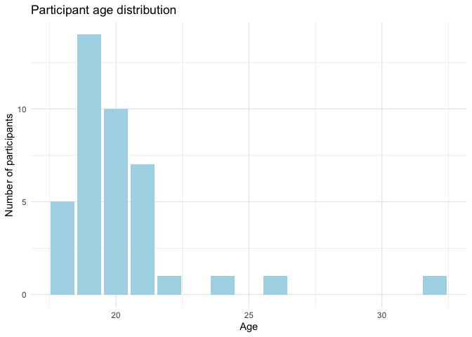
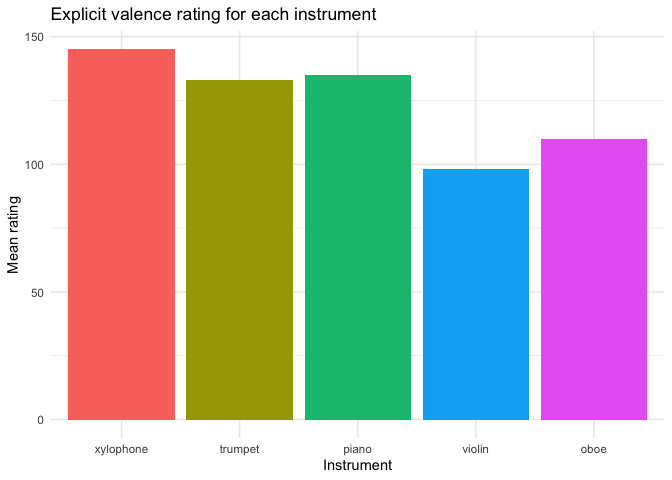
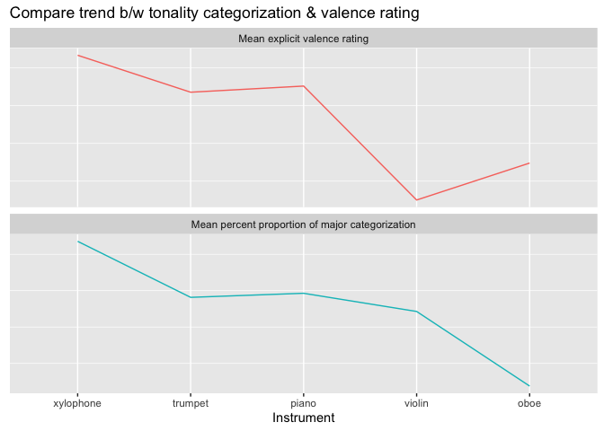

Exploratory Analysis
================
Eva Wu
2022-05-18

## Recap

### Hypothesis

“Happy” instruments would make people more prone to identify the chord
as major, while “sad” instruments might make people more prone to
identify the chord as minor.

### Exploratory research questions

1)  Association between timbre and tonality judgment

2)  Association between timbre and explicit ratings of instrument
    valence

3)  Association between tonality judgment and explicit ratings of
    instrument valence

4)  Association between musical background and tonality judgment and/or
    explicit ratings of instrument valence

### Design

-   IV1 (w/in-subject): instrument (happy \[xylophone, trumpet\]
    vs. neutral \[piano\] vs. sad \[oboe, violin\])

-   IV2 (w/in-subject): tuning of middle note (5 levels, ranging from
    absolute minor to absolute major)

-   IV3 (b/w-subject): key (B vs. C) (to find out absolute-pitch-related
    effects)

-   DV: the likelihood that one categorizes a chord as major/minor

### Procedure

-   Pt 1 Sound calibration & headphone test (choose the quietest sound
    among 3)

-   Pt 2 Training (press the buttons to listen to the chords, practice
    w/ feedback) + testing phase (listen to 12 chords and choose b/w
    major and minor for each, need to correctly answer 8 to pass)

-   only analyze the response of those who pass the assessment w/in 2
    tries

-   Pt 3 Categorization task (jspsych) - listen to 4 blocks of 70 chords
    and choose b/w major and minor for each chord; explicit rating of
    instrument valence at the end

-   Pt 4 Questionnaires (demographics & music experience; Qualtrics)

## Clean Data

    ## # A tibble: 8 × 3
    ##   qualtrics_id headphone test_corr
    ##   <chr>            <dbl>     <dbl>
    ## 1 1044403354           0         2
    ## 2 2077443174           0         2
    ## 3 3619423604           0         0
    ## 4 5405144116           0         0
    ## 5 6323213291           0         2
    ## 6 6783315289           0         2
    ## 7 8089229725           0         0
    ## 8 9018846073           0         1

Turns out 8 participants failed the headphone test.

A snapshot of the data (next step: find a measure to summarize musical
background)

    ## Rows: 49
    ## Columns: 44
    ## $ qualtrics_id              <chr> "1044403354", "1067596379", "1155580075", "1…
    ## $ mean_pct_maj_across_indvl <dbl> 0.585, 0.415, 0.465, 0.600, 0.430, 0.595, 0.…
    ## $ xylophone                 <dbl> 4, 4, 4, 4, 4, 4, 1, 3, 2, 2, 3, 4, 4, 4, 3,…
    ## $ violin                    <dbl> 2, 1, 2, 1, 1, 3, 2, 2, 2, 3, 3, 1, 1, 1, 1,…
    ## $ piano                     <dbl> 3, 3, 3, 2, 2, 3, 3, 4, 2, 3, 3, 2, 2, 3, 2,…
    ## $ trumpet                   <dbl> 2, 2, 3, 3, 3, 4, 2, 2, 3, 3, 2, 3, 3, 4, 3,…
    ## $ oboe                      <dbl> 1, 2, 2, 2, 2, 3, 1, 1, 3, 3, 3, 2, 3, 2, 2,…
    ## $ passed_practice           <dbl> 1, 1, 1, 1, 1, 1, 1, 1, 1, 1, 1, 1, 1, 1, 1,…
    ## $ block_passed_practice     <dbl> 1, 1, 1, 1, 1, 1, 1, 1, 1, 1, 1, 2, 1, 1, 1,…
    ## $ practice_score            <dbl> 9, 12, 12, 12, 8, 12, 12, 11, 12, 12, 12, 9,…
    ## $ Age                       <dbl> NA, 19, 20, 22, NA, 19, 26, NA, 18, 32, 20, …
    ## $ Gender                    <chr> NA, "Female", "Male", "Female", NA, "Female"…
    ## $ Year                      <chr> NA, "Sophomore", "Sophomore", "Senior", NA, …
    ## $ Year_6_TEXT               <chr> NA, NA, NA, NA, NA, NA, NA, NA, NA, "Non-stu…
    ## $ Major                     <chr> NA, "Other (please specify):", "Other (pleas…
    ## $ Major_5_TEXT              <chr> NA, "economics", NA, "Computer Science", NA,…
    ## $ Inst                      <chr> NA, "Yes", "Yes", "Yes", NA, "Yes", "Yes", "…
    ## $ Start                     <chr> NA, "10", "9", "4", NA, "12", "12", "5", "11…
    ## $ Inst_now                  <chr> NA, "No", "Yes", "No", NA, "No", "No", "No",…
    ## $ Inst_list                 <chr> NA, "violin (2)\npiano(8)\nclarinet(5)", "Pi…
    ## $ Ens                       <chr> NA, "No", "Yes", "No", NA, "No", "Yes", "Yes…
    ## $ Course                    <chr> NA, "Yes", "Yes", "No", NA, "Yes", "No", "Ye…
    ## $ Course_list               <chr> NA, "2", "Private piano lessons throughout h…
    ## $ Read                      <chr> NA, "Yes", "Yes", "Yes", NA, "No", "No", "No…
    ## $ `Pitch&Tempo_1`           <chr> NA, "50", "80", "70", NA, "14", "90", "23", …
    ## $ `Pitch&Tempo_2`           <chr> NA, "92", "61", "70", NA, "14", "90", "24", …
    ## $ Perf                      <chr> NA, "No", "No", "No", NA, "No", "No", "Not s…
    ## $ Time_make                 <chr> NA, "Less than one hour", "Less than one hou…
    ## $ Time_listen               <chr> NA, "3-4 hours", "1-2 hours", "3-4 hours", N…
    ## $ Concert                   <chr> NA, "2", "4", "1", NA, "0", "1", "2", "1", "…
    ## $ Genre_18                  <chr> NA, "40", "52", "20", NA, "33", "5", "50", "…
    ## $ Genre_8                   <chr> NA, "0", "8", "20", NA, "33", "20", "25", "0…
    ## $ Genre_9                   <chr> NA, "0", "0", "0", NA, "0", "15", "0", "15",…
    ## $ Genre_17                  <chr> NA, "0", "0", "0", NA, "0", "30", "10", "0",…
    ## $ Genre_10                  <chr> NA, "0", "0", "0", NA, "0", "0", "0", "0", "…
    ## $ Genre_11                  <chr> NA, "0", "5", "20", NA, "0", "0", "0", "10",…
    ## $ Genre_12                  <chr> NA, "30", "5", "0", NA, "34", "15", "0", "10…
    ## $ Genre_13                  <chr> NA, "0", "10", "20", NA, "0", "5", "15", "5"…
    ## $ Genre_16                  <chr> NA, "0", "20", "20", NA, "0", "10", "0", "0"…
    ## $ Genre_14                  <chr> NA, "30", "0", "0", NA, "0", "0", "0", "0", …
    ## $ Genre_15                  <chr> NA, "0", "0", "0", NA, "0", "0", "0", "0", "…
    ## $ Genre_15_TEXT             <chr> NA, NA, NA, NA, NA, NA, NA, NA, NA, NA, NA, …
    ## $ headphone                 <dbl> 0, 1, 1, 1, 1, 1, 1, 0, 1, 1, 1, 1, 1, 1, 1,…
    ## $ test_corr                 <dbl> 2, 5, 6, 6, 6, 6, 6, 2, 6, 6, 6, 6, 4, 5, 6,…

## Demographics

<!-- --><!-- -->

## Practice Score

<!-- -->

## Categorization

<!-- -->

## Explicit Rating

<!-- -->

## Compare trend between tonality judgment and explicit rating

<!-- -->

    ## # A tibble: 95 × 36
    ##    StartDate  jspsych_id Age   Gender Year  Year_6_TEXT Major Major_5_TEXT Inst 
    ##    <chr>      <chr>      <chr> <chr>  <chr> <chr>       <chr> <chr>        <chr>
    ##  1 2022-02-1… w3uh3gtry… 19    Female Soph… <NA>        Othe… Biology and… Yes  
    ##  2 2022-02-1… <NA>       <NA>  <NA>   <NA>  <NA>        <NA>  <NA>         <NA> 
    ##  3 2022-02-2… wczbffevc… 19    Female Soph… <NA>        Othe… economics    Yes  
    ##  4 2022-02-2… <NA>       <NA>  <NA>   <NA>  <NA>        <NA>  <NA>         <NA> 
    ##  5 2022-02-2… <NA>       <NA>  <NA>   <NA>  <NA>        <NA>  <NA>         <NA> 
    ##  6 2022-03-0… <NA>       <NA>  <NA>   <NA>  <NA>        <NA>  <NA>         <NA> 
    ##  7 2022-03-0… en7lefm4g… 20    Male   Fres… <NA>        Othe… Business Ec… Yes  
    ##  8 2022-03-1… 22-0159    20    Male   Soph… <NA>        Othe… Economics (… No   
    ##  9 2022-03-1… ghbk58xwj… 20    Male   Soph… <NA>        Psyc… Neuroscience Yes  
    ## 10 2022-03-1… a48zc72k3… 19    Male   Fres… <NA>        Othe… Business Ec… Yes  
    ## # … with 85 more rows, and 27 more variables: Start <chr>, Inst_now <chr>,
    ## #   Inst_list <chr>, Ens <chr>, Course <chr>, Course_list <chr>, Read <chr>,
    ## #   `Pitch&Tempo_1` <chr>, `Pitch&Tempo_2` <chr>, Perf <chr>, Time_make <chr>,
    ## #   Time_listen <chr>, Concert <chr>, Genre_18 <chr>, Genre_8 <chr>,
    ## #   Genre_9 <chr>, Genre_17 <chr>, Genre_10 <chr>, Genre_11 <chr>,
    ## #   Genre_12 <chr>, Genre_13 <chr>, Genre_16 <chr>, Genre_14 <chr>,
    ## #   Genre_15 <chr>, Genre_15_TEXT <chr>, id <chr>, participant <chr>

    ## # A tibble: 6 × 36
    ##   StartDate   jspsych_id Age   Gender Year  Year_6_TEXT Major Major_5_TEXT Inst 
    ##   <chr>       <chr>      <chr> <chr>  <chr> <chr>       <chr> <chr>        <chr>
    ## 1 2022-02-19… w3uh3gtry… 19    Female Soph… <NA>        Othe… Biology and… Yes  
    ## 2 2022-02-19… w3uh3gtry… 19    Female Soph… <NA>        Othe… Biology and… Yes  
    ## 3 2022-02-26… wczbffevc… 19    Female Soph… <NA>        Othe… economics    Yes  
    ## 4 2022-03-09… en7lefm4g… 20    Male   Fres… <NA>        Othe… Business Ec… Yes  
    ## 5 2022-03-10… 22-0159    20    Male   Soph… <NA>        Othe… Economics (… No   
    ## 6 2022-03-12… ghbk58xwj… 20    Male   Soph… <NA>        Psyc… Neuroscience Yes  
    ## # … with 27 more variables: Start <chr>, Inst_now <chr>, Inst_list <chr>,
    ## #   Ens <chr>, Course <chr>, Course_list <chr>, Read <chr>,
    ## #   `Pitch&Tempo_1` <chr>, `Pitch&Tempo_2` <chr>, Perf <chr>, Time_make <chr>,
    ## #   Time_listen <chr>, Concert <chr>, Genre_18 <chr>, Genre_8 <chr>,
    ## #   Genre_9 <chr>, Genre_17 <chr>, Genre_10 <chr>, Genre_11 <chr>,
    ## #   Genre_12 <chr>, Genre_13 <chr>, Genre_16 <chr>, Genre_14 <chr>,
    ## #   Genre_15 <chr>, Genre_15_TEXT <chr>, id <chr>, participant <chr>

## Explore correlation between music background & categorization / explicit rating

TBC

## Statistical Analyses

Descriptives, exploratory plot

Correlations b/w 1) instrument’s presumed valence, 2) mean explicit
rating, and 3) tuning step & percent of major categorization, and
4)instrument’s presumed valence & mean explicit rating

Logistic regression

1)  Percent major \~ instrument & tuning step

2)  Percent major \~ mean explicit rating of each instrument & tuning
    step

Linear regression

ANOVA exploring 1) whether adding instrument as a predictor
significantly improves model, and 2) whether adding both predictors is
significantly better than null model
