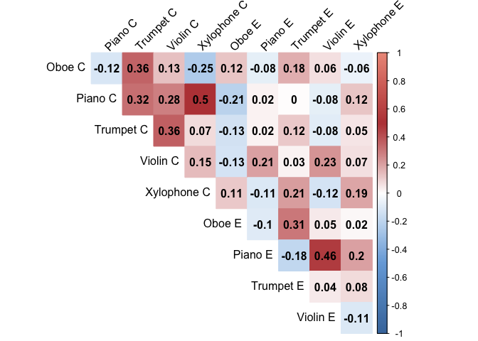

Instrument and Chord Perception
================
Stephen Van Hedger
22/02/2022

### Overview

Project examining how instrumental timbre influences categorization of
three-note arpeggios as major versus minor. Middle note of the arpeggios
has five steps, ranging from +0c (minor) to +100c (major) in 25c
increments. Participants heard five instruments in total (randomized
across trial): piano, oboe, violin, trumpet, xylophone.

Judgments should be theoretically independent of instrument. However, if
certain timbres are more strongly associated with positive/negative
affect, then it is possible that this will be reflected in the
categorization task (i.e., “happier” instruments leading to a greater
likelihood of responding “major”), despite no explicit instructions to
base judgments on affective characteristics.

### 1. Load Data

``` r
data <- read_csv("inst-cat-uc-1.csv")
```

### 2. Generalized Linear Models

Here we report our main analyses

``` r
data.cat <- data %>% filter(designation == "MAIN-JUDGMENT") # extract cat data

#first, let's confirm that the inclusion of linear/quadratic/cubic effects is warranted via nested models
main.model3 <- lmer(selected_major ~ poly(tuning_step, 3)*instrument + (1+instrument|participant), data = data.cat)
main.model2 <- lmer(selected_major ~ poly(tuning_step, 2)*instrument + (1+instrument|participant), data = data.cat)
main.model1 <- lmer(selected_major ~ poly(tuning_step, 1)*instrument + (1+instrument|participant), data = data.cat)
```

    ## Warning in checkConv(attr(opt, "derivs"), opt$par, ctrl = control$checkConv, :
    ## Model failed to converge with max|grad| = 0.00254061 (tol = 0.002, component 1)

``` r
anova(main.model3, main.model2) # strong evidence to keep cubic fit (versus just quadratic + linear)
```

    ## Data: data.cat
    ## Models:
    ## main.model2: selected_major ~ poly(tuning_step, 2) * instrument + (1 + instrument | participant)
    ## main.model3: selected_major ~ poly(tuning_step, 3) * instrument + (1 + instrument | participant)
    ##             npar   AIC   BIC  logLik deviance  Chisq Df Pr(>Chisq)    
    ## main.model2   31 10794 11018 -5365.8    10732                         
    ## main.model3   36 10485 10746 -5206.5    10413 318.53  5  < 2.2e-16 ***
    ## ---
    ## Signif. codes:  0 '***' 0.001 '**' 0.01 '*' 0.05 '.' 0.1 ' ' 1

``` r
anova(main.model3, main.model1) # strong evidence to keep cubic fit (versus just linear)
```

    ## Data: data.cat
    ## Models:
    ## main.model1: selected_major ~ poly(tuning_step, 1) * instrument + (1 + instrument | participant)
    ## main.model3: selected_major ~ poly(tuning_step, 3) * instrument + (1 + instrument | participant)
    ##             npar   AIC   BIC  logLik deviance  Chisq Df Pr(>Chisq)    
    ## main.model1   26 10825 11013 -5386.3    10773                         
    ## main.model3   36 10485 10746 -5206.5    10413 359.53 10  < 2.2e-16 ***
    ## ---
    ## Signif. codes:  0 '***' 0.001 '**' 0.01 '*' 0.05 '.' 0.1 ' ' 1

``` r
anova(main.model2, main.model1) # Eva: strong evidence to keep quadratic fit (versus just linear) - I guess that's a given when cubic is sig?
```

    ## Data: data.cat
    ## Models:
    ## main.model1: selected_major ~ poly(tuning_step, 1) * instrument + (1 + instrument | participant)
    ## main.model2: selected_major ~ poly(tuning_step, 2) * instrument + (1 + instrument | participant)
    ##             npar   AIC   BIC  logLik deviance  Chisq Df Pr(>Chisq)    
    ## main.model1   26 10825 11013 -5386.3    10773                         
    ## main.model2   31 10794 11018 -5365.8    10732 40.991  5   9.42e-08 ***
    ## ---
    ## Signif. codes:  0 '***' 0.001 '**' 0.01 '*' 0.05 '.' 0.1 ' ' 1

``` r
# cat results from the selected cubic model
summary(main.model3)
```

    ## Linear mixed model fit by REML. t-tests use Satterthwaite's method [
    ## lmerModLmerTest]
    ## Formula: 
    ## selected_major ~ poly(tuning_step, 3) * instrument + (1 + instrument |  
    ##     participant)
    ##    Data: data.cat
    ## 
    ## REML criterion at convergence: 10420.6
    ## 
    ## Scaled residuals: 
    ##      Min       1Q   Median       3Q      Max 
    ## -3.05280 -0.62342 -0.05556  0.64283  2.84696 
    ## 
    ## Random effects:
    ##  Groups      Name                Variance Std.Dev. Corr                   
    ##  participant (Intercept)         0.01155  0.1075                          
    ##              instrumentpiano     0.02622  0.1619   -0.78                  
    ##              instrumenttrumpet   0.01315  0.1147   -0.47  0.69            
    ##              instrumentviolin    0.02296  0.1515   -0.58  0.67  0.59      
    ##              instrumentxylophone 0.05460  0.2337   -0.68  0.80  0.50  0.53
    ##  Residual                        0.15399  0.3924                          
    ## Number of obs: 10400, groups:  participant, 52
    ## 
    ## Fixed effects:
    ##                                             Estimate Std. Error         df
    ## (Intercept)                                3.962e-01  1.721e-02  5.100e+01
    ## poly(tuning_step, 3)1                      2.600e+01  8.775e-01  1.012e+04
    ## poly(tuning_step, 3)2                      3.692e+00  8.775e-01  1.012e+04
    ## poly(tuning_step, 3)3                     -5.547e+00  8.775e-01  1.012e+04
    ## instrumentpiano                            1.207e-01  2.554e-02  5.100e+01
    ## instrumenttrumpet                          1.192e-01  2.002e-02  5.099e+01
    ## instrumentviolin                           9.663e-02  2.428e-02  5.100e+01
    ## instrumentxylophone                        1.990e-01  3.461e-02  5.100e+01
    ## poly(tuning_step, 3)1:instrumentpiano      2.773e+00  1.241e+00  1.012e+04
    ## poly(tuning_step, 3)2:instrumentpiano      5.860e-02  1.241e+00  1.012e+04
    ## poly(tuning_step, 3)3:instrumentpiano     -2.427e+00  1.241e+00  1.012e+04
    ## poly(tuning_step, 3)1:instrumenttrumpet    1.560e+00  1.241e+00  1.012e+04
    ## poly(tuning_step, 3)2:instrumenttrumpet   -5.714e+00  1.241e+00  1.012e+04
    ## poly(tuning_step, 3)3:instrumenttrumpet   -2.773e+00  1.241e+00  1.012e+04
    ## poly(tuning_step, 3)1:instrumentviolin     1.525e+00  1.241e+00  1.012e+04
    ## poly(tuning_step, 3)2:instrumentviolin    -3.516e+00  1.241e+00  1.012e+04
    ## poly(tuning_step, 3)3:instrumentviolin    -6.240e-01  1.241e+00  1.012e+04
    ## poly(tuning_step, 3)1:instrumentxylophone -5.547e-01  1.241e+00  1.012e+04
    ## poly(tuning_step, 3)2:instrumentxylophone -4.571e+00  1.241e+00  1.012e+04
    ## poly(tuning_step, 3)3:instrumentxylophone -1.317e+00  1.241e+00  1.012e+04
    ##                                           t value Pr(>|t|)    
    ## (Intercept)                                23.019  < 2e-16 ***
    ## poly(tuning_step, 3)1                      29.632  < 2e-16 ***
    ## poly(tuning_step, 3)2                       4.207 2.61e-05 ***
    ## poly(tuning_step, 3)3                      -6.322 2.70e-10 ***
    ## instrumentpiano                             4.725 1.85e-05 ***
    ## instrumenttrumpet                           5.954 2.42e-07 ***
    ## instrumentviolin                            3.979 0.000219 ***
    ## instrumentxylophone                         5.750 5.04e-07 ***
    ## poly(tuning_step, 3)1:instrumentpiano       2.235 0.025439 *  
    ## poly(tuning_step, 3)2:instrumentpiano       0.047 0.962336    
    ## poly(tuning_step, 3)3:instrumentpiano      -1.956 0.050536 .  
    ## poly(tuning_step, 3)1:instrumenttrumpet     1.257 0.208714    
    ## poly(tuning_step, 3)2:instrumenttrumpet    -4.604 4.19e-06 ***
    ## poly(tuning_step, 3)3:instrumenttrumpet    -2.235 0.025439 *  
    ## poly(tuning_step, 3)1:instrumentviolin      1.229 0.219006    
    ## poly(tuning_step, 3)2:instrumentviolin     -2.833 0.004615 ** 
    ## poly(tuning_step, 3)3:instrumentviolin     -0.503 0.615062    
    ## poly(tuning_step, 3)1:instrumentxylophone  -0.447 0.654884    
    ## poly(tuning_step, 3)2:instrumentxylophone  -3.683 0.000231 ***
    ## poly(tuning_step, 3)3:instrumentxylophone  -1.062 0.288430    
    ## ---
    ## Signif. codes:  0 '***' 0.001 '**' 0.01 '*' 0.05 '.' 0.1 ' ' 1

``` r
cat.emm <- emmeans(main.model3, "instrument")
pairs(cat.emm) # oboe < all others except piano; xylophone > piano
```

    ##  contrast            estimate     SE  df z.ratio p.value
    ##  oboe - piano         -0.1200 0.0294 Inf  -4.083  0.0004
    ##  oboe - trumpet       -0.1862 0.0247 Inf  -7.523  <.0001
    ##  oboe - violin        -0.1378 0.0283 Inf  -4.870  <.0001
    ##  oboe - xylophone     -0.2526 0.0375 Inf  -6.728  <.0001
    ##  piano - trumpet      -0.0662 0.0250 Inf  -2.650  0.0616
    ##  piano - violin       -0.0179 0.0260 Inf  -0.686  0.9595
    ##  piano - xylophone    -0.1326 0.0275 Inf  -4.828  <.0001
    ##  trumpet - violin      0.0484 0.0257 Inf   1.883  0.3265
    ##  trumpet - xylophone  -0.0664 0.0339 Inf  -1.957  0.2871
    ##  violin - xylophone   -0.1148 0.0335 Inf  -3.422  0.0056
    ## 
    ## Degrees-of-freedom method: asymptotic 
    ## P value adjustment: tukey method for comparing a family of 5 estimates

``` r
# assess explicit ratings of instruments
data.exp <- data %>% filter(designation == "INST-VALENCE-RTG")
data.exp$explicit_rtg <- ordered(data.exp$explicit_rtg)

explicit.model <- clmm(explicit_rtg ~ instrument + (1|participant), data = data.exp)
summary(explicit.model) # clear differences in reported capacity for instruments to play happy/sad
```

    ## Cumulative Link Mixed Model fitted with the Laplace approximation
    ## 
    ## formula: explicit_rtg ~ instrument + (1 | participant)
    ## data:    data.exp
    ## 
    ##  link  threshold nobs logLik  AIC    niter    max.grad cond.H 
    ##  logit flexible  260  -280.21 576.41 386(793) 2.78e-04 3.3e+01
    ## 
    ## Random effects:
    ##  Groups      Name        Variance Std.Dev.
    ##  participant (Intercept) 0.3202   0.5659  
    ## Number of groups:  participant 52 
    ## 
    ## Coefficients:
    ##                     Estimate Std. Error z value Pr(>|z|)    
    ## instrumentpiano       1.2605     0.3812   3.306 0.000945 ***
    ## instrumenttrumpet     1.1730     0.3840   3.054 0.002255 ** 
    ## instrumentviolin     -0.7965     0.3840  -2.074 0.038053 *  
    ## instrumentxylophone   1.9571     0.4062   4.818 1.45e-06 ***
    ## ---
    ## Signif. codes:  0 '***' 0.001 '**' 0.01 '*' 0.05 '.' 0.1 ' ' 1
    ## 
    ## Threshold coefficients:
    ##     Estimate Std. Error z value
    ## 1|2  -2.1871     0.3472  -6.300
    ## 2|3   0.6092     0.2843   2.143
    ## 3|4   3.1683     0.3682   8.605

``` r
explicit.emm <- emmeans(explicit.model, "instrument")
pairs(explicit.emm) # violin < all others except oboe; xylophone > oboe
```

    ##  contrast            estimate    SE  df z.ratio p.value
    ##  oboe - piano         -1.2605 0.381 Inf  -3.306  0.0084
    ##  oboe - trumpet       -1.1730 0.384 Inf  -3.054  0.0191
    ##  oboe - violin         0.7965 0.384 Inf   2.074  0.2312
    ##  oboe - xylophone     -1.9571 0.406 Inf  -4.818  <.0001
    ##  piano - trumpet       0.0875 0.375 Inf   0.233  0.9993
    ##  piano - violin        2.0570 0.403 Inf   5.108  <.0001
    ##  piano - xylophone    -0.6965 0.387 Inf  -1.800  0.3733
    ##  trumpet - violin      1.9694 0.404 Inf   4.873  <.0001
    ##  trumpet - xylophone  -0.7841 0.393 Inf  -1.998  0.2671
    ##  violin - xylophone   -2.7535 0.429 Inf  -6.422  <.0001
    ## 
    ## P value adjustment: tukey method for comparing a family of 5 estimates

``` r
# how do categorization results map onto explicit ratings? 
# [aggregate = summarize (by mean) in dplyr]
cat.sum <- aggregate(selected_major ~ instrument*participant, FUN = mean, data = data.cat)
exp.sum <- aggregate(as.numeric(explicit_rtg) ~ instrument*participant, FUN = mean, data = data.exp)

#convert to wide format for correlational analyses [= pivot wider]
cat.sum.wide <- dcast(cat.sum, participant ~ instrument) 
exp.sum.wide <- dcast(exp.sum, participant ~ instrument)
cor.data <- cbind(cat.sum.wide[, c(2:6)], exp.sum.wide[, c(2:6)])
```

### 3. Cat-rtg correlation plot

``` r
names(cor.data) = c("Oboe C", "Piano C", "Trumpet C", "Violin C", "Xylophone C", "Oboe E", "Piano E", "Trumpet E", "Violin E", "Xylophone E")
corvalues <- cor(cor.data) #cor matrix

col <- colorRampPalette(c("#4477AA",  "#77AADD", "#FFFFFF","#BB4444", "#EE9988"))
corrplot(corvalues, method = "color", col=col(200),    
         type = "upper", 
         addCoef.col = "black", # Add coefficient of correlation
         tl.col = "black", tl.srt = 45, # Text label color and rotation
         # Combine with significance
         # hide correlation coefficient on the principal diagonal
         diag = FALSE
         )
```

<!-- -->

### 4. Categorization smooth plot

``` r
eff.inst <- as.data.frame(effect(term = "poly(tuning_step,3)*instrument", mod = main.model3)) 
str(eff.inst) # shows structure of df
```

    ## 'data.frame':    25 obs. of  6 variables:
    ##  $ tuning_step: num  1 2 3 4 5 1 2 3 4 5 ...
    ##  $ instrument : Factor w/ 6 levels "oboe","piano",..: 1 1 1 1 1 2 2 2 2 2 ...
    ##  $ fit        : num  0.117 0.117 0.353 0.632 0.762 ...
    ##  $ se         : num  0.0242 0.0225 0.02 0.0225 0.0242 ...
    ##  $ lower      : num  0.0698 0.0731 0.3136 0.5876 0.714 ...
    ##  $ upper      : num  0.165 0.161 0.392 0.676 0.809 ...
    ##  - attr(*, "type")= chr "response"

``` r
levels(eff.inst$instrument) <- c("Oboe", "Piano", "Trumpet", "Violin", "Xylophone", NA)

efplot.main <- ggplot(eff.inst, aes(x = tuning_step, y = fit, color = instrument)) +
  geom_point(size = 2) + 
  geom_errorbar(aes(ymin = fit - se, ymax = fit + se), width = 0.1, lwd = 1) +
  #geom_line(size=1.2) +
  geom_smooth(formula = "y ~ poly(x, 3)", method = "glm", family = binomial, se = FALSE) +
  scale_x_continuous(labels = c("0", "25", "50", "75", "100")) +
  labs(y = "'Major' Response (Prop.)", x = "Tuning Step", color = "Instrument") +
  theme(plot.title = element_text(lineheight = .8, face = "bold", size = 16),
        legend.title = element_text(size = 16),
        legend.text = element_text(size = 16),
        legend.box = "vertical", 
        legend.background = element_rect(color = NA),
        legend.position = c(0.20, 0.75),
        panel.background = element_rect(fill = "white", colour = "black"),
        panel.border = element_rect(color = "black", fill=NA, size=1.25),
        panel.grid.major = element_blank(),
        panel.grid.minor = element_blank(),
        axis.title.x = element_text(size = 16),
        axis.title.y = element_text(size = 16),
        axis.text = element_text(size = 14),
        axis.line.x = element_line(colour = "black", size = 0.5, linetype = "solid"),
        axis.line.y = element_line(colour = "black", size = 0.5, linetype = "solid"),
        strip.text = element_text(size = 14))
```

    ## Warning: Ignoring unknown parameters: family

``` r
png("inst-cat-plot.png", height = 4, width = 5.5, res = 300, units = "in")
efplot.main
dev.off()
```

    ## quartz_off_screen 
    ##                 2
