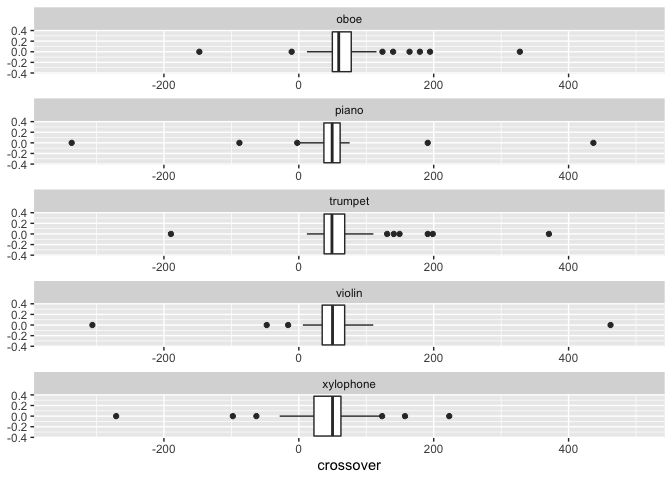

Calculate individual slopes and crossover
================
Eva Wu
2022-07-01

## Import data

``` r
demo_test <- read_csv("demo_test.csv") %>%
  select(-(2:5))
```

    ## Rows: 49 Columns: 46
    ## ── Column specification ────────────────────────────────────────────────────────
    ## Delimiter: ","
    ## chr (11): participant, Gender, Year, Year_6_TEXT, Major, Major_5_TEXT, Inst_...
    ## dbl (35): qualtrics_id, passed_practice, block_passed_practice, practice_sco...
    ## 
    ## ℹ Use `spec()` to retrieve the full column specification for this data.
    ## ℹ Specify the column types or set `show_col_types = FALSE` to quiet this message.

``` r
data <- read_csv("inst-cat-uc-1.csv") %>%
  inner_join(demo_test, by = "participant") # join demo & mus_exp data, discard duplicates
```

    ## Rows: 25161 Columns: 33
    ## ── Column specification ────────────────────────────────────────────────────────
    ## Delimiter: ","
    ## chr (18): trial_type, internal_node_id, participant, expt, chord, qualtrics_...
    ## dbl (13): trial_index, time_elapsed, played_major1, played_minor1, correct, ...
    ## lgl  (2): success, timeout
    ## 
    ## ℹ Use `spec()` to retrieve the full column specification for this data.
    ## ℹ Specify the column types or set `show_col_types = FALSE` to quiet this message.

``` r
data.cat <- data %>% 
  filter(designation == "MAIN-JUDGMENT") # extract cat data
```

## GLM

Run a simple GLM (without cubic and random effects) for each
participant-instrument pair, input in an empty data frame, export the
data as csv.

``` r
data.cat1 <- data.cat %>%
  group_by(qualtrics_id, instrument, tuning_step) %>%
  summarize(pct_maj = mean(selected_major)) %>%
  # convert tuning step to ratio data from 0 to 100
  mutate(tuning_step = (tuning_step - 1)*25)
```

    ## `summarise()` has grouped output by 'qualtrics_id', 'instrument'. You can
    ## override using the `.groups` argument.

``` r
# create an empty data frame to input each participant's calculated results (each row = 1 participant)
result <- as.data.frame(data.cat$qualtrics_id) %>%
  unique() %>%
  # crossover = tuning step point where proportion of major categorization = 50%
  mutate(instrument = NA, slopes = NA, crossover = NA) %>%
  rename(qualtrics_id = `data.cat$qualtrics_id`)

# each participant will have 5 rows, each row for an instrument
results <- result %>%
  mutate(instrument = "oboe") %>%
  rbind(result) %>% 
  mutate(instrument = case_when(is.na(instrument) ~ "violin",
                                !is.na(instrument) ~ instrument)) %>%
  rbind(result) %>%
  mutate(instrument = case_when(is.na(instrument) ~ "piano",
                                !is.na(instrument) ~ instrument)) %>%
  rbind(result) %>%
  mutate(instrument = case_when(is.na(instrument) ~ "trumpet",
                                !is.na(instrument) ~ instrument)) %>%
  rbind(result) %>%
  mutate(instrument = case_when(is.na(instrument) ~ "xylophone",
                                !is.na(instrument) ~ instrument)) %>%
  arrange(qualtrics_id)
```

``` r
# run a GLM model for each participant-instrument pair (a total of 245 models, which is why we are using the simpler model, or R will crash), input their slope and 50% crossover in the above data frame
for (i in results$qualtrics_id) {
  for (j in results$instrument %>% unique()) {
    data_filtered <- data.cat1 %>%
      filter(qualtrics_id == i & instrument == j)
    simple_model <- glm(pct_maj ~ tuning_step, data = data_filtered, family = binomial)
    results$slopes[results$qualtrics_id == i & results$instrument == j] = coef(simple_model)[[2]]
    results$crossover[results$qualtrics_id == i & results$instrument == j] = -coef(simple_model)[[1]] / coef(simple_model)[[2]]
  }
}

write_csv(results, "slope_crossover.csv")
```

Reference for [logistic
regression](http://www.sthda.com/english/articles/36-classification-methods-essentials/151-logistic-regression-essentials-in-r/).

## Comparing slopes and crossover points across instruments

``` r
# no extreme slope outliers
outliers_slope <- results %>%
  identify_outliers(slopes) %>%
  filter(`is.extreme` == TRUE)

# 13 extreme crossover outliers
co_outliers <- results %>%
  identify_outliers(crossover) %>%
  filter(`is.extreme` == TRUE)

results %>%
  ggplot(aes(crossover)) +
  geom_boxplot() +
  facet_wrap(~instrument, ncol = 1, scales = "free_x") +
  scale_x_continuous(limit = c(-350, 500)) # otherwise too hard to see anything
```

    ## Warning: Removed 5 rows containing non-finite values (stat_boxplot).

<!-- -->

``` r
# see how crossover for each instrument looks like when ignoring outliers
results.bounded <- results %>%
  anti_join(co_outliers, by = c("crossover"))
# note this outlier deletion is by instrument-participant pair, not by participant itself
```

``` r
results.bounded %>%
  group_by(instrument) %>%
  summarize(sl = mean(slopes)) %>%
  ggplot(aes(reorder(instrument, -sl), sl)) +
  geom_line(group = 1) +
  labs(x = "instrument", y = "slope")
```

<!-- -->

``` r
results.bounded %>%
  group_by(instrument) %>%
  summarize(co = mean(crossover)) %>%
  ggplot(aes(reorder(instrument, -co), co)) +
  geom_line(group = 1) +
  labs(x = "instrument", y = "crossover")
```

<!-- -->

Seems like xylophone has the steepest slope, then piano, then trumpet,
then violin, and oboe has the least steep slope. So the proportion of
major categorization for oboe increases slowest as tuning step
increases, while that for xylophone increases fastest. This is the same
as our expectation because it follows the same trend as average
proportion of major categorization.

Seems like oboe has the highest crossover, then trumpet, then xylophone,
then violin, and piano has the lowest crossover. So the middle note of a
chord played on oboe will need to be tuned sharper for participants to
switch from minor to major categorization, while that on piano will
least need to be tuned sharper for participants to switch from minor to
major categorization. This is a little surprising because it’s different
from the trend in all other analyses we conducted.
