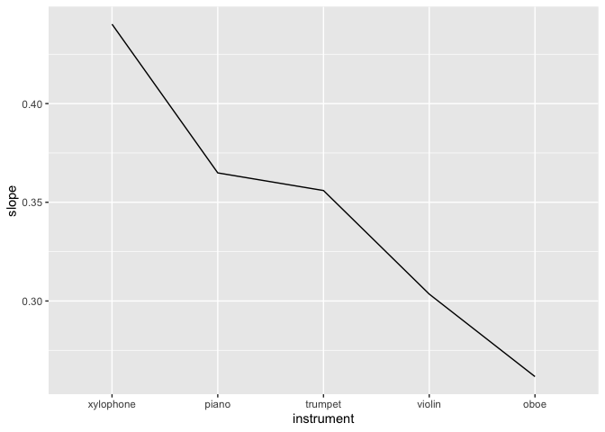
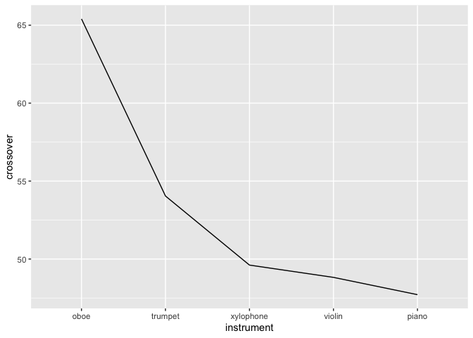

Calculating Individual Slopes and Crossovers
================
Eva Wu
2022-07-01

## Import data

``` r
demo_test <- read_csv("demo_test.csv") %>%
  select(-(2:5))
data <- read_csv("inst-cat-uc-1.csv") %>%
  inner_join(demo_test, by = "participant") # join demo & mus_exp data, discard duplicates

data.cat <- data %>% 
  filter(designation == "MAIN-JUDGMENT") # extract cat data
```

## GLM

Run a simple GLM (without cubic and random effects) for each
participant-instrument pair, and input slope and 50% crossover threshold
in an empty data frame.

``` r
data.cat1 <- data.cat %>%
  group_by(qualtrics_id, instrument, tuning_step) %>%
  summarize(pct_maj = mean(selected_major)) %>%
  # convert tuning step to ratio data from 0 to 100
  mutate(tuning_step = (tuning_step - 1)*25)

# create an empty data frame to input each participant's calculated results (each row = 1 participant)
result <- as.data.frame(data.cat$qualtrics_id) %>%
  unique() %>%
  # crossover = tuning step point where proportion of major categorization = 50%
  mutate(instrument = NA, slopes = NA, crossover = NA) %>%
  rename(qualtrics_id = `data.cat$qualtrics_id`)

# each participant will have 5 rows, each row for an instrument
results <- result %>%
  mutate(instrument = "oboe") %>%
  rbind(result) %>% 
  mutate(instrument = case_when(is.na(instrument) ~ "violin",
                                !is.na(instrument) ~ instrument)) %>%
  rbind(result) %>%
  mutate(instrument = case_when(is.na(instrument) ~ "piano",
                                !is.na(instrument) ~ instrument)) %>%
  rbind(result) %>%
  mutate(instrument = case_when(is.na(instrument) ~ "trumpet",
                                !is.na(instrument) ~ instrument)) %>%
  rbind(result) %>%
  mutate(instrument = case_when(is.na(instrument) ~ "xylophone",
                                !is.na(instrument) ~ instrument)) %>%
  arrange(qualtrics_id)
```

``` r
# run a GLM model for each participant-instrument pair (a total of 245 models, which is why we are using the simpler model, or R will crash), input their slope and 50% crossover in the above data frame
for (i in results$qualtrics_id) {
  for (j in results$instrument %>% unique()) {
    data_filtered <- data.cat1 %>%
      filter(qualtrics_id == i & instrument == j)
    simple_model <- glm(pct_maj ~ tuning_step, data = data_filtered, family = binomial)
    results$slopes[results$qualtrics_id == i & results$instrument == j] = coef(simple_model)[[2]]
    results$crossover[results$qualtrics_id == i & results$instrument == j] = -coef(simple_model)[[1]] / coef(simple_model)[[2]]
  }
}
```

Reference for [logistic
regression](http://www.sthda.com/english/articles/36-classification-methods-essentials/151-logistic-regression-essentials-in-r/).

## Descriptives

``` r
print("summary statistics for slope")
```

    ## [1] "summary statistics for slope"

``` r
results %>%
  group_by(instrument) %>%
  get_summary_stats(slopes, type = "mean_sd") %>%
  select(-variable, -n)
```

    ## # A tibble: 5 × 3
    ##   instrument  mean    sd
    ##   <chr>      <dbl> <dbl>
    ## 1 oboe       0.235 0.41 
    ## 2 piano      0.327 0.493
    ## 3 trumpet    0.326 0.562
    ## 4 violin     0.291 0.515
    ## 5 xylophone  0.376 0.512

``` r
print("summary statistics for crossover")
```

    ## [1] "summary statistics for crossover"

``` r
results %>% 
  filter(crossover > -1000 & crossover < 1000) %>%
  group_by(instrument) %>%
  get_summary_stats(crossover, type = "mean_sd") %>%
  select(-variable, -n)
```

    ## # A tibble: 5 × 3
    ##   instrument  mean    sd
    ##   <chr>      <dbl> <dbl>
    ## 1 oboe        71.6  62.6
    ## 2 piano       48.0  87.4
    ## 3 trumpet     61.4  70.9
    ## 4 violin      50.0  84.6
    ## 5 xylophone   40.6  69.9

## Visualizations

``` r
results %>%
  filter(crossover < 1000 & crossover > -1000) %>%
  group_by(instrument) %>%
  summarize(sl = mean(slopes)) %>%
  ggplot(aes(reorder(instrument, sl), sl, fill = instrument)) +
  geom_col() +
  labs(title = "Slope for each instrument",
       x = "Instrument", y = "Slope") +
  theme_bw()
```

<!-- -->

``` r
# eliminate outliers outside of this bound that disrupt our analyses (> 1e15) without eliminating too much info

results %>%
  filter(crossover < 1000 & crossover > -1000) %>%
  group_by(instrument) %>%
  summarize(co = mean(crossover)) %>%
  ggplot(aes(reorder(instrument, co), co, fill = instrument)) +
  geom_col() +
  labs(title = "50% threshold for each instrument",
       x = "Instrument", y = "Threshold") +
  theme_bw()
```

<!-- -->

``` r
# eliminate outliers outside of this bound that disrupt our analyses (> 1e15) without eliminating too much info
```

Seems like xylophone has the steepest slope, then piano, then trumpet,
then violin, and oboe has the least steep slope. So the proportion of
major categorization for oboe increases slowest as tuning step
increases, while that for xylophone increases fastest. This is the same
as our expectation because it follows the same trend as average
proportion of major categorization.

Seems like oboe has the highest crossover, then trumpet, then xylophone,
then violin, and piano has the lowest crossover. So the middle note of a
chord played on oboe will need to be tuned sharper for participants to
switch from minor to major categorization, while that on piano will
least need to be tuned sharper for participants to switch from minor to
major categorization. This is a little surprising because it’s different
from the trend in all other analyses we conducted.

## ANOVA

``` r
# check outliers

results %>%
  identify_outliers(slopes) %>%
  filter(is.extreme == TRUE)
```

    ##       qualtrics_id instrument    slopes crossover is.outlier is.extreme
    ## 48011   1067596379     violin 0.9591500  72.97121       TRUE       TRUE
    ## 48012   1067596379      piano 0.9316415  73.82078       TRUE       TRUE
    ## 4012    1155580075      piano 0.9295499  50.54954       TRUE       TRUE
    ## 4013    1155580075    trumpet 0.9419455  51.16632       TRUE       TRUE
    ## 9001    1176432322       oboe 0.9678109  47.98937       TRUE       TRUE
    ## 90011   1176432322     violin 1.8388735  37.55091       TRUE       TRUE
    ## 90012   1176432322      piano 1.8388735  37.55091       TRUE       TRUE
    ## 90013   1176432322    trumpet 1.8388735  37.55091       TRUE       TRUE
    ## 90014   1176432322  xylophone 0.9591500  27.02879       TRUE       TRUE
    ## 20011   1588756489     violin 0.9591500  27.02879       TRUE       TRUE
    ## 40012   2095686609      piano 0.9124362  75.00000       TRUE       TRUE
    ## 40014   2095686609  xylophone 1.8388735  62.44909       TRUE       TRUE
    ## 801     2334472117       oboe 0.9256128  50.00000       TRUE       TRUE
    ## 8012    2334472117      piano 0.9295499  49.45046       TRUE       TRUE
    ## 54014   2528622657  xylophone 0.9419455  51.16632       TRUE       TRUE
    ## 58014   2707228965  xylophone 0.8304250  -2.34327       TRUE       TRUE
    ## 201     3023525743       oboe 0.9295499  49.45046       TRUE       TRUE
    ## 2011    3023525743     violin 0.9295499  49.45046       TRUE       TRUE
    ## 2012    3023525743      piano 0.9419455  51.16632       TRUE       TRUE
    ## 2013    3023525743    trumpet 0.9678109  47.98937       TRUE       TRUE
    ## 2014    3023525743  xylophone 0.9419456  48.83368       TRUE       TRUE
    ## 18011   3270768954     violin 0.9256128  50.00000       TRUE       TRUE
    ## 18014   3270768954  xylophone 0.9295499  50.54954       TRUE       TRUE
    ## 52012   3566263097      piano 0.9678109  52.01063       TRUE       TRUE
    ## 30011   3586902878     violin 0.9256128  50.00000       TRUE       TRUE
    ## 30013   3586902878    trumpet 0.9419455  51.16632       TRUE       TRUE
    ## 30014   3586902878  xylophone 0.9419456  48.83368       TRUE       TRUE
    ## 6801    3600962747       oboe 0.9419456  48.83368       TRUE       TRUE
    ## 68011   3600962747     violin 1.8388735  37.55091       TRUE       TRUE
    ## 68012   3600962747      piano 0.9419456  48.83368       TRUE       TRUE
    ## 68013   3600962747    trumpet 1.8388735  37.55091       TRUE       TRUE
    ## 68014   3600962747  xylophone 1.8388735  37.55091       TRUE       TRUE
    ## 42011   3981943250     violin 0.9419455  51.16632       TRUE       TRUE
    ## 42012   3981943250      piano 0.9419455  51.16632       TRUE       TRUE
    ## 42013   3981943250    trumpet 0.9295499  49.45046       TRUE       TRUE
    ## 42014   3981943250  xylophone 0.9295499  50.54954       TRUE       TRUE
    ## 8401    4721459480       oboe 0.9256128  50.00000       TRUE       TRUE
    ## 84011   4721459480     violin 1.8388735  37.55091       TRUE       TRUE
    ## 84012   4721459480      piano 0.9419456  48.83368       TRUE       TRUE
    ## 84013   4721459480    trumpet 1.8388735  37.55091       TRUE       TRUE
    ## 84014   4721459480  xylophone 0.9591500  27.02879       TRUE       TRUE
    ## 10014   5041247779  xylophone 0.9256128  50.00000       TRUE       TRUE
    ## 7201    6323213291       oboe 1.8388735  62.44909       TRUE       TRUE
    ## 72013   6323213291    trumpet 1.8388735  62.44909       TRUE       TRUE
    ## 72014   6323213291  xylophone 0.9419455  51.16632       TRUE       TRUE
    ## 2601    6444402078       oboe 0.9176465  74.44333       TRUE       TRUE
    ## 26012   6444402078      piano 1.8388735  62.44909       TRUE       TRUE
    ## 26014   6444402078  xylophone 0.9295499  50.54954       TRUE       TRUE
    ## 6601    6559157051       oboe 0.9295499  49.45046       TRUE       TRUE
    ## 66012   6559157051      piano 0.9295499  50.54954       TRUE       TRUE
    ## 66013   6559157051    trumpet 0.9419456  48.83368       TRUE       TRUE
    ## 66014   6559157051  xylophone 0.9256128  50.00000       TRUE       TRUE
    ## 6401    7263097562       oboe 0.9316415  73.82078       TRUE       TRUE
    ## 64013   7263097562    trumpet 0.9678109  52.01063       TRUE       TRUE
    ## 64014   7263097562  xylophone 0.9678109  52.01063       TRUE       TRUE
    ## 14011   7404697358     violin 0.9678109  52.01063       TRUE       TRUE
    ## 14012   7404697358      piano 0.9295499  50.54954       TRUE       TRUE
    ## 28013   7849985568    trumpet 0.9591500  72.97121       TRUE       TRUE
    ## 28014   7849985568  xylophone 0.9591500  72.97121       TRUE       TRUE

``` r
print("No extreme outlier for slopes")
```

    ## [1] "No extreme outlier for slopes"

``` r
results %>%
  identify_outliers(crossover) %>%
  filter(is.extreme == TRUE)
```

    ##       qualtrics_id instrument        slopes     crossover is.outlier is.extreme
    ## 46011   1044403354     violin -2.670478e-03  4.622258e+02       TRUE       TRUE
    ## 46012   1044403354      piano -4.411453e-03  1.911518e+02       TRUE       TRUE
    ## 8801    1475084897       oboe -1.145240e-02 -1.475089e+02       TRUE       TRUE
    ## 3801    2077443174       oboe  1.083545e-02  3.277541e+02       TRUE       TRUE
    ## 38012   2077443174      piano  2.510936e-03 -3.367774e+02       TRUE       TRUE
    ## 38014   2077443174  xylophone -1.745967e-16  7.083540e+15       TRUE       TRUE
    ## 22012   2701997442      piano  8.104832e-03 -8.807226e+01       TRUE       TRUE
    ## 22013   2701997442    trumpet -9.554042e-03  1.986587e+02       TRUE       TRUE
    ## 22014   2701997442  xylophone  1.320066e-08 -1.860973e+09       TRUE       TRUE
    ## 5801    2707228965       oboe  7.608531e-03  1.795421e+02       TRUE       TRUE
    ## 44013   3189001139    trumpet  2.135112e-03 -1.895836e+02       TRUE       TRUE
    ## 44014   3189001139  xylophone  2.047573e-03 -9.782082e+01       TRUE       TRUE
    ## 12012   3192422879      piano -1.745967e-16  7.083540e+15       TRUE       TRUE
    ## 12014   3192422879  xylophone -1.521347e-02  2.230236e+02       TRUE       TRUE
    ## 6001    3619423604       oboe  8.736194e-03  1.945548e+02       TRUE       TRUE
    ## 60014   3619423604  xylophone  1.447015e-02 -6.293954e+01       TRUE       TRUE
    ## 5001    5684042495       oboe  2.556365e-19  3.314464e+18       TRUE       TRUE
    ## 50012   5684042495      piano  2.510936e-03  4.367774e+02       TRUE       TRUE
    ## 50013   5684042495    trumpet  2.281438e-03  3.708615e+02       TRUE       TRUE
    ## 62011   6783315289     violin  2.383550e-03 -3.060730e+02       TRUE       TRUE
    ## 62013   6783315289    trumpet -4.411453e-03  1.911518e+02       TRUE       TRUE
    ## 62014   6783315289  xylophone -7.305541e-17  2.746829e+15       TRUE       TRUE
    ## 78014   9969091032  xylophone  2.281438e-03 -2.708615e+02       TRUE       TRUE

``` r
print("23 extreme outliers for crossover")
```

    ## [1] "23 extreme outliers for crossover"

``` r
# set arbitrary bound +/-1000 for outliers
results %>%
  filter(crossover < 1000 & crossover > -1000) %>%
  group_by(instrument) %>%
  shapiro_test(crossover)
```

    ## # A tibble: 5 × 4
    ##   instrument variable  statistic        p
    ##   <chr>      <chr>         <dbl>    <dbl>
    ## 1 oboe       crossover     0.756 1.90e- 7
    ## 2 piano      crossover     0.546 7.67e-11
    ## 3 trumpet    crossover     0.707 1.74e- 8
    ## 4 violin     crossover     0.574 1.43e-10
    ## 5 xylophone  crossover     0.801 2.47e- 6

``` r
print("Normality assumption violated, which is a given for proportion data, but it's fine since we have a large and balanced sample")
```

    ## [1] "Normality assumption violated, which is a given for proportion data, but it's fine since we have a large and balanced sample"

``` r
results %>% 
  filter(crossover < 1000 & crossover > -1000) %>%
  levene_test(crossover ~ instrument) 
```

    ## # A tibble: 1 × 4
    ##     df1   df2 statistic     p
    ##   <int> <int>     <dbl> <dbl>
    ## 1     4   230    0.0386 0.997

``` r
print("Homoscedasticity assumption not violated")
```

    ## [1] "Homoscedasticity assumption not violated"

``` r
# crossover
cross_aov <- anova_test(data = results %>% filter(crossover < 1000 & crossover > -1000), dv = crossover, wid = qualtrics_id, within = instrument)
get_anova_table(cross_aov)
```

    ## ANOVA Table (type III tests)
    ## 
    ##       Effect  DFn    DFd     F     p p<.05   ges
    ## 1 instrument 2.65 111.45 2.555 0.066       0.042

``` r
slope_aov <- anova_test(data = results %>% filter(crossover < 1000 & crossover > -1000), dv = slopes, wid = qualtrics_id, within = instrument)
get_anova_table(slope_aov)
```

    ## ANOVA Table (type III tests)
    ## 
    ##       Effect  DFn    DFd     F     p p<.05  ges
    ## 1 instrument 3.47 145.67 1.218 0.306       0.01

Neither slope nor 50% crossover threshold was statistically
significantly different across instruments, though similar trends were
observed from visualizations.
